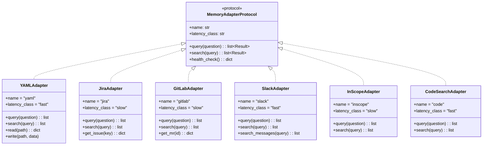

# Adapter Pattern

> Memory adapter protocol for unified data access

## Diagram



## Adapter Discovery


## Query Flow


## Components

| Component | File | Description |
|-----------|------|-------------|
| MemoryAdapterProtocol | `services/memory_abstraction/adapter_protocol.py` | Protocol definition |
| discovery | `services/memory_abstraction/discovery.py` | Adapter discovery |
| registry | `services/memory_abstraction/registry.py` | Adapter registry |
| router | `services/memory_abstraction/router.py` | Query routing |
| merger | `services/memory_abstraction/merger.py` | Result merging |

## Adapter Implementation

```python
# tool_modules/aa_example/src/adapter.py
from services.memory_abstraction import MemoryAdapterProtocol

class ExampleAdapter(MemoryAdapterProtocol):
    name = "example"
    latency_class = "fast"  # or "slow"

    async def query(self, question: str) -> list:
        """Query this source with natural language."""
        # Implementation
        return results

    async def search(self, query: str) -> list:
        """Search this source with keywords."""
        # Implementation
        return results

    async def health_check(self) -> dict:
        """Check adapter health."""
        return {"healthy": True, "message": "OK"}
```

## Latency Classes

| Class | Sources | Latency | Used In |
|-------|---------|---------|---------|
| fast | yaml, code, slack | <2s | Bootstrap, default |
| slow | jira, gitlab, inscope, calendar | >2s | On-demand |

## Related Diagrams

- [Memory Abstraction](../06-memory/memory-abstraction.md)
- [Memory Query Flow](../06-memory/memory-query-flow.md)
- [Tool Module Structure](./tool-module-structure.md)
