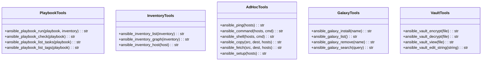
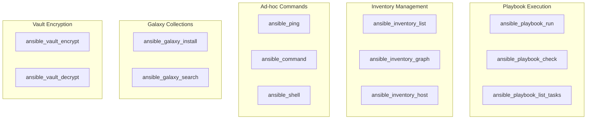

# Ansible Tools

> aa_ansible module for automation and configuration management

## Diagram



## Tool Categories



## Components

| Component | File | Description |
|-----------|------|-------------|
| tools_basic.py | `tool_modules/aa_ansible/src/` | All Ansible tools |

## Tool Summary

### Playbook Tools

| Tool | Description |
|------|-------------|
| `ansible_playbook_run` | Run an Ansible playbook |
| `ansible_playbook_check` | Dry-run a playbook (check mode) |
| `ansible_playbook_list_tasks` | List tasks in a playbook |
| `ansible_playbook_list_tags` | List tags in a playbook |

### Inventory Tools

| Tool | Description |
|------|-------------|
| `ansible_inventory_list` | List hosts in inventory |
| `ansible_inventory_graph` | Show inventory hierarchy |
| `ansible_inventory_host` | Get variables for a specific host |

### Ad-hoc Command Tools

| Tool | Description |
|------|-------------|
| `ansible_ping` | Ping hosts to check connectivity |
| `ansible_command` | Run ad-hoc command on hosts |
| `ansible_shell` | Run shell command on hosts |
| `ansible_copy` | Copy files to hosts |
| `ansible_fetch` | Fetch files from hosts |
| `ansible_setup` | Gather facts from hosts |

### Galaxy Tools

| Tool | Description |
|------|-------------|
| `ansible_galaxy_install` | Install roles/collections |
| `ansible_galaxy_list` | List installed roles/collections |
| `ansible_galaxy_remove` | Remove installed roles/collections |
| `ansible_galaxy_search` | Search Galaxy |

### Vault Tools

| Tool | Description |
|------|-------------|
| `ansible_vault_encrypt` | Encrypt a file |
| `ansible_vault_decrypt` | Decrypt a vault file |
| `ansible_vault_view` | View encrypted vault file |
| `ansible_vault_edit_string` | Encrypt a string for YAML |

## Usage Examples

```python
# Run a playbook
result = await ansible_playbook_run("site.yml", inventory="hosts.ini")

# Check mode (dry run)
result = await ansible_playbook_check("deploy.yml")

# Ping all hosts
result = await ansible_ping("all")

# Install a collection
result = await ansible_galaxy_install("community.general")

# Encrypt a file
result = await ansible_vault_encrypt("secrets.yml")
```

## Related Diagrams

- [SSH Tools](./ssh-tools.md)
- [Kubernetes Tools](./k8s-tools.md)
