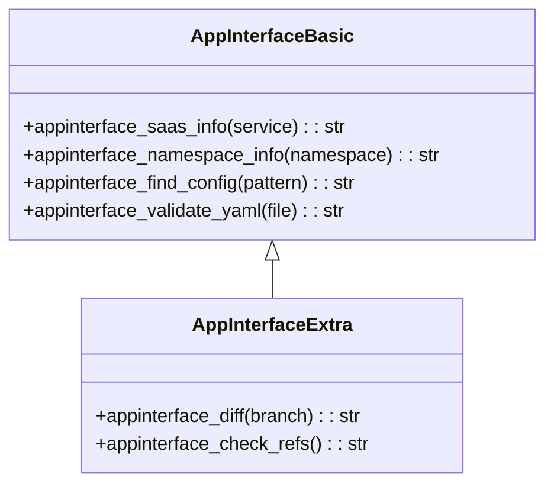

# App-Interface Tools

> aa_appinterface module for Qontract/app-interface GitOps operations

## Diagram



## Configuration Lookup

```mermaid
flowchart TB
    START[Find app-interface path]

    CONFIG_AI[config.json: app_interface.path]
    CONFIG_REPOS[config.json: repositories.app-interface]
    CONFIG_ROOTS[config.json: paths.workspace_roots]
    ENV_VAR[APP_INTERFACE_PATH env var]
    FALLBACK[/opt/app-interface]

    START --> CONFIG_AI
    CONFIG_AI -->|not found| CONFIG_REPOS
    CONFIG_REPOS -->|not found| CONFIG_ROOTS
    CONFIG_ROOTS -->|not found| ENV_VAR
    ENV_VAR -->|not found| FALLBACK

    CONFIG_AI -->|found| RETURN[Return path]
    CONFIG_REPOS -->|found| RETURN
    CONFIG_ROOTS -->|found| RETURN
    ENV_VAR -->|found| RETURN
    FALLBACK -->|exists| RETURN
```

## Components

| Component | File | Description |
|-----------|------|-------------|
| tools_basic.py | `tool_modules/aa_appinterface/src/` | Basic SaaS/namespace lookups |
| tools_extra.py | `tool_modules/aa_appinterface/src/` | Diff and validation tools |
| find_app_interface_path | `tools_basic.py` | Path resolution helper |

## Tool Summary

| Tool | Tier | Description |
|------|------|-------------|
| `appinterface_saas_info` | basic | Get SaaS configuration for a service |
| `appinterface_namespace_info` | basic | Get namespace configuration |
| `appinterface_find_config` | basic | Search for config files by pattern |
| `appinterface_validate_yaml` | basic | Validate YAML syntax and schema |
| `appinterface_diff` | extra | Show changes vs main branch |
| `appinterface_check_refs` | extra | Validate SHA/ref references |

## SaaS File Structure

```mermaid
graph TB
    subgraph AppInterface[app-interface repository]
        SAAS[data/services/saas/]
        NS[data/services/namespaces/]
        APPS[data/apps/]
    end

    SAAS --> SAAS_YML[saas-{service}.yml]
    NS --> NS_YML[{cluster}-{namespace}.yml]
    APPS --> APP_YML[{app}.yml]
```

## Usage Examples

```python
# Find SaaS configuration for a service
result = await appinterface_saas_info("automation-analytics-backend")

# Get namespace configuration
result = await appinterface_namespace_info("stage-automation-analytics")

# Search for config files
result = await appinterface_find_config("prometheus-rule")
```

## Related Diagrams

- [Tool Module Structure](./tool-module-structure.md)
- [Konflux Tools](./konflux-tools.md)
- [Kubernetes Tools](./k8s-tools.md)
