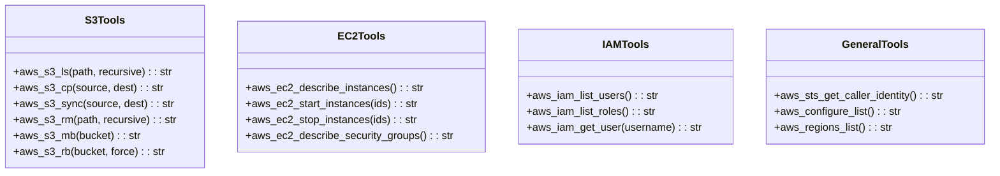
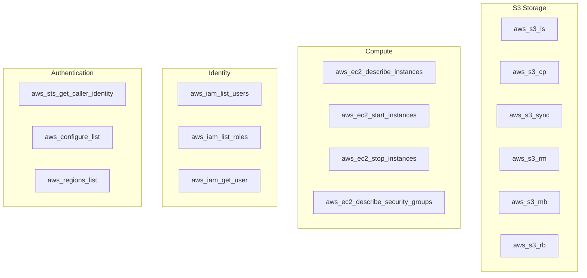

# AWS Tools

> aa_aws module for Amazon Web Services management

## Diagram



## Tool Categories



## Components

| Component | File | Description |
|-----------|------|-------------|
| tools_basic.py | `tool_modules/aa_aws/src/` | All AWS CLI tools |

## Tool Summary

### S3 Tools

| Tool | Description |
|------|-------------|
| `aws_s3_ls` | List S3 buckets or objects |
| `aws_s3_cp` | Copy files to/from S3 |
| `aws_s3_sync` | Sync directories with S3 |
| `aws_s3_rm` | Remove S3 objects |
| `aws_s3_mb` | Create S3 bucket |
| `aws_s3_rb` | Remove S3 bucket |

### EC2 Tools

| Tool | Description |
|------|-------------|
| `aws_ec2_describe_instances` | List EC2 instances |
| `aws_ec2_start_instances` | Start EC2 instances |
| `aws_ec2_stop_instances` | Stop EC2 instances |
| `aws_ec2_describe_security_groups` | List security groups |

### IAM Tools

| Tool | Description |
|------|-------------|
| `aws_iam_list_users` | List IAM users |
| `aws_iam_list_roles` | List IAM roles |
| `aws_iam_get_user` | Get IAM user details |

### General Tools

| Tool | Description |
|------|-------------|
| `aws_sts_get_caller_identity` | Get current AWS identity |
| `aws_configure_list` | Show AWS configuration |
| `aws_regions_list` | List available AWS regions |

## Usage Examples

```python
# List S3 buckets
result = await aws_s3_ls()

# Copy to S3
result = await aws_s3_cp("./data", "s3://my-bucket/data", recursive=True)

# Sync directory with S3
result = await aws_s3_sync("./uploads", "s3://my-bucket/uploads")

# List EC2 instances
result = await aws_ec2_describe_instances()

# Get current identity
result = await aws_sts_get_caller_identity()
```

## Configuration

Uses AWS CLI configuration (`~/.aws/config` and `~/.aws/credentials`). All tools support an optional `profile` parameter to use a specific AWS profile.

## Related Diagrams

- [GCloud Tools](./gcloud-tools.md)
- [Kubernetes Tools](./k8s-tools.md)
