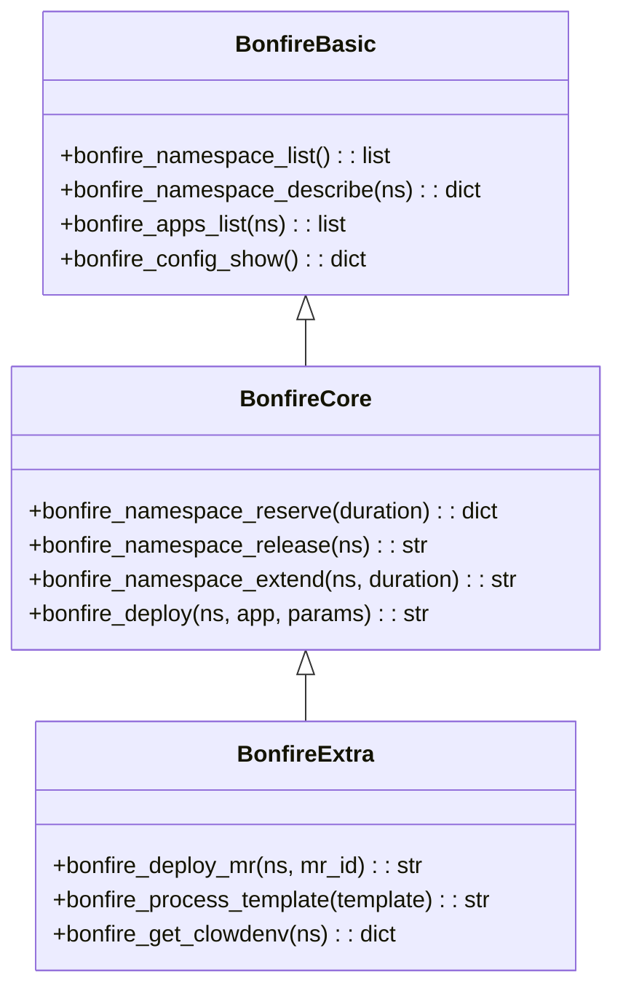
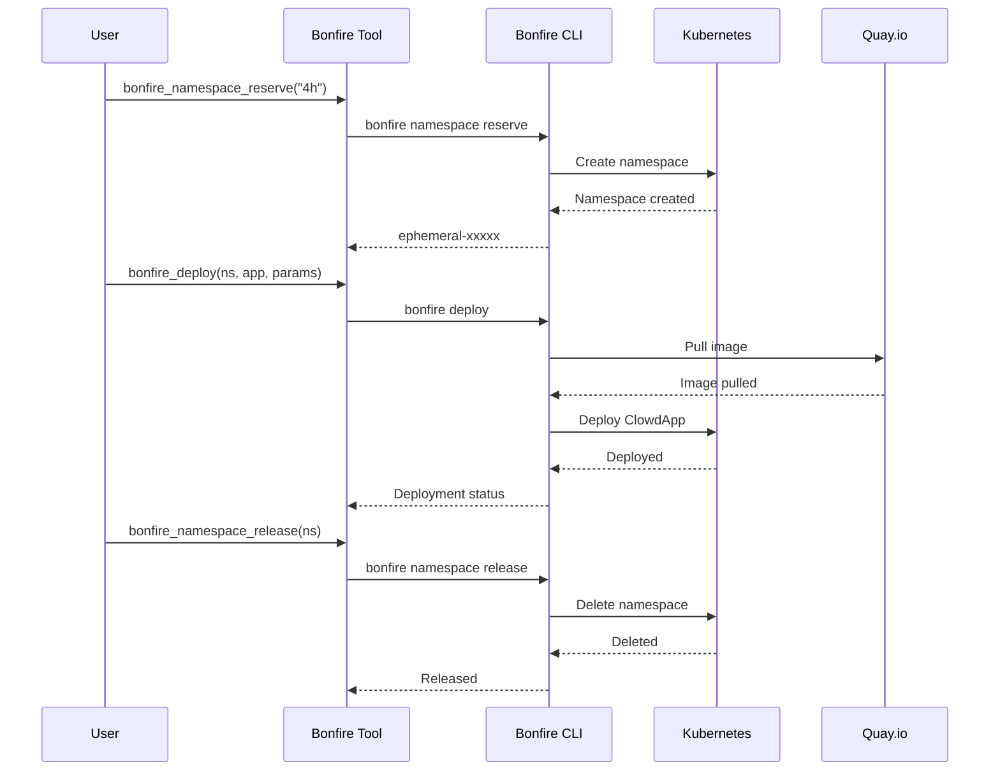
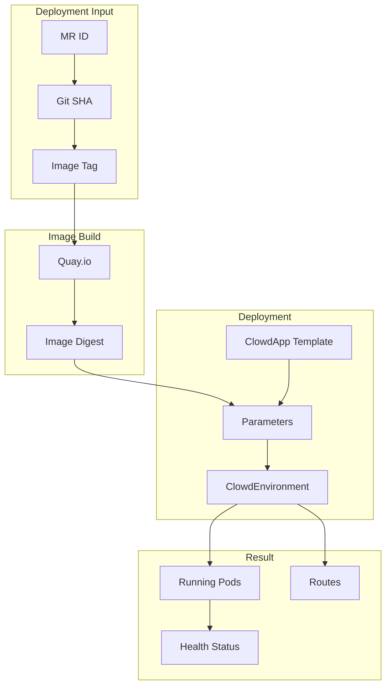

# Bonfire Tools

> aa_bonfire module for ephemeral environment management

## Diagram



## Deployment Flow



## Components

| Component | File | Description |
|-----------|------|-------------|
| tools_basic.py | `tool_modules/aa_bonfire/src/` | Read operations |
| tools_core.py | `tool_modules/aa_bonfire/src/` | Write operations |
| tools_extra.py | `tool_modules/aa_bonfire/src/` | Advanced operations |

## Tool Summary

| Tool | Tier | Description |
|------|------|-------------|
| `bonfire_namespace_list` | basic | List namespaces |
| `bonfire_namespace_describe` | basic | Describe namespace |
| `bonfire_apps_list` | basic | List deployed apps |
| `bonfire_namespace_reserve` | core | Reserve namespace |
| `bonfire_namespace_release` | core | Release namespace |
| `bonfire_namespace_extend` | core | Extend reservation |
| `bonfire_deploy` | core | Deploy application |
| `bonfire_deploy_mr` | extra | Deploy from MR |

## Environment Variables

```bash
# Required for bonfire commands
export KUBECONFIG=~/.kube/config.e
```

## ClowdApp Deployment



## Safety Rules

1. **Only release YOUR namespaces** - Check with `bonfire namespace list --mine`
2. **Use full 40-char SHA** - Short SHAs don't exist in Quay
3. **Always use KUBECONFIG env** - Never copy kubeconfig files

## Related Diagrams

- [Tool Module Structure](./tool-module-structure.md)
- [K8s Tools](./k8s-tools.md)
- [Ephemeral Deployment Flow](../08-data-flows/ephemeral-deployment.md)
