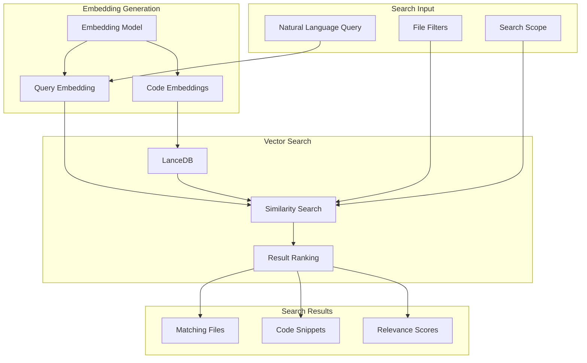
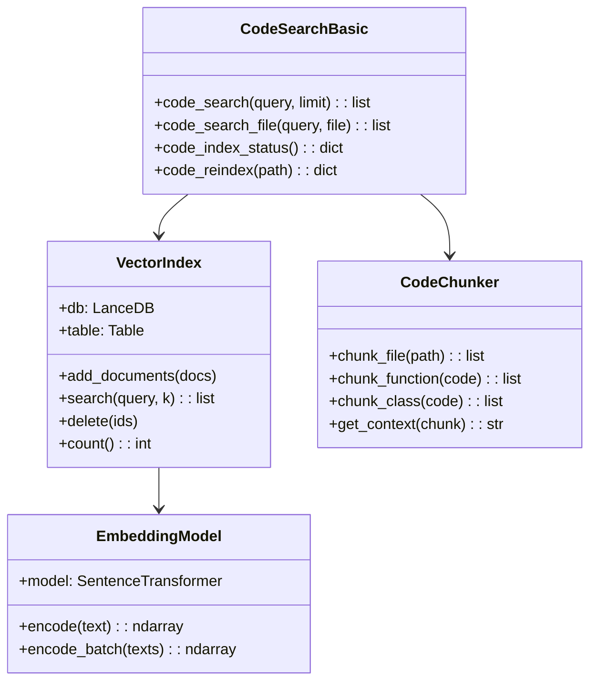
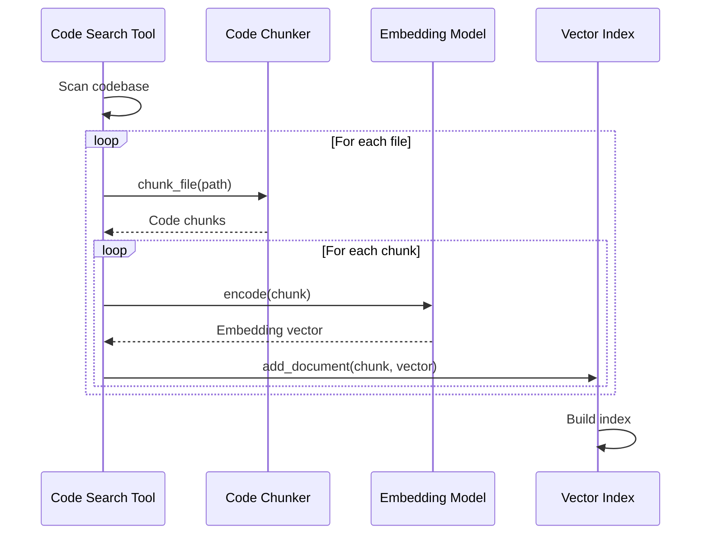

# Code Search Tools

> aa_code_search module for semantic code search

## Diagram



## Class Structure



## Indexing Flow



## Components

| Component | File | Description |
|-----------|------|-------------|
| tools_basic.py | `tool_modules/aa_code_search/src/` | Search operations |
| adapter.py | `tool_modules/aa_code_search/src/` | Memory adapter |

## Tool Summary

| Tool | Description |
|------|-------------|
| `code_search` | Semantic code search |
| `code_search_file` | Search within file |
| `code_index_status` | Get index status |
| `code_reindex` | Rebuild index |

## Chunking Strategy

| Element | Chunk Size | Overlap |
|---------|------------|---------|
| Function | Entire function | None |
| Class | Class + methods | None |
| File | 500 tokens | 50 tokens |
| Comment | With context | None |

## Configuration

```json
{
  "code_search": {
    "index_path": "~/.config/aa-workflow/.lancedb",
    "embedding_model": "nomic-embed-text",
    "chunk_size": 500,
    "chunk_overlap": 50,
    "file_extensions": [".py", ".ts", ".js", ".yaml"],
    "exclude_patterns": ["node_modules", "__pycache__", ".git"]
  }
}
```

## Search Query Examples

```
# Natural language queries
"How does authentication work?"
"Where is the database connection configured?"
"Find error handling for API calls"

# Specific queries
"function that validates JWT tokens"
"class that handles Slack messages"
"YAML schema for skills"
```

## Related Diagrams

- [Tool Module Structure](./tool-module-structure.md)
- [Vector Search](../06-memory/vector-search.md)
- [Ollama Tools](./ollama-tools.md)
