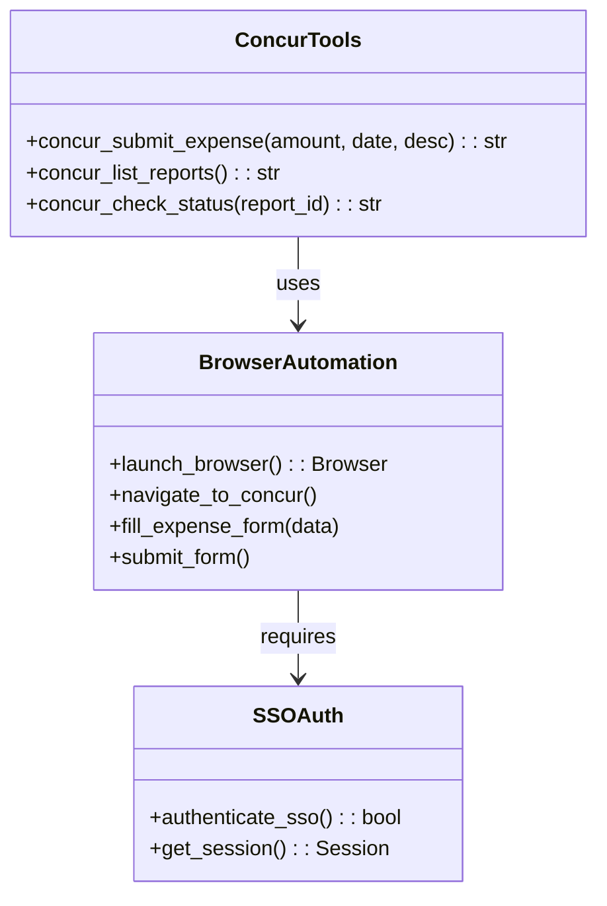
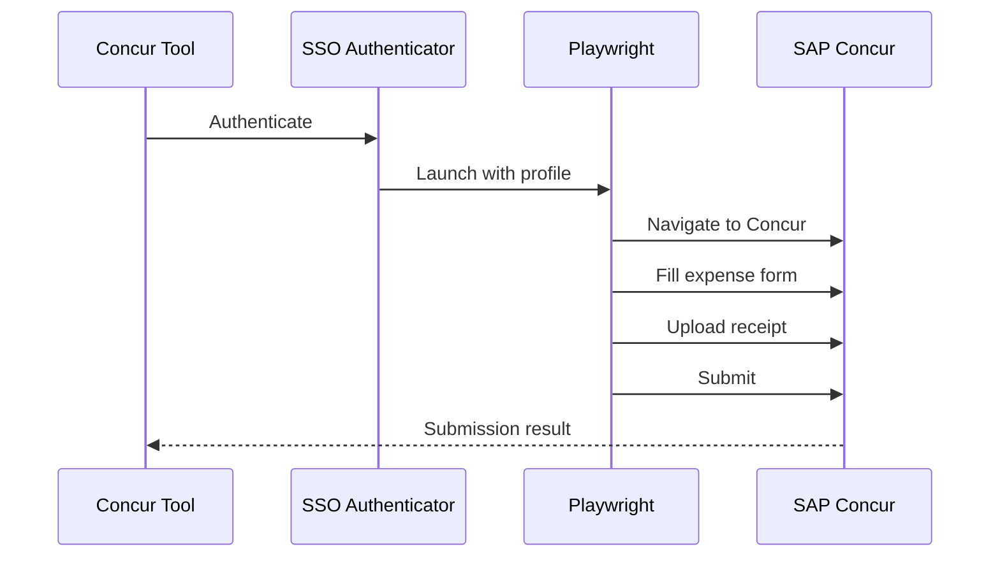
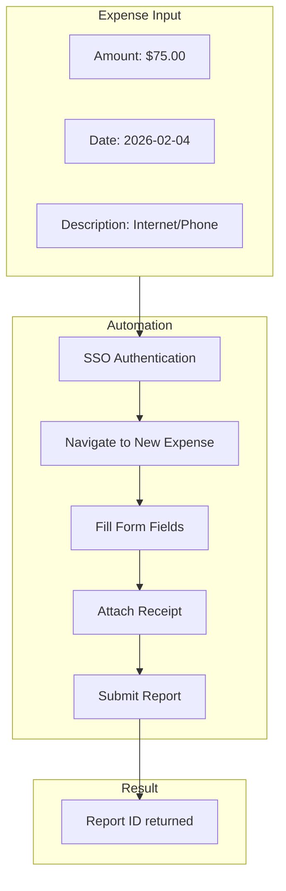

# Concur Tools

> aa_concur module for SAP Concur expense automation

## Diagram



## Expense Submission Flow



## Components

| Component | File | Description |
|-----------|------|-------------|
| tools_basic.py | `tool_modules/aa_concur/src/` | Concur automation tools |

## Tool Summary

| Tool | Description |
|------|-------------|
| `concur_submit_expense` | Submit a new expense report |
| `concur_list_reports` | List existing expense reports |
| `concur_check_status` | Check status of a report |

## Remote Worker Expense

The primary use case is submitting Remote Worker Expenses:



## Configuration

```yaml
# config.json
concur:
  expense_type: "Remote Worker Expense"
  default_amount: 75.00
  company_code: "RHAT"
```

## Prerequisites

- Red Hat SSO authentication configured
- Shared Chrome profile with session
- Valid Concur access

## Usage Examples

```python
# Submit a remote worker expense
result = await concur_submit_expense(
    amount=75.00,
    date="2026-02-04",
    description="Monthly Internet/Phone"
)

# List recent reports
result = await concur_list_reports()

# Check report status
result = await concur_check_status("RPT12345")
```

## Related Diagrams

- [SSO Tools](./sso-tools.md)
- [Auth Flows](../07-integrations/auth-flows.md)
