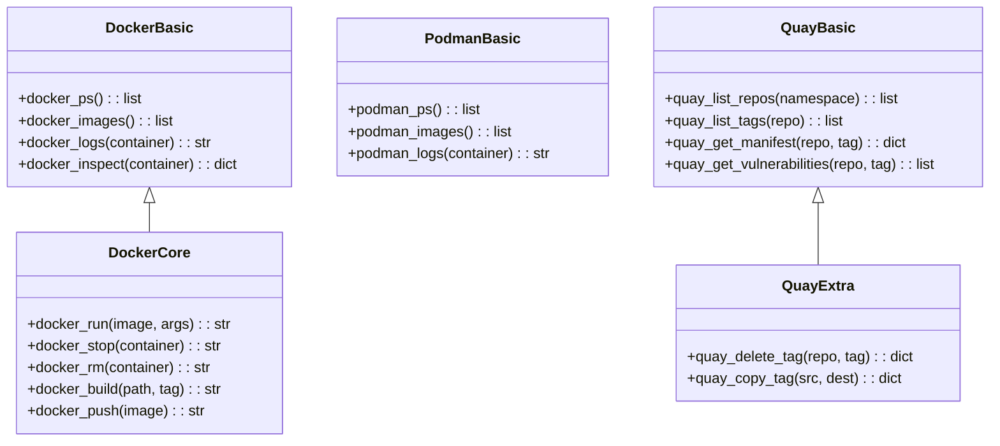
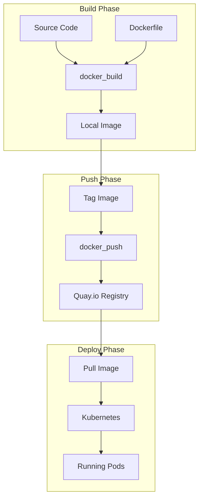
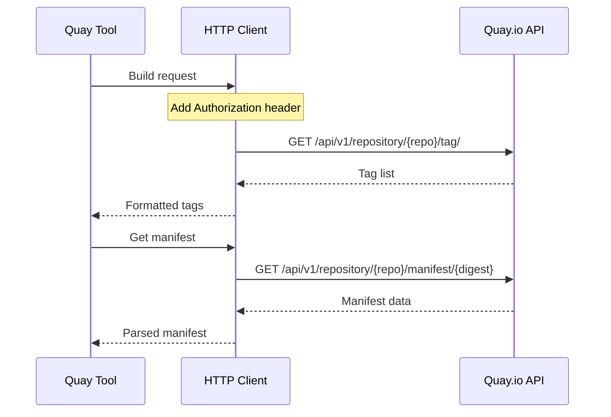

# Container Tools

> Docker, Podman, and Quay integration modules

## Diagram



## Image Flow



## Components

| Module | File | Description |
|--------|------|-------------|
| aa_docker | `tool_modules/aa_docker/` | Docker operations |
| aa_podman | `tool_modules/aa_podman/` | Podman operations |
| aa_quay | `tool_modules/aa_quay/` | Quay.io operations |

## Tool Summary

| Tool | Module | Description |
|------|--------|-------------|
| `docker_ps` | docker | List containers |
| `docker_images` | docker | List images |
| `docker_build` | docker | Build image |
| `docker_push` | docker | Push to registry |
| `podman_ps` | podman | List containers |
| `quay_list_tags` | quay | List image tags |
| `quay_get_manifest` | quay | Get image manifest |

## Quay API Flow



## Configuration

```json
{
  "containers": {
    "docker": {
      "socket": "unix:///var/run/docker.sock"
    },
    "podman": {
      "socket": "unix:///run/user/1000/podman/podman.sock"
    },
    "quay": {
      "url": "https://quay.io",
      "namespace": "cloudservices",
      "token_env": "QUAY_TOKEN"
    }
  }
}
```

## Image Tag Formats

| Format | Example | Use Case |
|--------|---------|----------|
| Git SHA | `abc123def456...` | CI builds |
| Semantic | `v1.2.3` | Releases |
| Latest | `latest` | Development |
| Branch | `main`, `feature-x` | Branch builds |

## Related Diagrams

- [Tool Module Structure](./tool-module-structure.md)
- [Quay Integration](../07-integrations/quay-integration.md)
- [Ephemeral Deployment](../08-data-flows/ephemeral-deployment.md)
