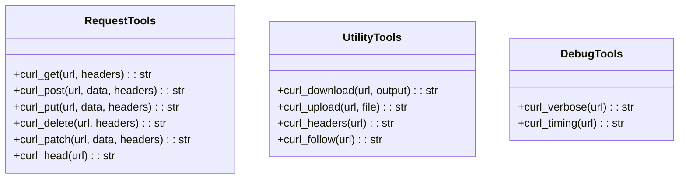
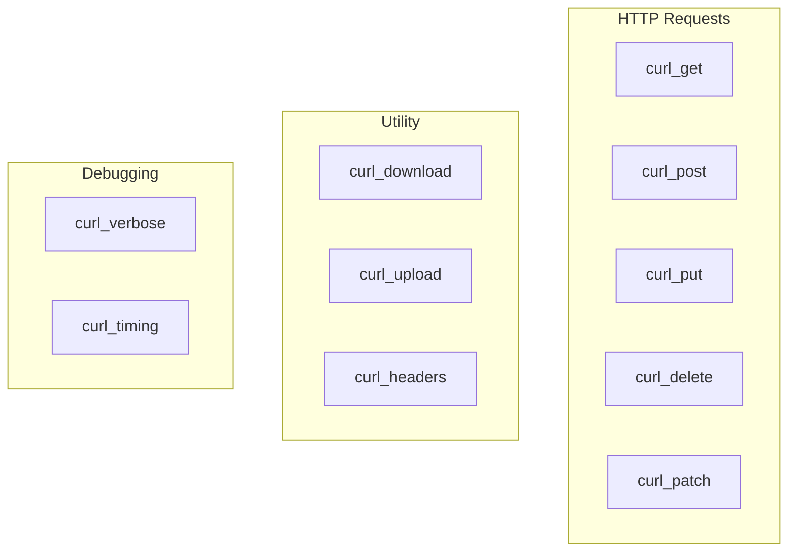

# cURL Tools

> aa_curl module for HTTP client and API testing

## Diagram



## Tool Categories



## Components

| Component | File | Description |
|-----------|------|-------------|
| tools_basic.py | `tool_modules/aa_curl/src/` | All cURL tools |

## Tool Summary

### Request Tools

| Tool | Description |
|------|-------------|
| `curl_get` | HTTP GET request |
| `curl_post` | HTTP POST request |
| `curl_put` | HTTP PUT request |
| `curl_delete` | HTTP DELETE request |
| `curl_patch` | HTTP PATCH request |
| `curl_head` | HTTP HEAD request |

### Utility Tools

| Tool | Description |
|------|-------------|
| `curl_download` | Download file to disk |
| `curl_upload` | Upload file |
| `curl_headers` | Get response headers only |
| `curl_follow` | Follow redirects, show final URL |

### Debug Tools

| Tool | Description |
|------|-------------|
| `curl_verbose` | Verbose request with timing |
| `curl_timing` | Show request timing breakdown |

## Usage Examples

```python
# Simple GET request
result = await curl_get("https://api.example.com/users")

# POST with JSON
result = await curl_post(
    "https://api.example.com/users",
    data='{"name": "John"}',
    headers={"Content-Type": "application/json"}
)

# Download a file
result = await curl_download(
    "https://example.com/file.zip",
    output="/tmp/file.zip"
)

# Check timing
result = await curl_timing("https://example.com")
```

## Related Diagrams

- [HTTP Client](../01-server/http-client.md)
- [Auth Flows](../07-integrations/auth-flows.md)
