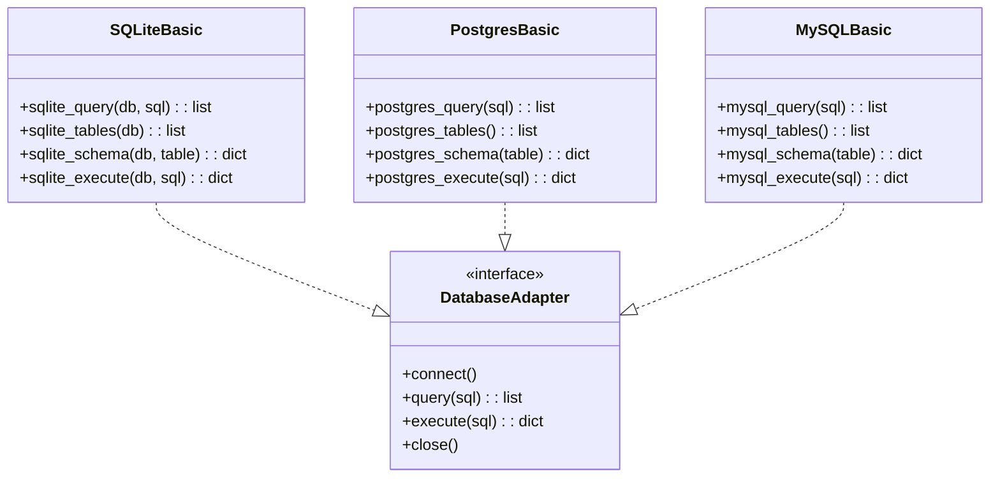
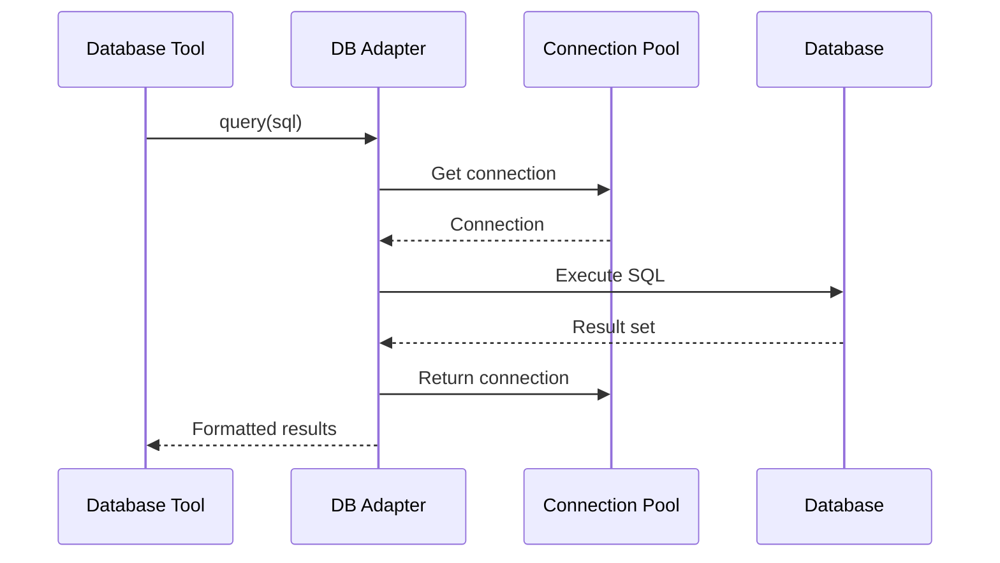
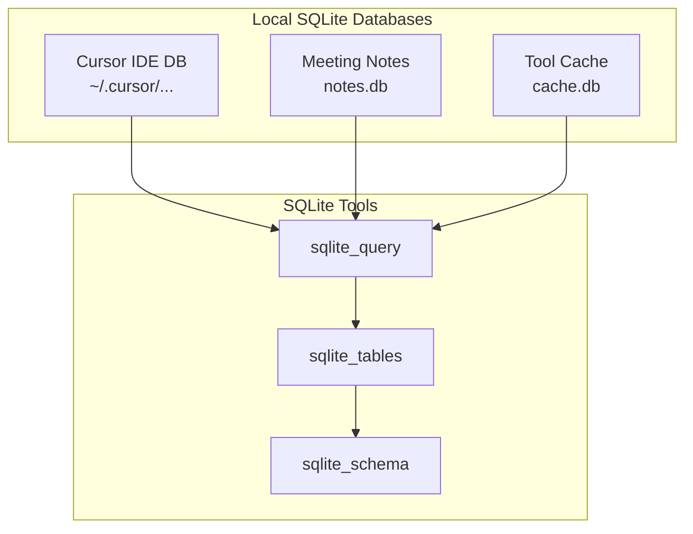

# Database Tools

> SQLite, PostgreSQL, and MySQL integration modules

## Diagram



## Query Flow



## Components

| Module | File | Description |
|--------|------|-------------|
| aa_sqlite | `tool_modules/aa_sqlite/` | SQLite operations |
| aa_postgres | `tool_modules/aa_postgres/` | PostgreSQL operations |
| aa_mysql | `tool_modules/aa_mysql/` | MySQL operations |

## Tool Summary

| Tool | Module | Description |
|------|--------|-------------|
| `sqlite_query` | sqlite | Execute SELECT query |
| `sqlite_tables` | sqlite | List tables |
| `sqlite_schema` | sqlite | Get table schema |
| `sqlite_execute` | sqlite | Execute INSERT/UPDATE/DELETE |
| `postgres_query` | postgres | Execute SELECT query |
| `mysql_query` | mysql | Execute SELECT query |

## SQLite Usage



## Configuration

```json
{
  "databases": {
    "sqlite": {
      "allowed_paths": [
        "~/.cursor/",
        "~/.config/aa-workflow/"
      ]
    },
    "postgres": {
      "host": "localhost",
      "port": 5432,
      "database": "analytics",
      "user_env": "POSTGRES_USER",
      "password_env": "POSTGRES_PASSWORD"
    },
    "mysql": {
      "host": "localhost",
      "port": 3306,
      "database": "app",
      "user_env": "MYSQL_USER",
      "password_env": "MYSQL_PASSWORD"
    }
  }
}
```

## Safety Rules

| Operation | Safety Level | Notes |
|-----------|--------------|-------|
| SELECT | Safe | Read-only |
| INSERT | Caution | Modifies data |
| UPDATE | Caution | Modifies data |
| DELETE | Dangerous | Requires confirmation |
| DROP | Dangerous | Requires confirmation |
| TRUNCATE | Dangerous | Requires confirmation |

## Related Diagrams

- [Tool Module Structure](./tool-module-structure.md)
- [Session Daemon](../02-services/session-daemon.md)
- [Meet Daemon](../02-services/meet-daemon.md)
