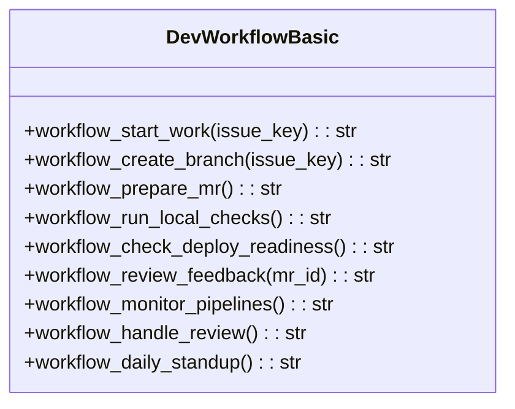
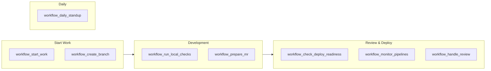
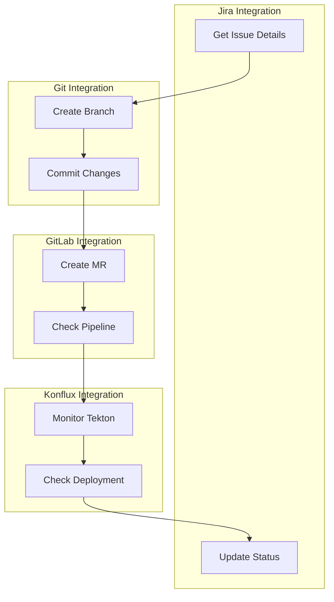

# Development Workflow Tools

> aa_dev_workflow module for high-level development workflow coordination

## Diagram



## Workflow Stages



## Components

| Component | File | Description |
|-----------|------|-------------|
| tools_basic.py | `tool_modules/aa_dev_workflow/src/` | All workflow coordination tools |

## Tool Summary

| Tool | Description |
|------|-------------|
| `workflow_start_work` | Get context to start working on a Jira issue |
| `workflow_create_branch` | Create a feature branch from a Jira issue |
| `workflow_prepare_mr` | Prepare a Merge Request with proper format |
| `workflow_run_local_checks` | Run local linting and validation |
| `workflow_check_deploy_readiness` | Check if MR is ready to deploy |
| `workflow_review_feedback` | Get guidance on addressing review feedback |
| `workflow_monitor_pipelines` | Monitor GitLab + Konflux pipelines |
| `workflow_handle_review` | Prepare to handle MR review feedback |
| `workflow_daily_standup` | Generate a summary of recent work |

## Workflow Integration



## Usage Examples

```python
# Start work on a Jira issue
result = await workflow_start_work("AAP-12345")

# Create a feature branch
result = await workflow_create_branch("AAP-12345")

# Run local checks before committing
result = await workflow_run_local_checks()

# Check if MR is ready to deploy
result = await workflow_check_deploy_readiness()
```

## Related Diagrams

- [Git Tools](./git-tools.md)
- [GitLab Tools](./gitlab-tools.md)
- [Jira Tools](./jira-tools.md)
- [Common Skills](../04-skills/common-skills.md)
