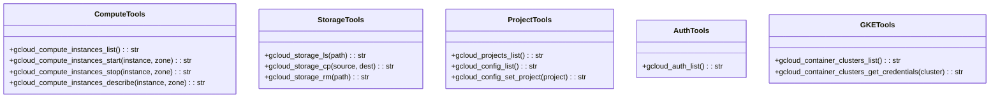
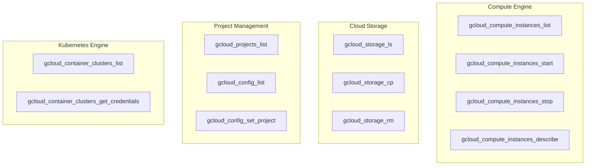

# GCloud Tools

> aa_gcloud module for Google Cloud Platform management

## Diagram



## Tool Categories



## Components

| Component | File | Description |
|-----------|------|-------------|
| tools_basic.py | `tool_modules/aa_gcloud/src/` | All GCloud CLI tools |

## Tool Summary

### Compute Tools

| Tool | Description |
|------|-------------|
| `gcloud_compute_instances_list` | List compute instances |
| `gcloud_compute_instances_start` | Start a compute instance |
| `gcloud_compute_instances_stop` | Stop a compute instance |
| `gcloud_compute_instances_describe` | Get instance details |

### Storage Tools

| Tool | Description |
|------|-------------|
| `gcloud_storage_ls` | List storage buckets/objects |
| `gcloud_storage_cp` | Copy files to/from GCS |
| `gcloud_storage_rm` | Remove storage objects |

### Project Tools

| Tool | Description |
|------|-------------|
| `gcloud_projects_list` | List GCP projects |
| `gcloud_config_list` | Show current configuration |
| `gcloud_config_set_project` | Set active project |

### Auth Tools

| Tool | Description |
|------|-------------|
| `gcloud_auth_list` | List authenticated accounts |

### GKE Tools

| Tool | Description |
|------|-------------|
| `gcloud_container_clusters_list` | List GKE clusters |
| `gcloud_container_clusters_get_credentials` | Get cluster credentials |

## Usage Examples

```python
# List projects
result = await gcloud_projects_list()

# List compute instances
result = await gcloud_compute_instances_list(project="my-project")

# Start an instance
result = await gcloud_compute_instances_start("my-vm", "us-central1-a")

# List GCS objects
result = await gcloud_storage_ls("gs://my-bucket/data/")

# Get GKE credentials
result = await gcloud_container_clusters_get_credentials(
    "my-cluster",
    region="us-central1"
)
```

## Configuration

Uses gcloud CLI configuration. Authenticate with:
```bash
gcloud auth login
gcloud auth application-default login
```

## Related Diagrams

- [AWS Tools](./aws-tools.md)
- [Kubernetes Tools](./k8s-tools.md)
