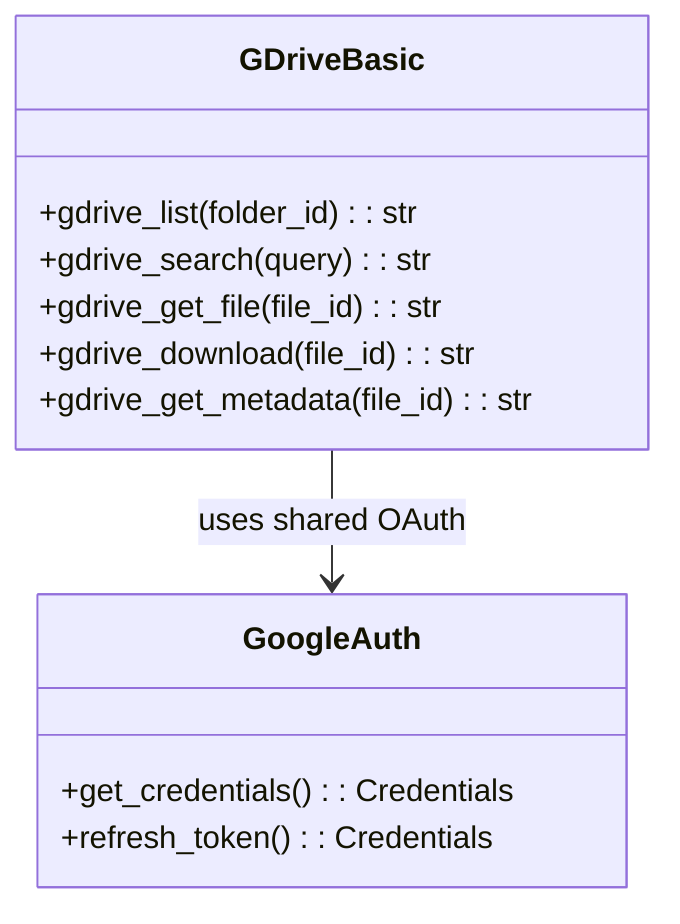
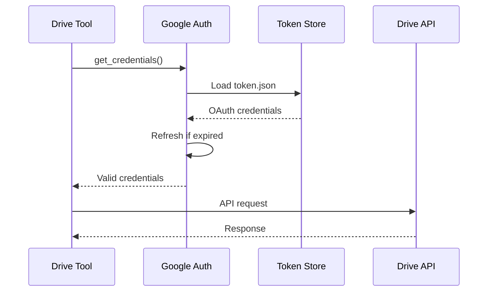

# Google Drive Tools

> aa_gdrive module for Google Drive file operations

## Diagram



## Authentication Flow



## Components

| Component | File | Description |
|-----------|------|-------------|
| tools_basic.py | `tool_modules/aa_gdrive/src/` | Drive API tools |

## Tool Summary

| Tool | Description |
|------|-------------|
| `gdrive_list` | List files in a folder |
| `gdrive_search` | Search for files by name or content |
| `gdrive_get_file` | Get file content |
| `gdrive_download` | Download file to local path |
| `gdrive_get_metadata` | Get file metadata |

## Shared Authentication

Uses the same OAuth credentials as Google Calendar:

```
~/.config/google-calendar/
├── credentials.json    # OAuth client secrets
└── token.json          # Access/refresh tokens
```

## Setup

1. Configure Google Calendar OAuth (shared credentials)
2. Run `google_calendar_status()` to authenticate
3. Google Drive tools use the same token

## Usage Examples

```python
# List files in root
result = await gdrive_list()

# Search for files
result = await gdrive_search("architecture diagram")

# Get file content
result = await gdrive_get_file("1abc123...")

# Download file
result = await gdrive_download("1abc123...", "/tmp/file.pdf")
```

## Query Syntax

Google Drive supports query operators:

| Query | Description |
|-------|-------------|
| `name contains 'report'` | Files with "report" in name |
| `mimeType = 'application/pdf'` | PDF files only |
| `modifiedTime > '2026-01-01'` | Modified after date |
| `'folder_id' in parents` | Files in specific folder |

## Related Diagrams

- [Google Tools](./google-tools.md)
- [Google Slides Tools](./google-tools.md)
- [Auth Flows](../07-integrations/auth-flows.md)
