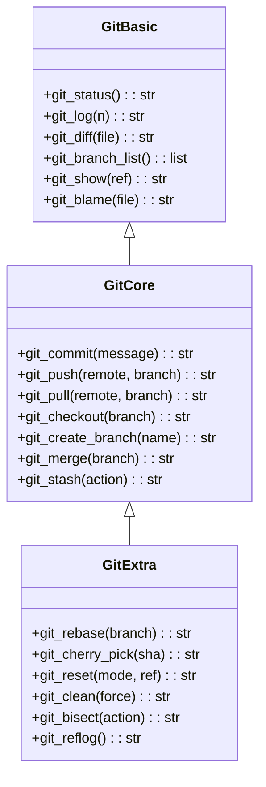
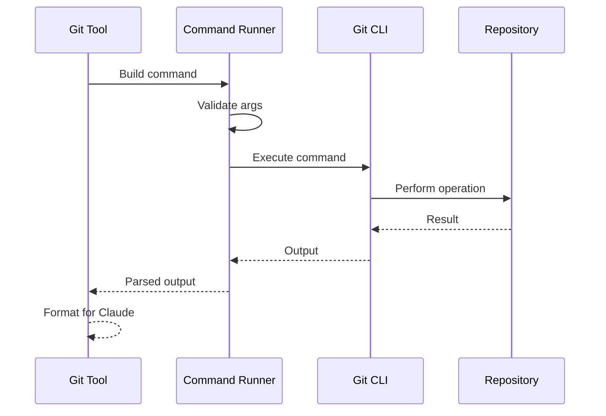
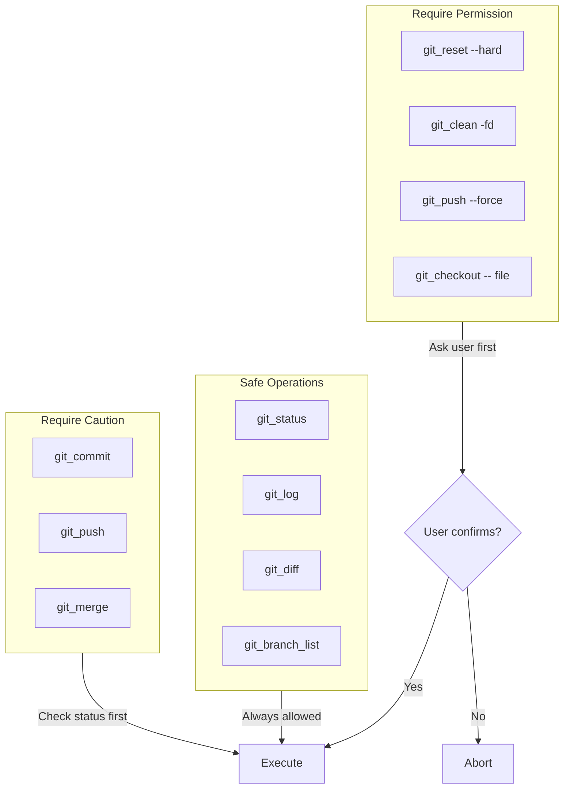
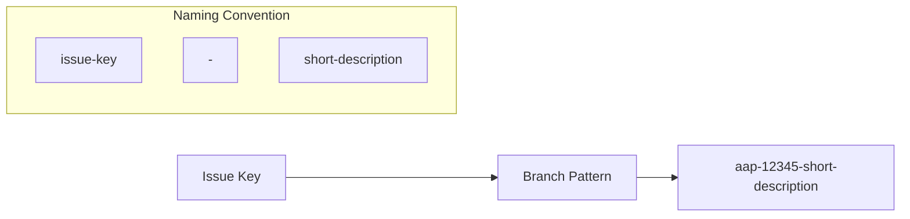

# Git Tools

> aa_git module for local Git operations

## Diagram



## Command Execution



## Components

| Component | File | Description |
|-----------|------|-------------|
| tools_basic.py | `tool_modules/aa_git/src/` | Read operations |
| tools_core.py | `tool_modules/aa_git/src/` | Write operations |
| tools_extra.py | `tool_modules/aa_git/src/` | Advanced operations |

## Tool Summary

| Tool | Tier | Description |
|------|------|-------------|
| `git_status` | basic | Show working tree status |
| `git_log` | basic | Show commit history |
| `git_diff` | basic | Show changes |
| `git_branch_list` | basic | List branches |
| `git_commit` | core | Create commit |
| `git_push` | core | Push to remote |
| `git_pull` | core | Pull from remote |
| `git_checkout` | core | Switch branches |
| `git_rebase` | extra | Rebase branch |
| `git_cherry_pick` | extra | Cherry-pick commit |

## Safety Rules



## Branch Naming



## Commit Message Format

```
{issue_key} - {type}({scope}): {description}

Examples:
AAP-12345 - feat(api): add new endpoint
AAP-12345 - fix(auth): resolve token refresh
AAP-12345 - docs(readme): update installation
```

## Related Diagrams

- [Tool Module Structure](./tool-module-structure.md)
- [GitLab Tools](./gitlab-tools.md)
- [Git Safety Rules](../../ai-rules/30-git-safety.md)
