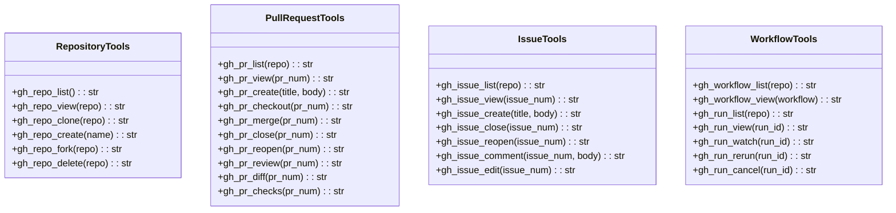
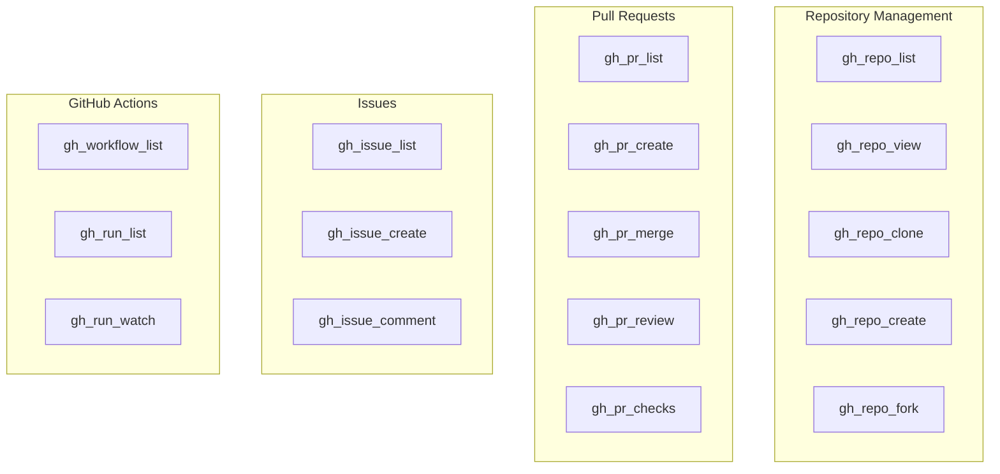

# GitHub Tools

> aa_github module for GitHub CLI (gh) operations

## Diagram



## Tool Categories



## Components

| Component | File | Description |
|-----------|------|-------------|
| tools_basic.py | `tool_modules/aa_github/src/` | All GitHub CLI tools |

## Tool Summary

### Repository Tools

| Tool | Description |
|------|-------------|
| `gh_repo_list` | List repositories |
| `gh_repo_view` | View repository details |
| `gh_repo_clone` | Clone a repository |
| `gh_repo_create` | Create a new repository |
| `gh_repo_fork` | Fork a repository |
| `gh_repo_delete` | Delete a repository |

### Pull Request Tools

| Tool | Description |
|------|-------------|
| `gh_pr_list` | List pull requests |
| `gh_pr_view` | View pull request details |
| `gh_pr_create` | Create a pull request |
| `gh_pr_checkout` | Checkout a pull request locally |
| `gh_pr_merge` | Merge a pull request |
| `gh_pr_close` | Close a pull request |
| `gh_pr_review` | Review a pull request |
| `gh_pr_diff` | View pull request diff |
| `gh_pr_checks` | View PR check status |

### Issue Tools

| Tool | Description |
|------|-------------|
| `gh_issue_list` | List issues |
| `gh_issue_view` | View issue details |
| `gh_issue_create` | Create an issue |
| `gh_issue_close` | Close an issue |
| `gh_issue_comment` | Add comment to an issue |

### Workflow/Actions Tools

| Tool | Description |
|------|-------------|
| `gh_workflow_list` | List workflows |
| `gh_workflow_view` | View workflow details |
| `gh_run_list` | List workflow runs |
| `gh_run_view` | View workflow run details |
| `gh_run_watch` | Watch a workflow run |
| `gh_run_rerun` | Re-run a workflow |
| `gh_run_cancel` | Cancel a workflow run |

## Prerequisites

Requires GitHub CLI (`gh`) to be installed and authenticated:

```bash
# Install
brew install gh  # macOS
dnf install gh   # Fedora

# Authenticate
gh auth login
```

## Usage Examples

```python
# List repositories
result = await gh_repo_list()

# View a pull request
result = await gh_pr_view("owner/repo", 123)

# Create a pull request
result = await gh_pr_create("Fix bug", "This PR fixes...")

# Watch a workflow run
result = await gh_run_watch("12345")
```

## Related Diagrams

- [Git Tools](./git-tools.md)
- [GitLab Tools](./gitlab-tools.md)
- [Tool Module Structure](./tool-module-structure.md)
