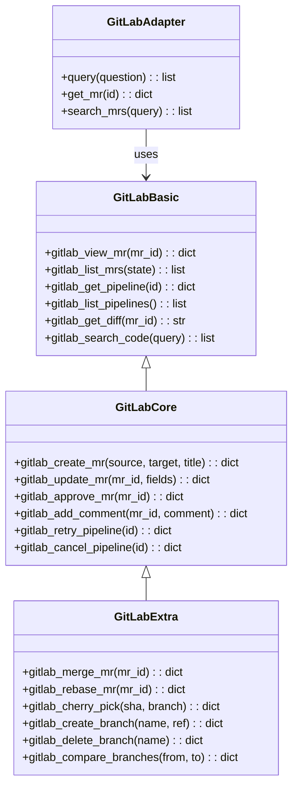
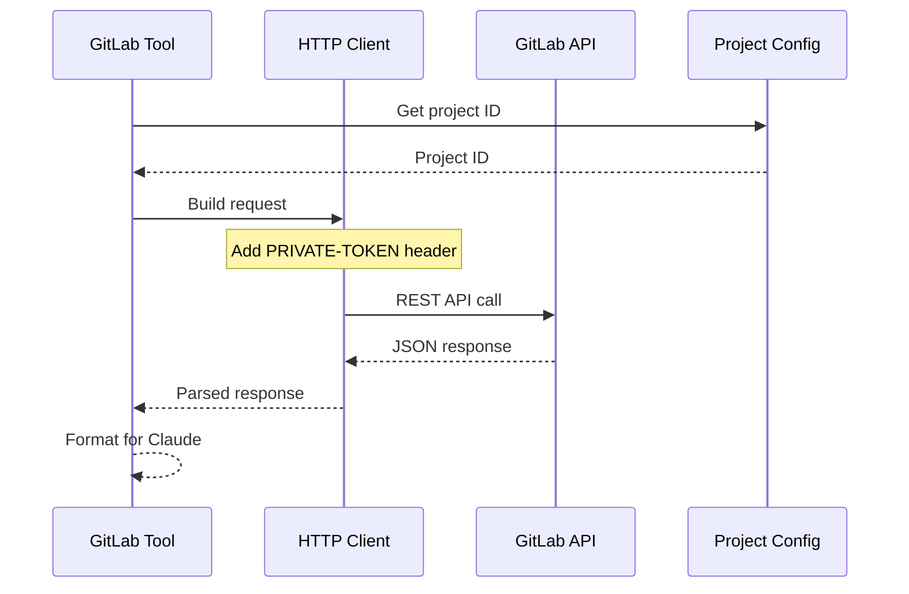
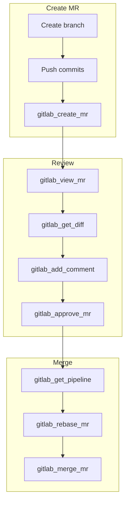

# GitLab Tools

> aa_gitlab module for GitLab API integration

## Diagram



## API Flow



## Components

| Component | File | Description |
|-----------|------|-------------|
| tools_basic.py | `tool_modules/aa_gitlab/src/` | Read operations |
| tools_core.py | `tool_modules/aa_gitlab/src/` | Write operations |
| tools_extra.py | `tool_modules/aa_gitlab/src/` | Advanced operations |
| adapter.py | `tool_modules/aa_gitlab/src/` | Memory adapter |
| server.py | `tool_modules/aa_gitlab/src/` | Standalone server |

## Tool Summary

| Tool | Tier | Description |
|------|------|-------------|
| `gitlab_view_mr` | basic | View MR details |
| `gitlab_list_mrs` | basic | List merge requests |
| `gitlab_get_pipeline` | basic | Get pipeline status |
| `gitlab_get_diff` | basic | Get MR diff |
| `gitlab_create_mr` | core | Create merge request |
| `gitlab_approve_mr` | core | Approve MR |
| `gitlab_retry_pipeline` | core | Retry failed pipeline |
| `gitlab_merge_mr` | extra | Merge MR |
| `gitlab_rebase_mr` | extra | Rebase MR |

## Configuration

```json
{
  "gitlab": {
    "url": "https://gitlab.cee.redhat.com",
    "project": "automation-analytics/automation-analytics-backend",
    "token_env": "GITLAB_TOKEN"
  }
}
```

## MR Workflow



## Related Diagrams

- [Tool Module Structure](./tool-module-structure.md)
- [GitLab Integration](../07-integrations/gitlab-integration.md)
- [Git Tools](./git-tools.md)
