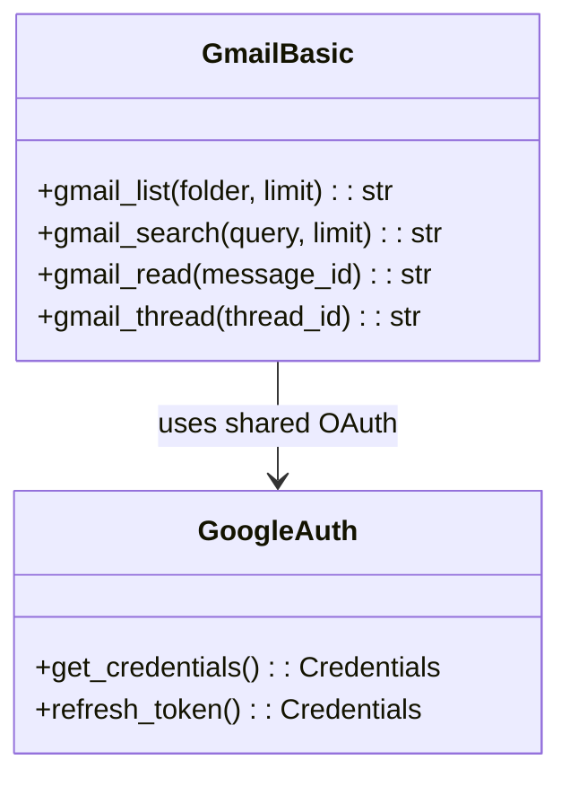

# Gmail Tools

> aa_gmail module for Gmail email operations

## Diagram



## Components

| Component | File | Description |
|-----------|------|-------------|
| tools_basic.py | `tool_modules/aa_gmail/src/` | Gmail API tools |

## Tool Summary

| Tool | Description |
|------|-------------|
| `gmail_list` | List emails in a folder (inbox, sent, starred) |
| `gmail_search` | Search emails by query |
| `gmail_read` | Read email content by message ID |
| `gmail_thread` | Get full email thread |

## Shared Authentication

Uses the same OAuth credentials as Google Calendar:

```
~/.config/google-calendar/
├── credentials.json    # OAuth client secrets
└── token.json          # Access/refresh tokens
```

## Setup

1. Configure Google Calendar OAuth (shared credentials)
2. Run `google_calendar_status()` to authenticate
3. Gmail tools use the same token

## Search Query Syntax

Gmail supports standard search operators:

| Query | Description |
|-------|-------------|
| `from:user@example.com` | Emails from address |
| `to:user@example.com` | Emails to address |
| `subject:meeting` | Subject contains word |
| `is:unread` | Unread emails |
| `has:attachment` | Emails with attachments |
| `after:2026/01/01` | Emails after date |
| `label:important` | Emails with label |

## Usage Examples

```python
# List inbox emails
result = await gmail_list("inbox", limit=10)

# Search for emails
result = await gmail_search("from:manager@company.com is:unread")

# Read specific email
result = await gmail_read("msg_id_123")

# Get email thread
result = await gmail_thread("thread_id_456")
```

## Related Diagrams

- [Google Tools](./google-tools.md)
- [Google Drive Tools](./gdrive-tools.md)
- [Auth Flows](../07-integrations/auth-flows.md)
