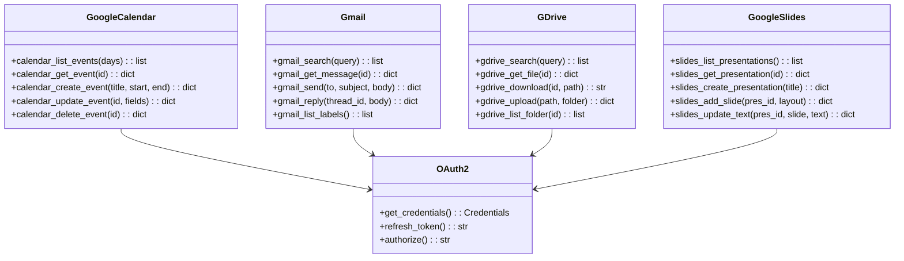

# Google Tools

> Google Workspace integration modules

## Diagram



## OAuth Flow


## Components

| Module | File | Description |
|--------|------|-------------|
| aa_google_calendar | `tool_modules/aa_google_calendar/` | Calendar operations |
| aa_gmail | `tool_modules/aa_gmail/` | Email operations |
| aa_gdrive | `tool_modules/aa_gdrive/` | Drive operations |
| aa_google_slides | `tool_modules/aa_google_slides/` | Slides operations |

## Tool Summary

| Tool | Module | Description |
|------|--------|-------------|
| `calendar_list_events` | calendar | List upcoming events |
| `calendar_create_event` | calendar | Create event |
| `gmail_search` | gmail | Search emails |
| `gmail_send` | gmail | Send email |
| `gdrive_search` | gdrive | Search files |
| `gdrive_download` | gdrive | Download file |
| `slides_create_presentation` | slides | Create presentation |

## Configuration

```json
{
  "google": {
    "credentials_file": "~/.config/aa-workflow/google_credentials.json",
    "token_file": "~/.config/aa-workflow/google_token.json",
    "scopes": [
      "https://www.googleapis.com/auth/calendar",
      "https://www.googleapis.com/auth/gmail.modify",
      "https://www.googleapis.com/auth/drive"
    ]
  }
}
```

## Scopes

| Scope | Purpose |
|-------|---------|
| `calendar` | Read/write calendar events |
| `calendar.readonly` | Read-only calendar access |
| `gmail.modify` | Read/send emails |
| `drive` | Full Drive access |
| `drive.readonly` | Read-only Drive access |
| `presentations` | Create/edit presentations |

## Related Diagrams

- [Tool Module Structure](./tool-module-structure.md)
- [Google Integration](../07-integrations/google-integration.md)
- [Auth Flows](../07-integrations/auth-flows.md)
