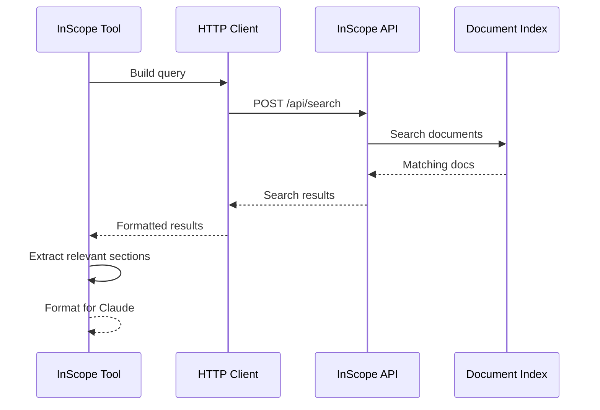
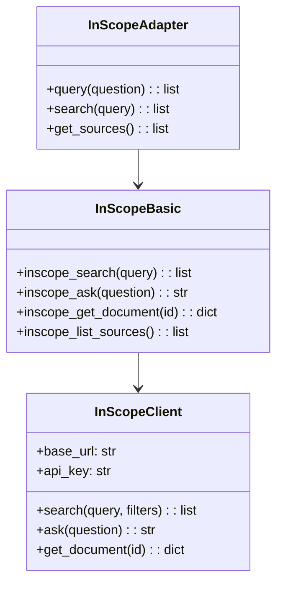
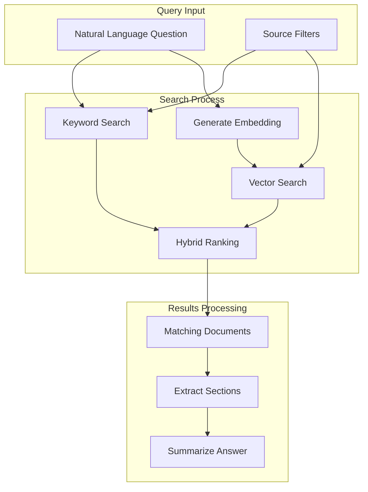
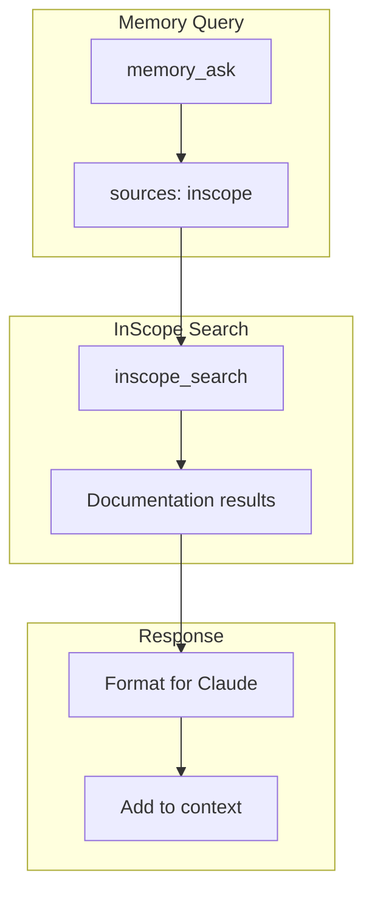

# InScope Tools

> aa_inscope module for internal documentation search

## Diagram



## Class Structure



## Search Flow



## Components

| Component | File | Description |
|-----------|------|-------------|
| tools_basic.py | `tool_modules/aa_inscope/src/` | Search operations |
| adapter.py | `tool_modules/aa_inscope/src/` | Memory adapter |

## Tool Summary

| Tool | Description |
|------|-------------|
| `inscope_search` | Search documentation |
| `inscope_ask` | Ask question, get answer |
| `inscope_get_document` | Get specific document |
| `inscope_list_sources` | List available sources |

## Document Sources

| Source | Content Type |
|--------|--------------|
| Confluence | Wiki pages |
| GitLab | Repository docs |
| Google Docs | Shared documents |
| Notion | Team knowledge |
| Internal wikis | Company docs |

## Configuration

```json
{
  "inscope": {
    "base_url": "https://inscope.example.com",
    "api_key_env": "INSCOPE_API_KEY",
    "default_sources": ["confluence", "gitlab"],
    "max_results": 10
  }
}
```

## Query Examples

```
# Documentation queries
"How do I deploy to production?"
"What is the release process for Konflux?"
"Where is the database schema documented?"

# Specific lookups
"RDS configuration guide"
"Slack integration setup"
"CI/CD pipeline documentation"
```

## Memory Integration



## Related Diagrams

- [Tool Module Structure](./tool-module-structure.md)
- [Memory Abstraction](../06-memory/memory-abstraction.md)
- [Memory Query Flow](../06-memory/memory-query-flow.md)
