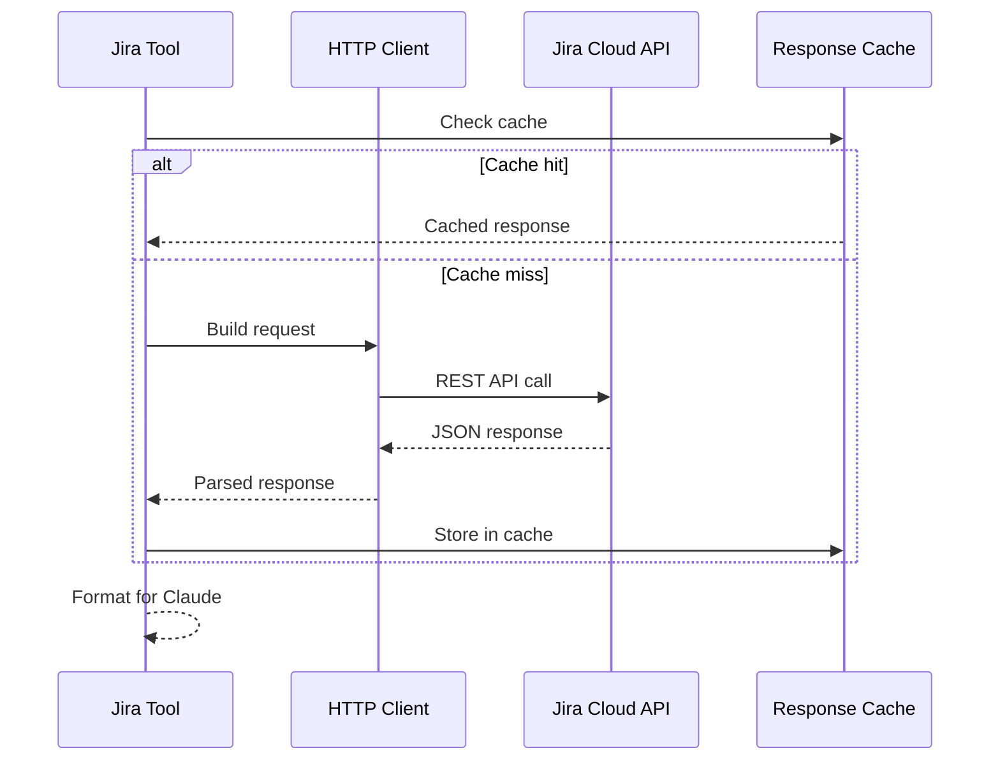

# Jira Tools

> aa_jira module for Jira Cloud integration

## Diagram


## API Flow



## Components

| Component | File | Description |
|-----------|------|-------------|
| tools_basic.py | `tool_modules/aa_jira/src/` | Read operations |
| tools_core.py | `tool_modules/aa_jira/src/` | Write operations |
| tools_extra.py | `tool_modules/aa_jira/src/` | Advanced operations |
| adapter.py | `tool_modules/aa_jira/src/` | Memory adapter |
| server.py | `tool_modules/aa_jira/src/` | Standalone server |

## Tool Summary

| Tool | Tier | Description |
|------|------|-------------|
| `jira_view_issue` | basic | View issue details |
| `jira_search` | basic | Search with JQL |
| `jira_list_projects` | basic | List accessible projects |
| `jira_get_transitions` | basic | Get available transitions |
| `jira_create_issue` | core | Create new issue |
| `jira_update_issue` | core | Update issue fields |
| `jira_transition` | core | Change issue status |
| `jira_add_comment` | core | Add comment |
| `jira_bulk_update` | extra | Bulk update issues |
| `jira_clone_issue` | extra | Clone issue |

## Configuration

```json
{
  "jira": {
    "url": "https://issues.redhat.com",
    "project": "AAP",
    "token_env": "JIRA_JPAT"
  }
}
```

## Authentication


## Related Diagrams

- [Tool Module Structure](./tool-module-structure.md)
- [Jira Integration](../07-integrations/jira-integration.md)
- [Adapter Pattern](./adapter-pattern.md)
