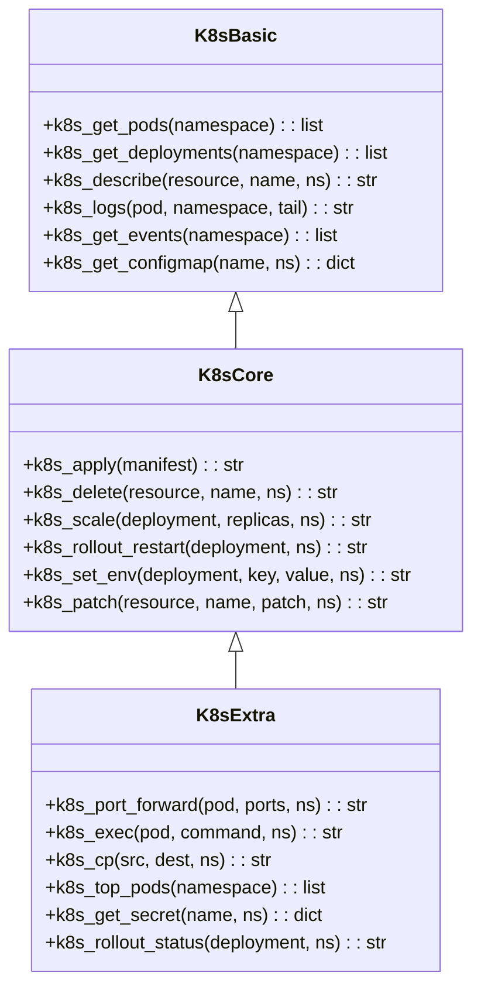
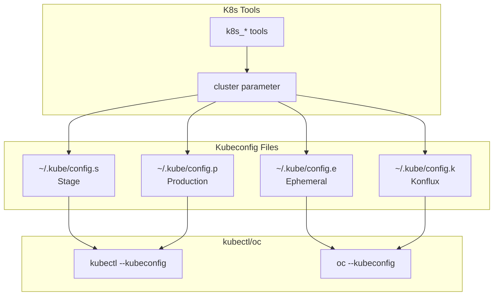
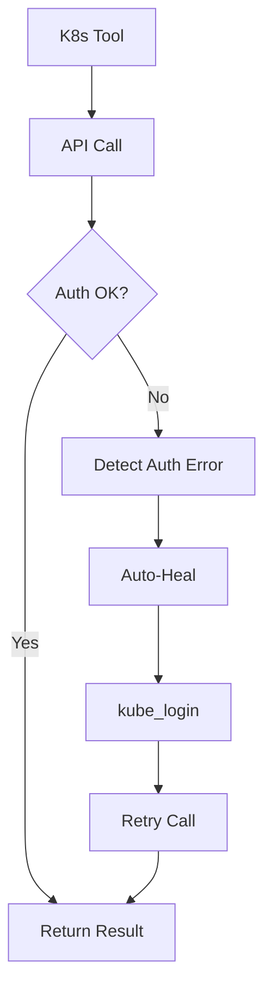

# Kubernetes Tools

> aa_k8s module for Kubernetes cluster operations

## Diagram

## Multi-Cluster Access

## Components

| Component | File | Description |
|-----------|------|-------------|
| tools_basic.py | `tool_modules/aa_k8s/src/` | Read operations |
| tools_core.py | `tool_modules/aa_k8s/src/` | Write operations |
| tools_extra.py | `tool_modules/aa_k8s/src/` | Advanced operations |
| server.py | `tool_modules/aa_k8s/src/` | Standalone server |

## Tool Summary

| Tool | Tier | Description |
|------|------|-------------|
| `k8s_get_pods` | basic | List pods |
| `k8s_describe` | basic | Describe resource |
| `k8s_logs` | basic | Get pod logs |
| `k8s_get_events` | basic | Get events |
| `k8s_apply` | core | Apply manifest |
| `k8s_delete` | core | Delete resource |
| `k8s_scale` | core | Scale deployment |
| `k8s_rollout_restart` | core | Restart deployment |
| `k8s_port_forward` | extra | Port forwarding |
| `k8s_exec` | extra | Execute in pod |

## Cluster Parameter

| Value | Kubeconfig | Environment |
|-------|------------|-------------|
| `stage` | `~/.kube/config.s` | Stage |
| `prod` | `~/.kube/config.p` | Production |
| `ephemeral` | `~/.kube/config.e` | Ephemeral |
| `konflux` | `~/.kube/config.k` | Konflux |

## Auto-Heal Integration

## Related Diagrams

- [Tool Module Structure](./tool-module-structure.md)
- [Kubernetes Integration](../07-integrations/kubernetes-integration.md)
- [Bonfire Tools](./bonfire-tools.md)
- [Auto-Heal Decorator](../01-server/auto-heal-decorator.md)
