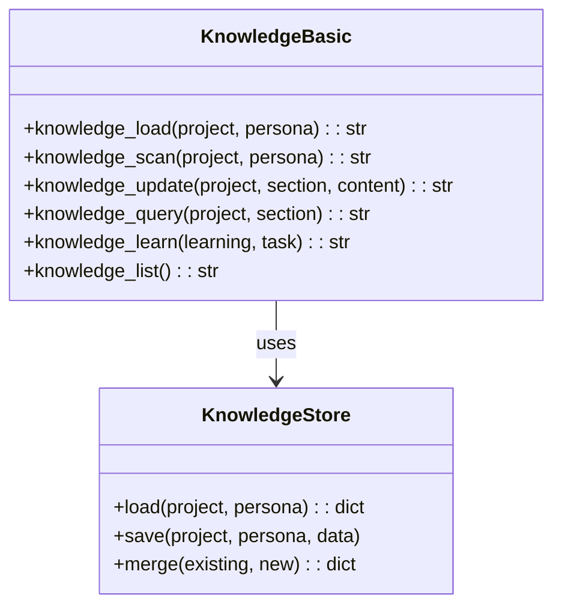
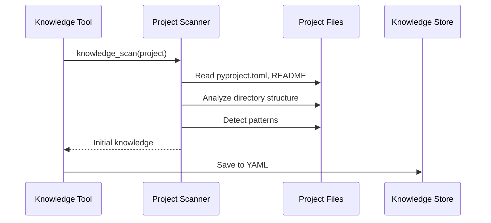

# Knowledge Tools

> aa_knowledge module for project-specific expertise loading and learning

## Diagram



## Knowledge Flow



## Components

| Component | File | Description |
|-----------|------|-------------|
| tools_basic.py | `tool_modules/aa_knowledge/src/` | Knowledge tools |

## Tool Summary

| Tool | Description |
|------|-------------|
| `knowledge_load` | Load project knowledge for a persona |
| `knowledge_scan` | AI scans project, generates initial knowledge |
| `knowledge_update` | Update specific section of knowledge |
| `knowledge_query` | Query specific knowledge sections |
| `knowledge_learn` | Record a learning from completed task |
| `knowledge_list` | List all available knowledge files |

## Knowledge Structure

```yaml
# memory/knowledge/personas/{persona}/{project}.yaml
architecture:
  overview: "Description of the project"
  key_modules:
    - name: api
      purpose: "REST API endpoints"
    - name: tasks
      purpose: "Celery background tasks"

patterns:
  coding:
    - "Use async/await for I/O operations"
    - "Follow conventional commits"
  testing:
    - "Unit tests in tests/unit/"
    - "Integration tests in tests/integration/"

gotchas:
  - "RDS connection requires VPN"
  - "Stage uses mock authentication"

learned_from_tasks:
  - task: "AAP-12345"
    learning: "ClowdApp resources are in clowdapp.yaml"
```

## Knowledge Sections

| Section | Description |
|---------|-------------|
| `architecture` | Project structure and key modules |
| `patterns` | Coding and testing patterns |
| `gotchas` | Common pitfalls and workarounds |
| `learned_from_tasks` | Learnings from completed work |

## Storage Location

```
memory/knowledge/
└── personas/
    ├── developer/
    │   ├── automation-analytics-backend.yaml
    │   └── redhat-ai-workflow.yaml
    └── devops/
        └── automation-analytics-backend.yaml
```

## Usage Examples

```python
# Load knowledge for current project
result = await knowledge_load("automation-analytics-backend", "developer")

# Scan project to generate knowledge
result = await knowledge_scan("automation-analytics-backend", "developer")

# Update a section
result = await knowledge_update(
    "automation-analytics-backend",
    "gotchas",
    "New gotcha: Feature flags are in config.py"
)

# Query specific section
result = await knowledge_query("automation-analytics-backend", "patterns.coding")

# Record a learning
result = await knowledge_learn(
    "ClowdApp resources need to be in clowdapp.yaml",
    task="AAP-12345"
)
```

## Related Diagrams

- [Memory Architecture](../06-memory/memory-architecture.md)
- [Knowledge Storage](../06-memory/knowledge-storage.md)
- [Persona Architecture](../05-personas/persona-architecture.md)
