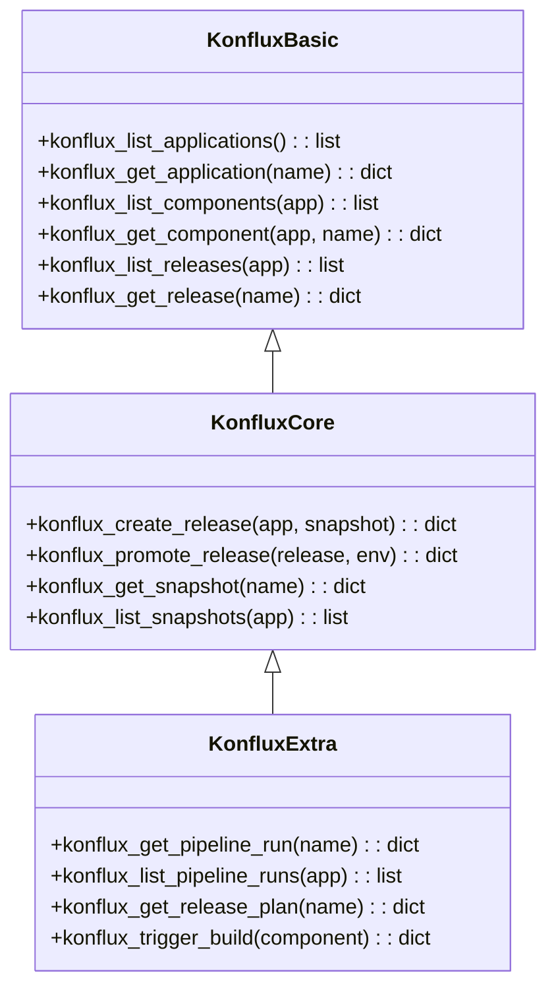
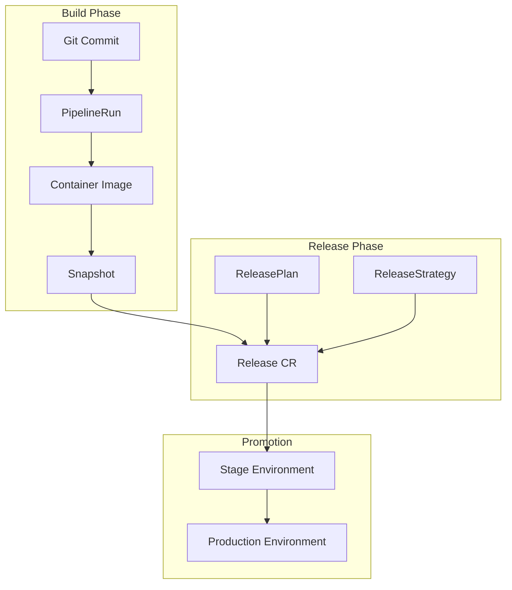
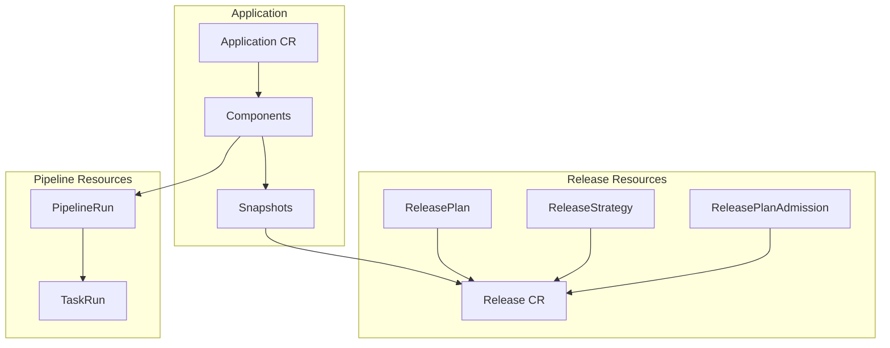

# Konflux Tools

> aa_konflux module for Konflux release pipeline management

## Diagram



## Release Pipeline



## Components

| Component | File | Description |
|-----------|------|-------------|
| tools_basic.py | `tool_modules/aa_konflux/src/` | Read operations |
| tools_core.py | `tool_modules/aa_konflux/src/` | Write operations |
| tools_extra.py | `tool_modules/aa_konflux/src/` | Advanced operations |
| server.py | `tool_modules/aa_konflux/src/` | Standalone server |

## Tool Summary

| Tool | Tier | Description |
|------|------|-------------|
| `konflux_list_applications` | basic | List applications |
| `konflux_get_application` | basic | Get application details |
| `konflux_list_components` | basic | List components |
| `konflux_list_releases` | basic | List releases |
| `konflux_create_release` | core | Create release |
| `konflux_promote_release` | core | Promote to environment |
| `konflux_get_pipeline_run` | extra | Get pipeline run |
| `konflux_trigger_build` | extra | Trigger component build |

## Konflux Resources



## Configuration

```json
{
  "konflux": {
    "tenant": "aap-aa-tenant",
    "application": "automation-analytics-backend",
    "kubeconfig": "~/.kube/config.k"
  }
}
```

## Related Diagrams

- [Tool Module Structure](./tool-module-structure.md)
- [Konflux Integration](../07-integrations/konflux-integration.md)
- [Release Pipeline Flow](../08-data-flows/release-pipeline.md)
