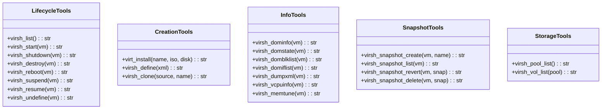
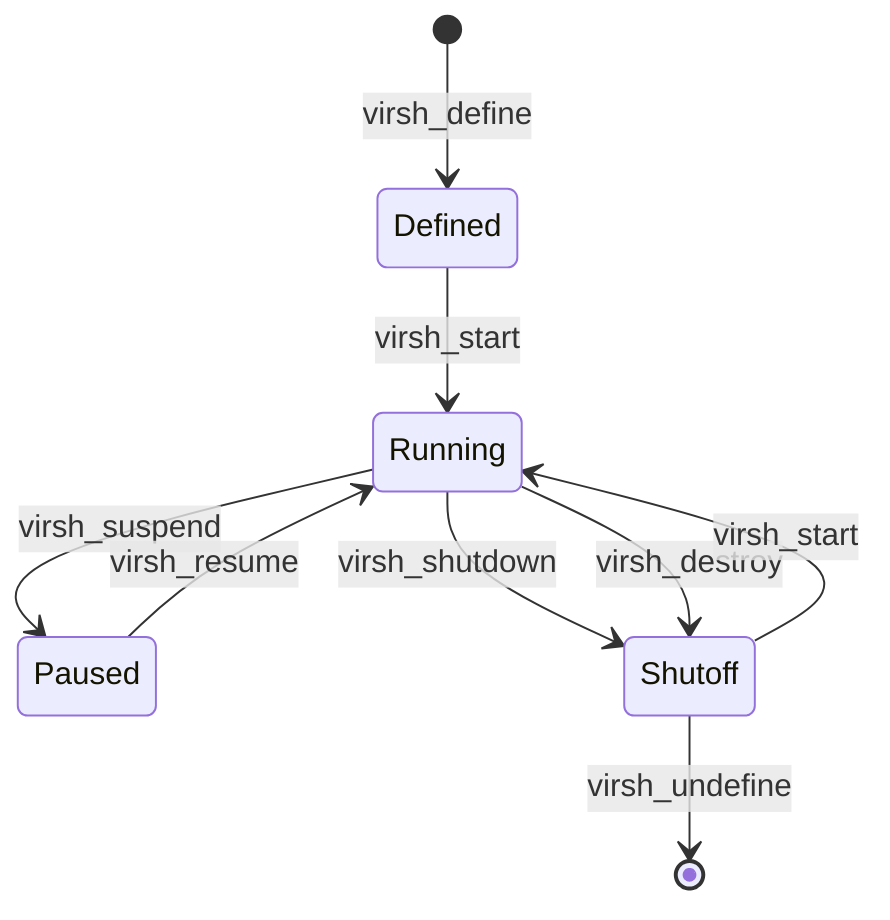

# Libvirt Tools

> aa_libvirt module for KVM/QEMU virtual machine management

## Diagram



## VM Lifecycle



## Components

| Component | File | Description |
|-----------|------|-------------|
| tools_basic.py | `tool_modules/aa_libvirt/src/` | All libvirt/virsh tools |

## Tool Summary

### Lifecycle Tools

| Tool | Description |
|------|-------------|
| `virsh_list` | List virtual machines |
| `virsh_start` | Start a VM |
| `virsh_shutdown` | Gracefully shutdown a VM |
| `virsh_destroy` | Force stop a VM |
| `virsh_reboot` | Reboot a VM |
| `virsh_suspend` | Suspend a VM |
| `virsh_resume` | Resume a suspended VM |
| `virsh_undefine` | Remove VM definition |

### Creation Tools

| Tool | Description |
|------|-------------|
| `virt_install` | Create a new VM |
| `virsh_define` | Define VM from XML |
| `virsh_clone` | Clone an existing VM |

### Info Tools

| Tool | Description |
|------|-------------|
| `virsh_dominfo` | Get VM information |
| `virsh_domstate` | Get VM state |
| `virsh_domblklist` | List VM block devices |
| `virsh_domiflist` | List VM network interfaces |
| `virsh_dumpxml` | Dump VM XML configuration |

### Snapshot Tools

| Tool | Description |
|------|-------------|
| `virsh_snapshot_create` | Create a VM snapshot |
| `virsh_snapshot_list` | List VM snapshots |
| `virsh_snapshot_revert` | Revert to a snapshot |
| `virsh_snapshot_delete` | Delete a snapshot |

## Usage Examples

```python
# List all VMs
result = await virsh_list()

# Start a VM
result = await virsh_start("my-vm")

# Create a snapshot
result = await virsh_snapshot_create("my-vm", "before-upgrade")

# Get VM info
result = await virsh_dominfo("my-vm")
```

## Related Diagrams

- [Kubernetes Tools](./k8s-tools.md)
- [Docker Tools](./container-tools.md)
