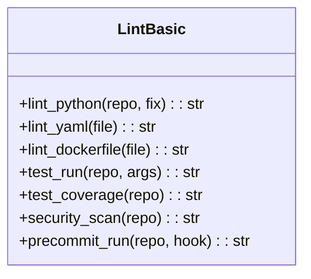
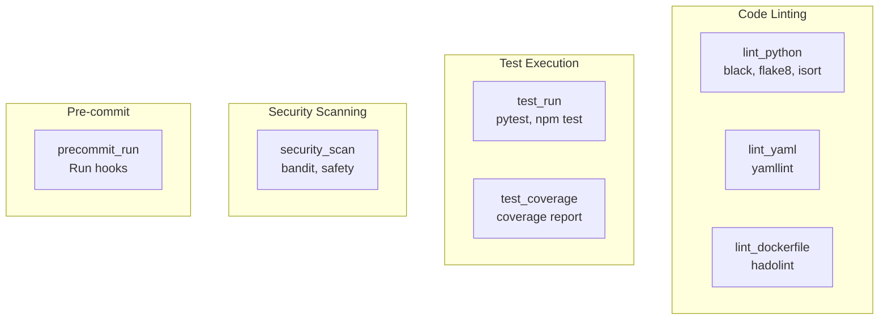
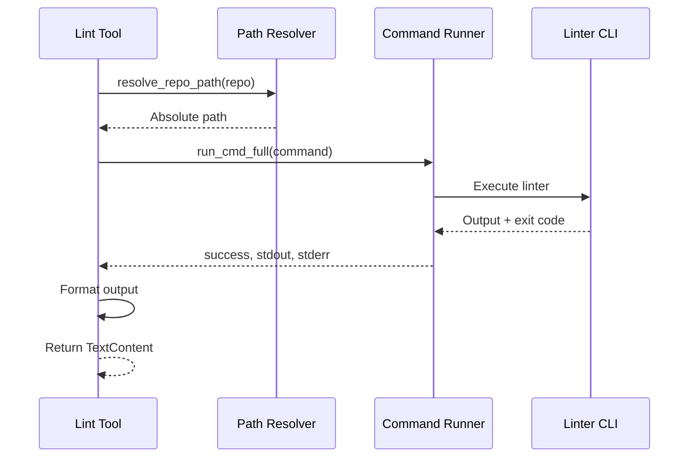

# Lint Tools

> aa_lint module for code quality, testing, and pre-commit hooks

## Diagram



## Tool Categories



## Components

| Component | File | Description |
|-----------|------|-------------|
| tools_basic.py | `tool_modules/aa_lint/src/` | All lint and test tools |

## Tool Summary

| Tool | Description | Commands Used |
|------|-------------|---------------|
| `lint_python` | Run Python linters | black, flake8, isort |
| `lint_yaml` | Validate YAML files | yamllint |
| `lint_dockerfile` | Lint Dockerfiles | hadolint |
| `test_run` | Run project tests | pytest, npm test |
| `test_coverage` | Get coverage report | pytest --cov |
| `security_scan` | Security scanning | bandit, safety |
| `precommit_run` | Run pre-commit hooks | pre-commit run |

## Execution Flow



## Configuration

Tools use project-level configuration from:

| File | Tool |
|------|------|
| `pyproject.toml` | black, isort, pytest |
| `.flake8` | flake8 |
| `.pre-commit-config.yaml` | pre-commit |
| `.yamllint` | yamllint |

## Usage Examples

```python
# Lint Python code (with auto-fix)
result = await lint_python("automation-analytics-backend", fix=True)

# Run tests
result = await test_run("automation-analytics-backend", args="-v -x")

# Run specific pre-commit hook
result = await precommit_run("myproject", hook="black")
```

## Related Diagrams

- [Tool Module Structure](./tool-module-structure.md)
- [Git Tools](./git-tools.md)
- [Development Skills](../04-skills/common-skills.md)
