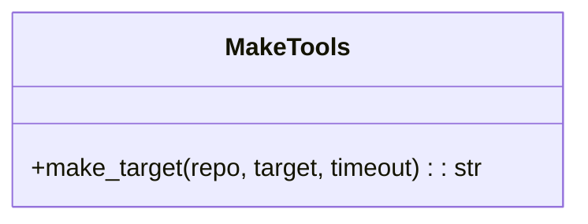

# Make Tools

> aa_make module for build automation with Make

## Diagram



## Components

| Component | File | Description |
|-----------|------|-------------|
| tools_basic.py | `tool_modules/aa_make/src/` | Make target execution |

## Tool Summary

| Tool | Description |
|------|-------------|
| `make_target` | Run a make target in a repository |

## Common Targets

| Target | Description |
|--------|-------------|
| `test` | Run tests |
| `lint` | Run linting |
| `build` | Build the project |
| `migrations` | Run database migrations |
| `data` | Load sample data |
| `clean` | Clean build artifacts |

## Usage Examples

```python
# Run tests
result = await make_target("automation-analytics-backend", "test")

# Run linting
result = await make_target("automation-analytics-backend", "lint")

# Build with timeout
result = await make_target("myproject", "build", timeout=300)
```

## Related Diagrams

- [Lint Tools](./lint-tools.md)
- [Dev Workflow Tools](./dev-workflow-tools.md)
