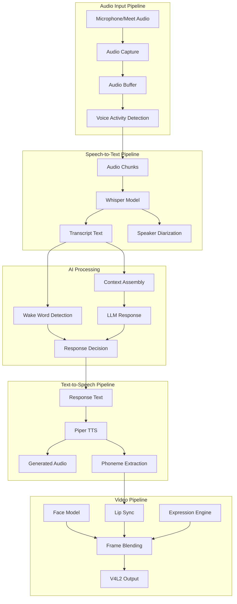
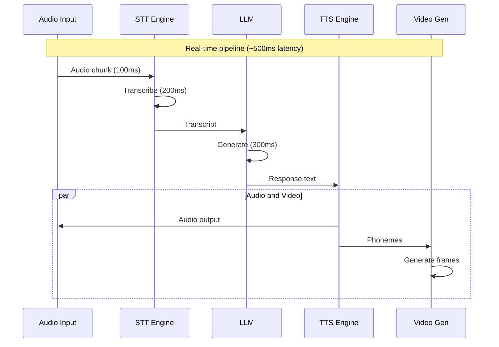
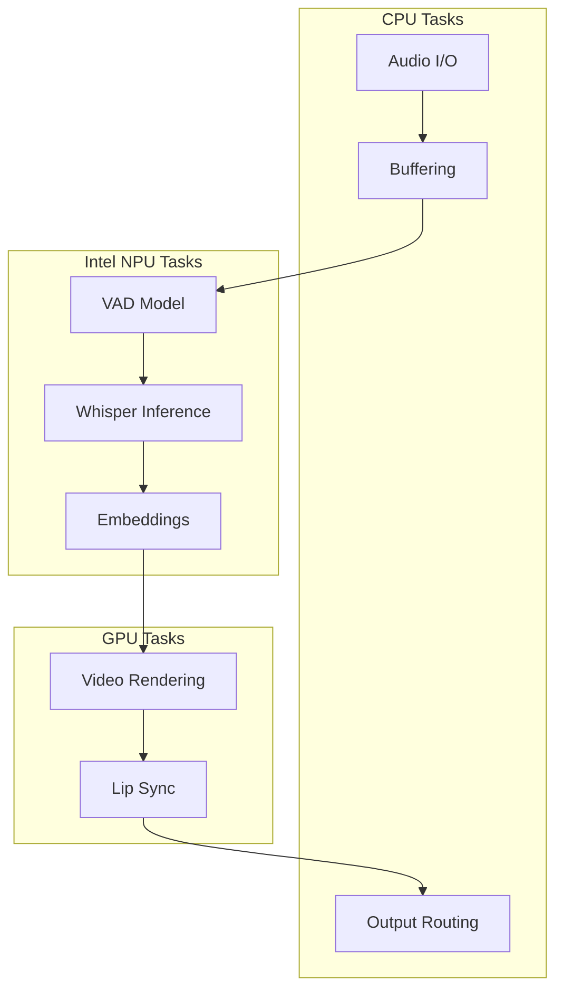

# Meet Bot Pipeline

> Audio/video processing pipeline for meeting bot

## Diagram



## Pipeline Timing



## Intel NPU Acceleration



## Components

| Component | File | Description |
|-----------|------|-------------|
| audio_capture | `audio_capture.py` | PulseAudio capture |
| stt_engine | `stt_engine.py` | Whisper inference |
| voice_pipeline | `voice_pipeline.py` | Full voice pipeline |
| intel_streaming | `intel_streaming.py` | NPU acceleration |
| video_generator | `video_generator.py` | Frame generation |
| virtual_devices | `virtual_devices.py` | V4L2/PulseAudio setup |

## Latency Budget

| Stage | Target | Description |
|-------|--------|-------------|
| Audio capture | 50ms | Buffer size |
| VAD | 20ms | Voice detection |
| STT | 200ms | Transcription |
| LLM | 300ms | Response generation |
| TTS | 100ms | Speech synthesis |
| Video | 33ms | Frame generation (30fps) |
| **Total** | **~700ms** | End-to-end |

## Configuration

```json
{
  "pipeline": {
    "audio": {
      "sample_rate": 16000,
      "chunk_size": 1600,
      "channels": 1
    },
    "stt": {
      "model": "whisper-base",
      "device": "npu"
    },
    "tts": {
      "model": "piper-lessac",
      "sample_rate": 22050
    },
    "video": {
      "fps": 30,
      "resolution": [1280, 720]
    }
  }
}
```

## Related Diagrams

- [Meet Bot Tools](./meet-bot-tools.md)
- [Meet Daemon](../02-services/meet-daemon.md)
- [Video Daemon](../02-services/video-daemon.md)
