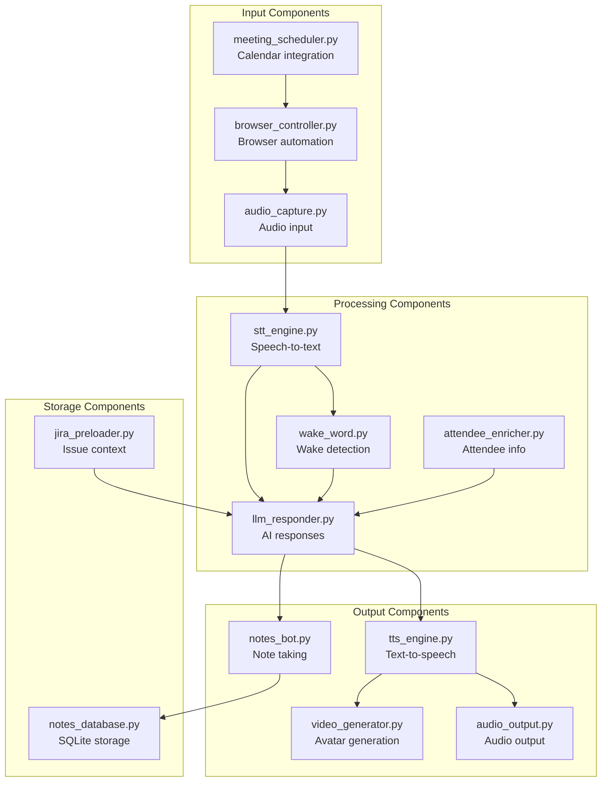
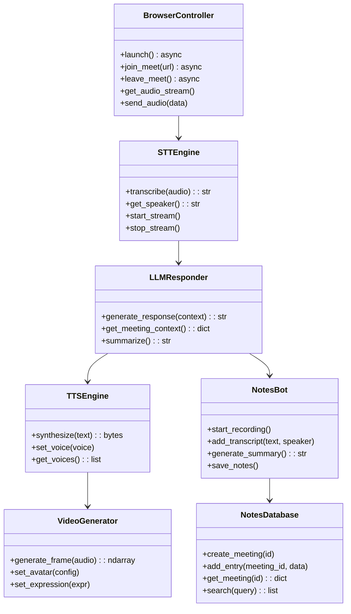

# Meet Bot Tools

> aa_meet_bot module components for meeting automation

## Diagram



## Component Classes



## Components

| Component | File | Description |
|-----------|------|-------------|
| browser_controller | `browser_controller.py` | Selenium/Playwright automation |
| stt_engine | `stt_engine.py` | Whisper/Google STT |
| llm_responder | `llm_responder.py` | Claude/Gemini responses |
| tts_engine | `tts_engine.py` | Text-to-speech synthesis |
| video_generator | `video_generator.py` | Avatar frame generation |
| notes_bot | `notes_bot.py` | Meeting note capture |
| notes_database | `notes_database.py` | SQLite storage |
| wake_word | `wake_word.py` | Wake word detection |
| attendee_enricher | `attendee_enricher.py` | Attendee info lookup |
| jira_preloader | `jira_preloader.py` | Jira context loading |

## MCP Tools

| Tool | Description |
|------|-------------|
| `meet_join` | Join a meeting |
| `meet_leave` | Leave current meeting |
| `meet_get_transcript` | Get current transcript |
| `meet_summarize` | Generate summary |
| `meet_search_notes` | Search past notes |

## Configuration

```json
{
  "meet_bot": {
    "stt": {
      "engine": "whisper",
      "model": "base"
    },
    "tts": {
      "engine": "piper",
      "voice": "en_US-lessac-medium"
    },
    "llm": {
      "provider": "gemini",
      "model": "gemini-pro"
    },
    "avatar": {
      "enabled": true,
      "model": "default"
    },
    "wake_word": "hey assistant"
  }
}
```

## Related Diagrams

- [Meet Bot Pipeline](./meet-bot-pipeline.md)
- [Meet Daemon](../02-services/meet-daemon.md)
- [Video Daemon](../02-services/video-daemon.md)
