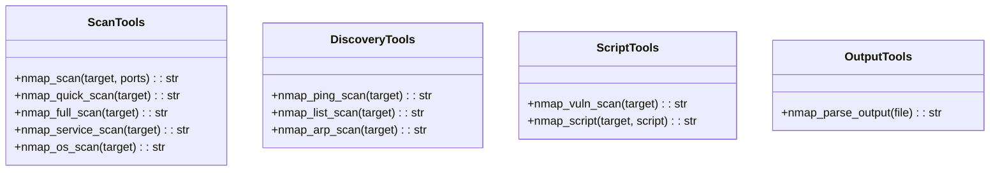
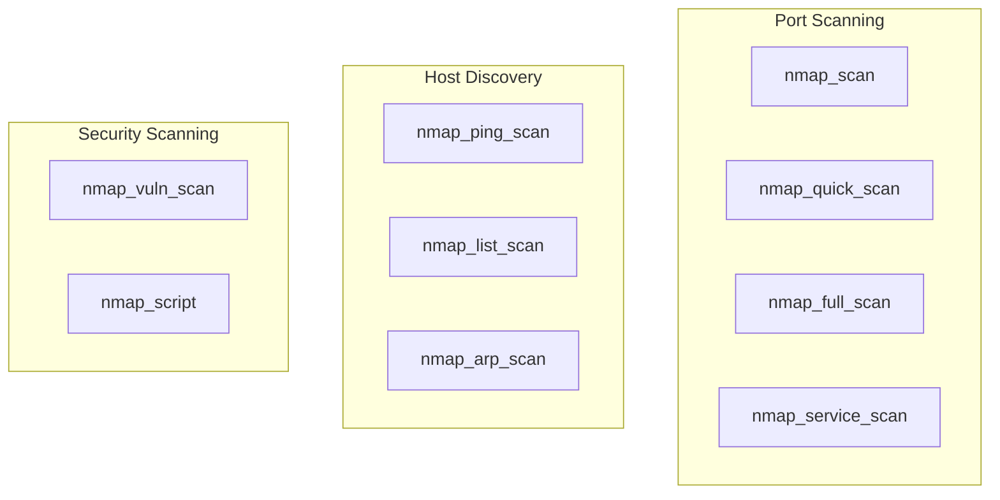

# Nmap Tools

> aa_nmap module for network scanning and security auditing

## Diagram



## Tool Categories



## Components

| Component | File | Description |
|-----------|------|-------------|
| tools_basic.py | `tool_modules/aa_nmap/src/` | All nmap tools |

## Tool Summary

### Scan Tools

| Tool | Description |
|------|-------------|
| `nmap_scan` | Basic port scan |
| `nmap_quick_scan` | Quick scan (top 100 ports) |
| `nmap_full_scan` | Full port scan (all 65535) |
| `nmap_service_scan` | Service/version detection |
| `nmap_os_scan` | OS detection |

### Discovery Tools

| Tool | Description |
|------|-------------|
| `nmap_ping_scan` | Host discovery (ping scan) |
| `nmap_list_scan` | List targets without scanning |
| `nmap_arp_scan` | ARP discovery (local network) |

### Script Tools

| Tool | Description |
|------|-------------|
| `nmap_vuln_scan` | Vulnerability scan |
| `nmap_script` | Run specific NSE script |

## Usage Examples

```python
# Quick port scan
result = await nmap_quick_scan("192.168.1.1")

# Service detection
result = await nmap_service_scan("example.com")

# Vulnerability scan
result = await nmap_vuln_scan("192.168.1.0/24")

# Run specific script
result = await nmap_script("example.com", "http-headers")
```

## Related Diagrams

- [SSH Tools](./ssh-tools.md)
- [OpenSSL Tools](./openssl-tools.md)
