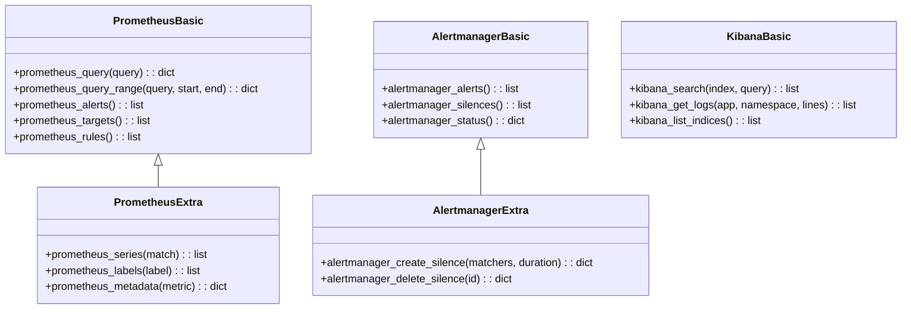
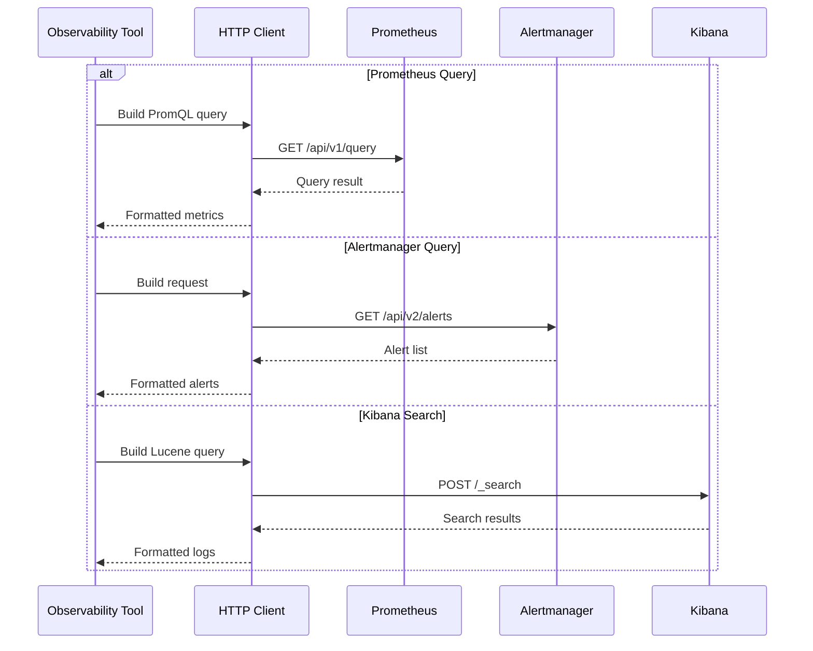
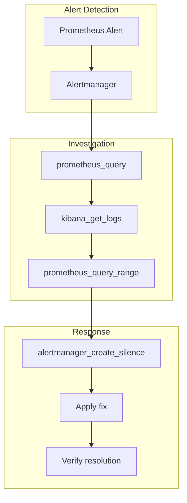

# Observability Tools

> Prometheus, Alertmanager, and Kibana integration modules

## Diagram



## Query Flow



## Components

| Module | File | Description |
|--------|------|-------------|
| aa_prometheus | `tool_modules/aa_prometheus/` | Prometheus queries |
| aa_alertmanager | `tool_modules/aa_alertmanager/` | Alert management |
| aa_kibana | `tool_modules/aa_kibana/` | Log search |

## Tool Summary

| Tool | Module | Description |
|------|--------|-------------|
| `prometheus_query` | prometheus | Execute PromQL query |
| `prometheus_alerts` | prometheus | Get firing alerts |
| `alertmanager_alerts` | alertmanager | List alerts |
| `alertmanager_create_silence` | alertmanager | Create silence |
| `kibana_search` | kibana | Search logs |
| `kibana_get_logs` | kibana | Get app logs |

## PromQL Examples

```promql
# CPU usage by pod
sum(rate(container_cpu_usage_seconds_total{namespace="tower-analytics-stage"}[5m])) by (pod)

# Memory usage
container_memory_usage_bytes{namespace="tower-analytics-stage"}

# Request rate
sum(rate(http_requests_total{namespace="tower-analytics-stage"}[5m]))

# Error rate
sum(rate(http_requests_total{status=~"5.."}[5m])) / sum(rate(http_requests_total[5m]))
```

## Configuration

```json
{
  "observability": {
    "prometheus": {
      "url": "https://prometheus.example.com",
      "token_env": "PROMETHEUS_TOKEN"
    },
    "alertmanager": {
      "url": "https://alertmanager.example.com"
    },
    "kibana": {
      "url": "https://kibana.example.com",
      "index_pattern": "app-*"
    }
  }
}
```

## Incident Response Flow



## Related Diagrams

- [Tool Module Structure](./tool-module-structure.md)
- [Incident Response Flow](../08-data-flows/incident-response.md)
- [Auto-Heal Decorator](../01-server/auto-heal-decorator.md)
