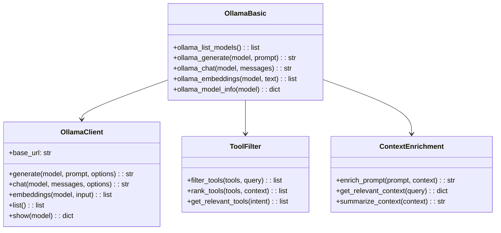
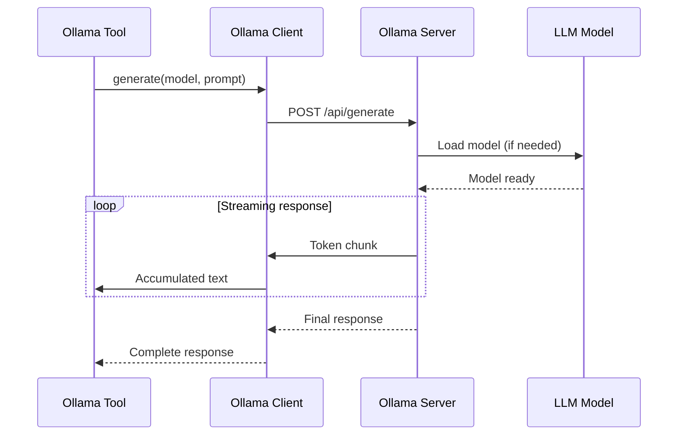
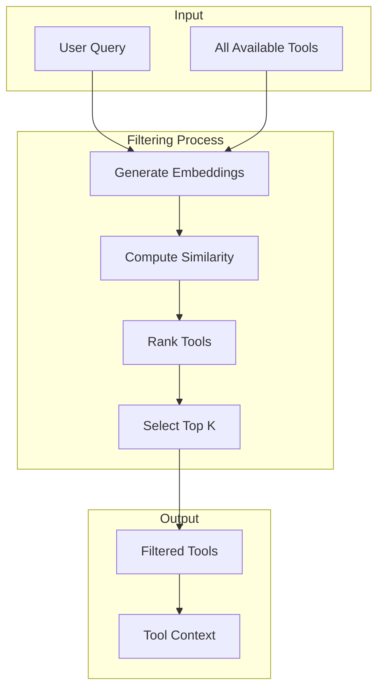
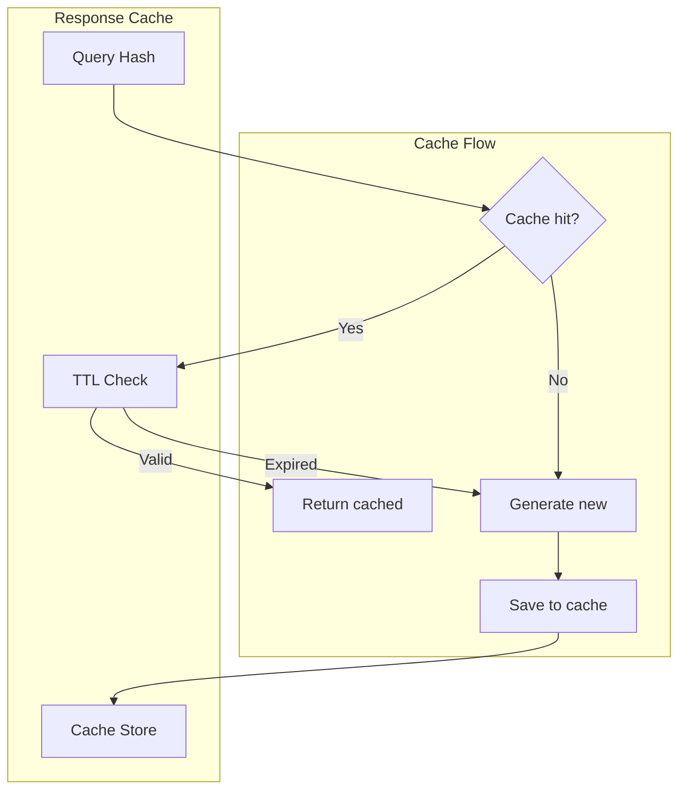

# Ollama Tools

> aa_ollama module for local LLM inference

## Diagram



## Inference Flow



## Components

| Component | File | Description |
|-----------|------|-------------|
| tools_basic.py | `tool_modules/aa_ollama/src/` | Ollama operations |
| client.py | `tool_modules/aa_ollama/src/` | HTTP client |
| tool_filter.py | `tool_modules/aa_ollama/src/` | Tool filtering |
| context_enrichment.py | `tool_modules/aa_ollama/src/` | Context building |
| cache.py | `tool_modules/aa_ollama/src/` | Response caching |
| categories.py | `tool_modules/aa_ollama/src/` | Tool categorization |

## Tool Summary

| Tool | Description |
|------|-------------|
| `ollama_list_models` | List available models |
| `ollama_generate` | Generate text completion |
| `ollama_chat` | Chat completion |
| `ollama_embeddings` | Generate embeddings |
| `ollama_model_info` | Get model details |

## Tool Filtering



## Configuration

```json
{
  "ollama": {
    "base_url": "http://localhost:11434",
    "default_model": "llama3.2",
    "embedding_model": "nomic-embed-text",
    "timeout": 120,
    "options": {
      "temperature": 0.7,
      "num_ctx": 4096
    }
  }
}
```

## Model Selection

| Model | Use Case | Size |
|-------|----------|------|
| llama3.2 | General tasks | 3B |
| codellama | Code generation | 7B |
| nomic-embed-text | Embeddings | 137M |
| mistral | Complex reasoning | 7B |

## Caching Strategy



## Related Diagrams

- [Tool Module Structure](./tool-module-structure.md)
- [Code Search Tools](./code-search-tools.md)
- [Memory Abstraction](../06-memory/memory-abstraction.md)
