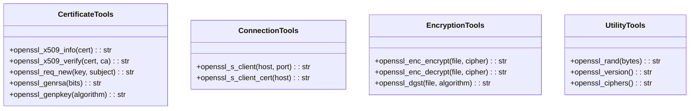
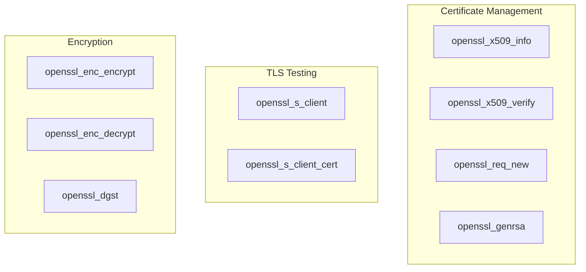

# OpenSSL Tools

> aa_openssl module for cryptography and certificate management

## Diagram



## Tool Categories



## Components

| Component | File | Description |
|-----------|------|-------------|
| tools_basic.py | `tool_modules/aa_openssl/src/` | All OpenSSL tools |

## Tool Summary

### Certificate Tools

| Tool | Description |
|------|-------------|
| `openssl_x509_info` | View certificate information |
| `openssl_x509_verify` | Verify certificate chain |
| `openssl_req_new` | Generate certificate signing request |
| `openssl_genrsa` | Generate RSA private key |
| `openssl_genpkey` | Generate private key (various algorithms) |

### Connection Tools

| Tool | Description |
|------|-------------|
| `openssl_s_client` | Test SSL/TLS connection |
| `openssl_s_client_cert` | Get server certificate |

### Encryption Tools

| Tool | Description |
|------|-------------|
| `openssl_enc_encrypt` | Encrypt file |
| `openssl_enc_decrypt` | Decrypt file |
| `openssl_dgst` | Generate hash/digest |

### Utility Tools

| Tool | Description |
|------|-------------|
| `openssl_rand` | Generate random data |
| `openssl_version` | Show OpenSSL version |
| `openssl_ciphers` | List available ciphers |

## Usage Examples

```python
# View certificate info
result = await openssl_x509_info("/path/to/cert.pem")

# Test TLS connection
result = await openssl_s_client("example.com", 443)

# Generate RSA key
result = await openssl_genrsa(4096)

# Generate SHA256 hash
result = await openssl_dgst("file.txt", "sha256")
```

## Related Diagrams

- [SSH Tools](./ssh-tools.md)
- [Kubernetes Tools](./k8s-tools.md)
