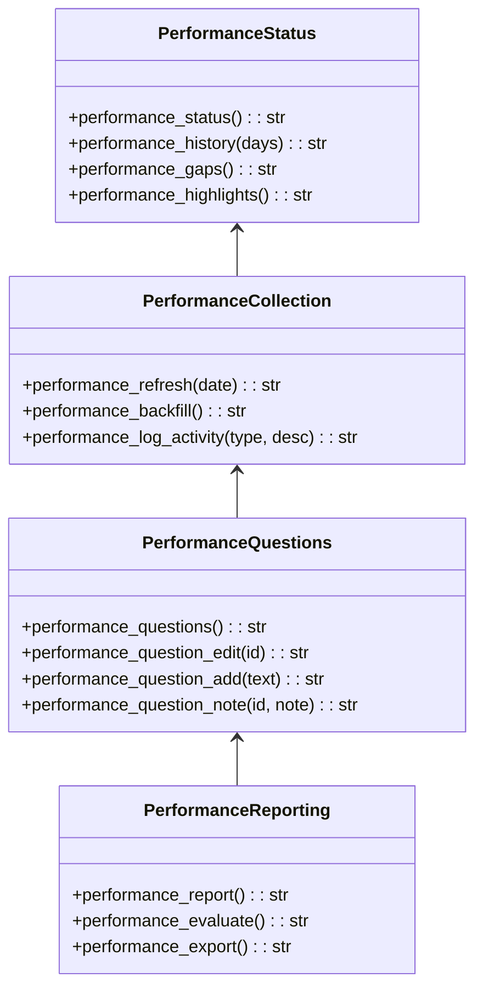
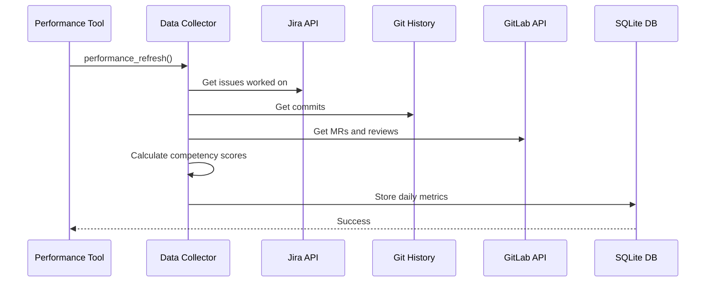
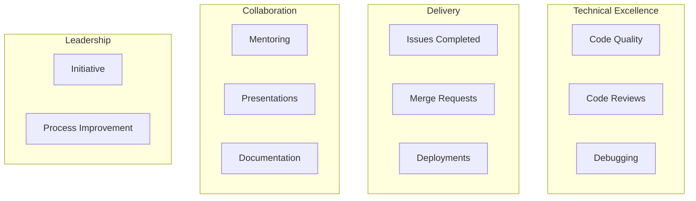

# Performance Tools

> aa_performance module for PSE competency tracking and evaluation

## Diagram



## Data Collection Flow



## Components

| Component | File | Description |
|-----------|------|-------------|
| tools_basic.py | `tool_modules/aa_performance/src/` | All performance tracking tools |

## Tool Summary

### Status & History

| Tool | Description |
|------|-------------|
| `performance_status` | Current quarter progress and scores |
| `performance_history` | Daily scores history |
| `performance_gaps` | Competencies needing attention |
| `performance_highlights` | Notable achievements |

### Data Collection

| Tool | Description |
|------|-------------|
| `performance_refresh` | Collect data for today or specific date |
| `performance_backfill` | Find and fill missing days |
| `performance_log_activity` | Manual entry for presentations, mentoring, etc. |

### Questions Management

| Tool | Description |
|------|-------------|
| `performance_questions` | List quarterly questions |
| `performance_question_edit` | Edit a question |
| `performance_question_add` | Add custom question |
| `performance_question_note` | Add manual note to question |

### Reporting

| Tool | Description |
|------|-------------|
| `performance_report` | Generate performance report |
| `performance_evaluate` | LLM evaluation of questions |
| `performance_export` | Export quarterly report |

## PSE Competencies Tracked



## Data Storage

Performance data is stored in SQLite:

```
~/.config/aa-workflow/performance/
├── metrics.db          # Daily metrics database
├── questions.json      # Quarterly questions
└── activities.json     # Manual activity log
```

## Usage Examples

```python
# Check current status
result = await performance_status()

# Refresh today's data
result = await performance_refresh()

# Backfill missing days
result = await performance_backfill()

# Log a presentation
result = await performance_log_activity("presentation", "Team tech talk on MCP")

# Generate quarterly report
result = await performance_export()
```

## Related Diagrams

- [Jira Tools](./jira-tools.md)
- [GitLab Tools](./gitlab-tools.md)
- [Workflow Tools](./workflow-tools.md)
