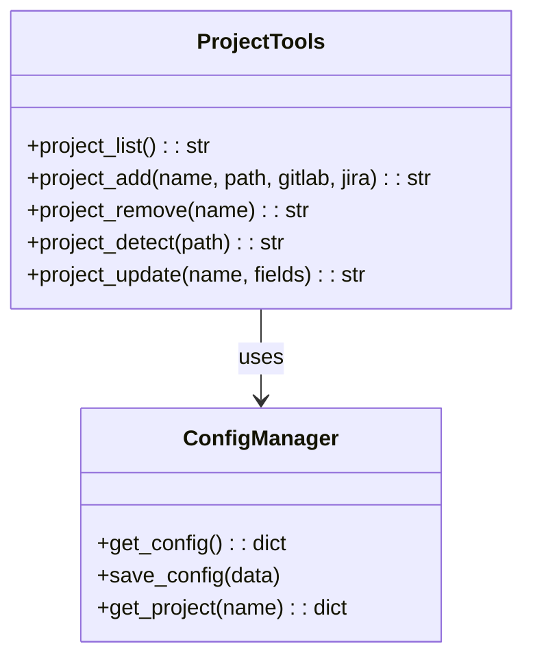
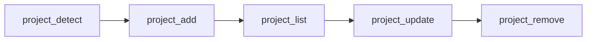

# Project Tools

> aa_project module for managing projects in config.json

## Diagram



## Project Workflow



## Components

| Component | File | Description |
|-----------|------|-------------|
| tools_basic.py | `tool_modules/aa_project/src/` | Project management tools |
| config_manager | `server/config_manager.py` | Config file management |

## Tool Summary

| Tool | Description |
|------|-------------|
| `project_list` | List all configured projects |
| `project_add` | Add a new project to config.json |
| `project_remove` | Remove a project from config.json |
| `project_detect` | Auto-detect project settings from a directory |
| `project_update` | Update an existing project's settings |

## Project Configuration

Each project in config.json has these fields:

```json
{
  "projects": {
    "automation-analytics-backend": {
      "path": "/home/user/src/automation-analytics-backend",
      "gitlab": "automation-analytics/automation-analytics-backend",
      "jira_project": "AAP",
      "jira_component": "automation-analytics",
      "default_branch": "main",
      "lint_command": "make lint",
      "test_command": "make test",
      "konflux_namespace": "aa-backend-tenant"
    }
  }
}
```

## Auto-Detection

`project_detect` scans a directory to detect:

| Detected From | Settings |
|---------------|----------|
| `.git/config` | GitLab remote URL |
| `pyproject.toml` | Python project info |
| `package.json` | Node.js project info |
| Directory structure | Commit scopes |
| Branch name | Default branch |

## Usage Examples

```python
# List all projects
result = await project_list()

# Auto-detect and add a project
settings = await project_detect("/home/user/src/new-project")
result = await project_add(
    name="new-project",
    path="/home/user/src/new-project",
    gitlab="org/new-project",
    jira_project="PROJ"
)

# Update a project
result = await project_update("new-project", lint_command="make lint")

# Remove a project
result = await project_remove("old-project")
```

## Related Diagrams

- [Config System](../01-server/config-system.md)
- [Persona Loader](../01-server/persona-loader.md)
