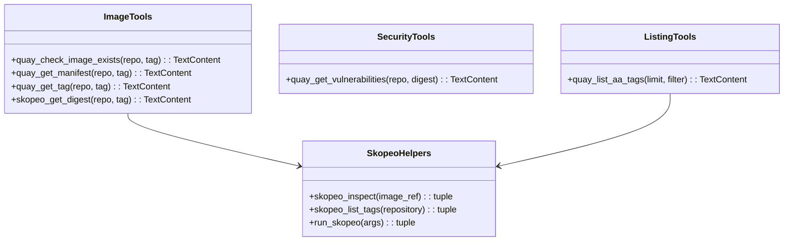
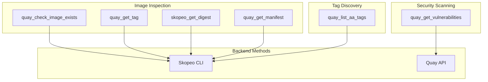

# Quay Tools

> aa_quay module for Quay.io container image management

## Diagram



## Tool Flow



## Components

| Component | File | Description |
|-----------|------|-------------|
| tools_basic.py | `tool_modules/aa_quay/src/` | Quay/Skopeo tools |

## Tool Summary

### Image Tools

| Tool | Description |
|------|-------------|
| `quay_check_image_exists` | Check if a specific image tag or digest exists |
| `quay_get_manifest` | Get manifest details for an image |
| `quay_get_tag` | Get tag details including sha256 digest |
| `skopeo_get_digest` | Get sha256 digest for bonfire deploy |

### Security Tools

| Tool | Description |
|------|-------------|
| `quay_get_vulnerabilities` | Get security vulnerabilities for an image |

### Listing Tools

| Tool | Description |
|------|-------------|
| `quay_list_aa_tags` | List recent tags for Automation Analytics image |

## Usage Examples

```python
# Check if image exists before deploy
result = await quay_check_image_exists(
    "aap-aa-tenant/aap-aa-main/automation-analytics-backend-main",
    "abc123def456"
)

# Get digest for bonfire deploy
result = await skopeo_get_digest(
    "aap-aa-tenant/aap-aa-main/automation-analytics-backend-main",
    "abc123def456789"  # 40-char git SHA
)

# Check vulnerabilities
result = await quay_get_vulnerabilities(
    "my-repo",
    "sha256:abc123..."
)

# List AA image tags
result = await quay_list_aa_tags(limit=20)
```

## Configuration

Configuration in `config.json`:
```json
{
  "quay": {
    "api_url": "https://quay.io/api/v1",
    "default_namespace": "redhat-user-workloads"
  }
}
```

Authentication:
- **Skopeo tools**: Use `podman login quay.io` or `docker login quay.io`
- **API tools**: Set `QUAY_TOKEN` environment variable

## Integration with Bonfire

The `skopeo_get_digest` tool is specifically designed for bonfire deployments:

```python
# Get the IMAGE_TAG value for bonfire
result = await skopeo_get_digest(
    "aap-aa-tenant/aap-aa-main/automation-analytics-backend-main",
    "abc123"  # Git commit SHA
)
# Returns: 64-char sha256 hash (without 'sha256:' prefix)
```

## Related Diagrams

- [Bonfire Tools](./bonfire-tools.md)
- [Konflux Tools](./konflux-tools.md)
- [Container Tools](./container-tools.md)
