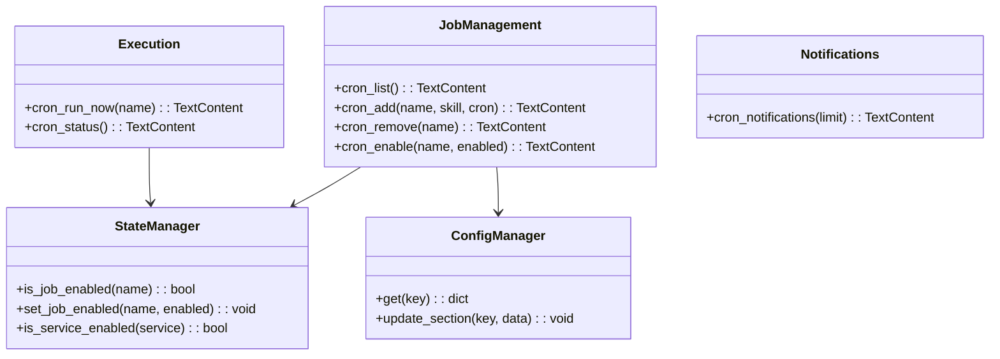
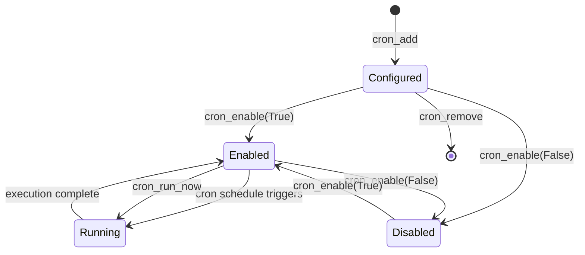

# Scheduler Tools

> aa_scheduler module for managing scheduled jobs and cron tasks

## Diagram



## Job Lifecycle



## Components

| Component | File | Description |
|-----------|------|-------------|
| tools_basic.py | `tool_modules/aa_scheduler/src/` | Job management tools |
| scheduler.py | `tool_modules/aa_scheduler/src/` | Scheduler engine |
| notification_engine.py | `tool_modules/aa_scheduler/src/` | Notification handling |

## Tool Summary

### Job Management

| Tool | Description |
|------|-------------|
| `cron_list` | List all scheduled jobs with next run time |
| `cron_add` | Add a new scheduled job |
| `cron_remove` | Remove a scheduled job |
| `cron_enable` | Enable or disable a job |

### Execution

| Tool | Description |
|------|-------------|
| `cron_run_now` | Manually trigger a scheduled job |
| `cron_status` | Show scheduler status and recent executions |

### Notifications

| Tool | Description |
|------|-------------|
| `cron_notifications` | Show recent notifications from scheduled jobs |

## Usage Examples

```python
# List all scheduled jobs
result = await cron_list()

# Add a morning coffee job (8:30 AM weekdays)
result = await cron_add(
    name="morning_coffee",
    skill="coffee",
    cron="30 8 * * 1-5",
    notify="slack,desktop"
)

# Add an evening beer job (5:30 PM weekdays)
result = await cron_add(
    name="evening_beer",
    skill="beer",
    cron="30 17 * * 1-5",
    notify="slack"
)

# Add a poll-based job (check for stale PRs hourly)
result = await cron_add(
    name="stale_prs",
    skill="pr_reminder",
    poll_interval="1h",
    poll_condition="gitlab_stale_prs"
)

# Disable a job temporarily
result = await cron_enable("morning_coffee", enabled=False)

# Run a job immediately
result = await cron_run_now("coffee")

# Check scheduler status
result = await cron_status()
```

## Configuration

Jobs are defined in `config.json` under `schedules`:

```json
{
  "schedules": {
    "timezone": "UTC",
    "jobs": [
      {
        "name": "morning_coffee",
        "skill": "coffee",
        "cron": "30 8 * * 1-5",
        "notify": ["slack", "desktop"]
      },
      {
        "name": "stale_prs",
        "skill": "pr_reminder",
        "trigger": "poll",
        "poll_interval": "1h",
        "condition": "gitlab_stale_prs"
      }
    ]
  }
}
```

Job enabled state is stored separately in `state.json`.

## Job Types

### Cron-based Jobs
Use standard cron expressions:
- `30 8 * * 1-5` - 8:30 AM on weekdays
- `0 9 * * *` - 9:00 AM daily
- `0 */4 * * *` - Every 4 hours

### Poll-based Jobs
Check conditions periodically:
- `poll_interval`: How often to check (e.g., "1h", "30m")
- `condition`: Name of the condition to check

## Related Diagrams

- [Skill Engine](../04-skills/skill-engine.md)
- [Notification Flow](../02-services/notification-flow.md)
