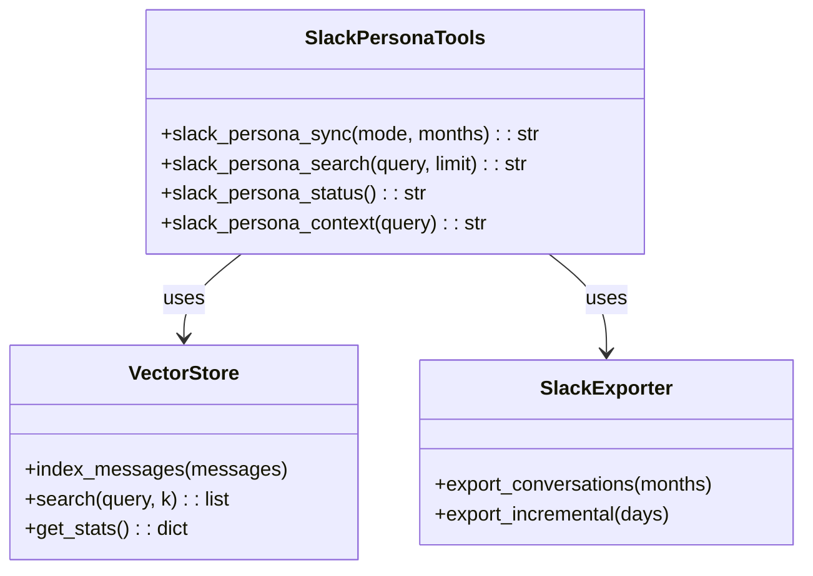
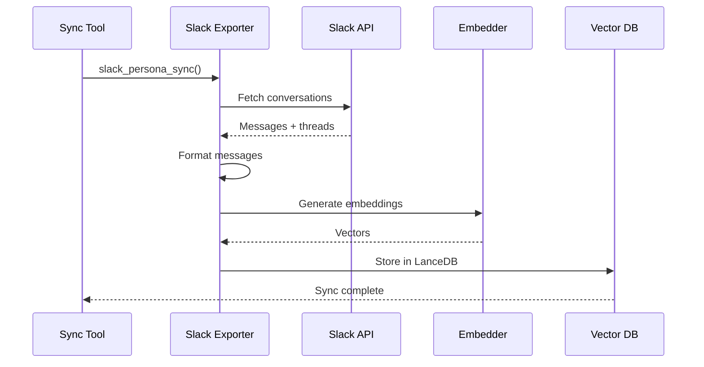

# Slack Persona Tools

> aa_slack_persona module for Slack conversation vector search and persona context

## Diagram



## Sync Flow



## Components

| Component | File | Description |
|-----------|------|-------------|
| tools_basic.py | `tool_modules/aa_slack_persona/src/` | MCP tool definitions |
| sync.py | `tool_modules/aa_slack_persona/src/` | Sync implementation |

## Tool Summary

| Tool | Description |
|------|-------------|
| `slack_persona_sync` | Full or incremental sync of Slack conversations |
| `slack_persona_search` | Semantic search across past conversations |
| `slack_persona_status` | Get current sync status and stats |
| `slack_persona_context` | Get context for a query (persona injection) |

## Sync Modes

| Mode | Description |
|------|-------------|
| `incremental` | Sync only recent messages (last N days) |
| `full` | Full sync of all conversations (last N months) |

## Usage Examples

```python
# Incremental sync (last day)
result = await slack_persona_sync(mode="incremental", days=1)

# Full sync (last 12 months)
result = await slack_persona_sync(mode="full", months=12)

# Search conversations
result = await slack_persona_search("RDS configuration issues", limit=5)

# Get context for persona response
result = await slack_persona_context("How do I configure alerts?")
```

## Vector Storage

Conversations are stored in LanceDB for semantic search:

```
~/.config/aa-workflow/vectors/slack_persona/
├── data/           # LanceDB data files
└── metadata.json   # Sync metadata
```

## Related Diagrams

- [Slack Tools](./slack-tools.md)
- [Code Search Tools](./code-search-tools.md)
- [Memory Architecture](../06-memory/memory-architecture.md)
