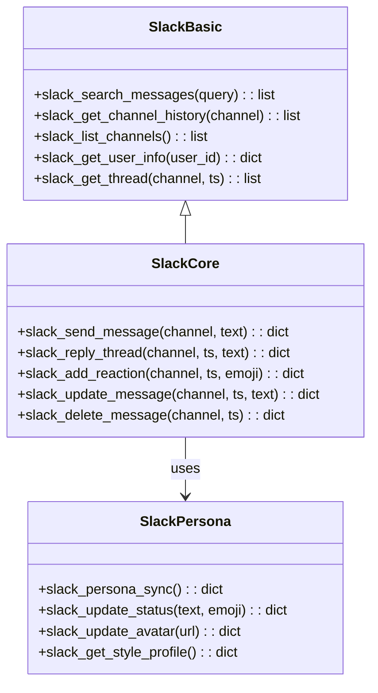
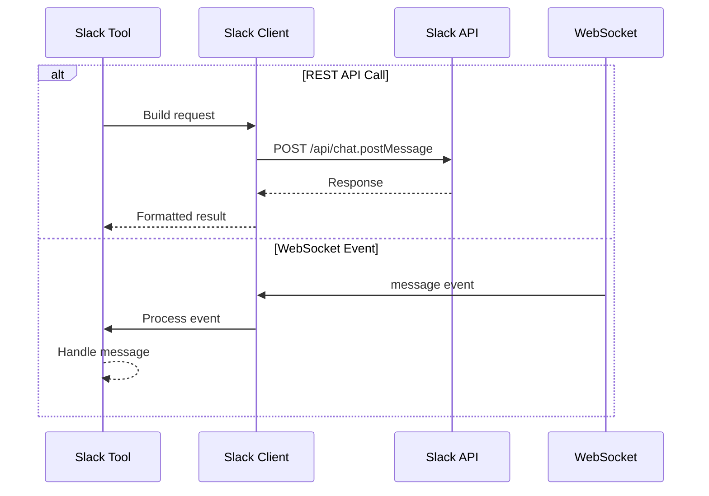
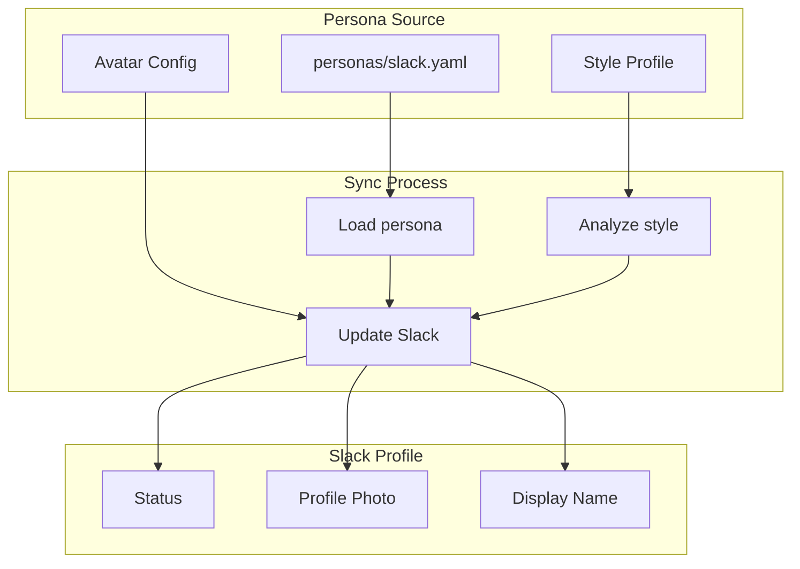

# Slack Tools

> aa_slack and aa_slack_persona modules for Slack integration

## Diagram



## Message Flow



## Components

| Component | File | Description |
|-----------|------|-------------|
| tools_basic.py | `tool_modules/aa_slack/src/` | Read operations |
| tools_core.py | `tool_modules/aa_slack/src/` | Write operations |
| sync.py | `tool_modules/aa_slack_persona/src/` | Persona sync |
| adapter.py | `tool_modules/aa_slack_persona/src/` | Memory adapter |

## Tool Summary

| Tool | Module | Description |
|------|--------|-------------|
| `slack_search_messages` | aa_slack | Search messages |
| `slack_get_channel_history` | aa_slack | Get channel history |
| `slack_send_message` | aa_slack | Send message |
| `slack_reply_thread` | aa_slack | Reply in thread |
| `slack_persona_sync` | aa_slack_persona | Sync persona to Slack |
| `slack_update_status` | aa_slack_persona | Update status |

## Persona Sync



## Configuration

```json
{
  "slack": {
    "workspace": "redhat",
    "bot_token_env": "SLACK_BOT_TOKEN",
    "user_token_env": "SLACK_USER_TOKEN",
    "default_channel": "#ai-workflow"
  }
}
```

## Related Diagrams

- [Tool Module Structure](./tool-module-structure.md)
- [Slack Integration](../07-integrations/slack-integration.md)
- [Slack Daemon](../02-services/slack-daemon.md)
