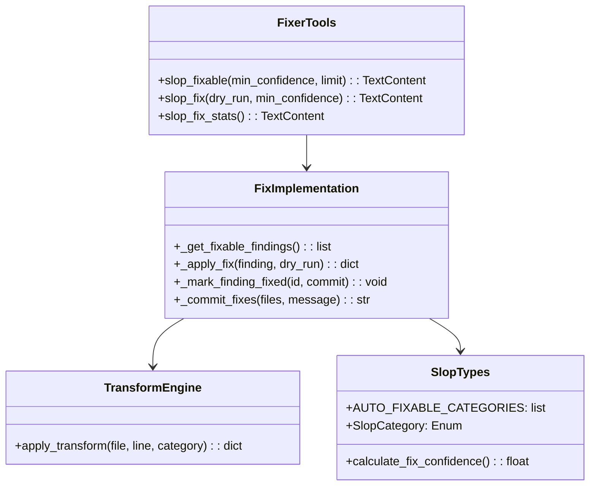
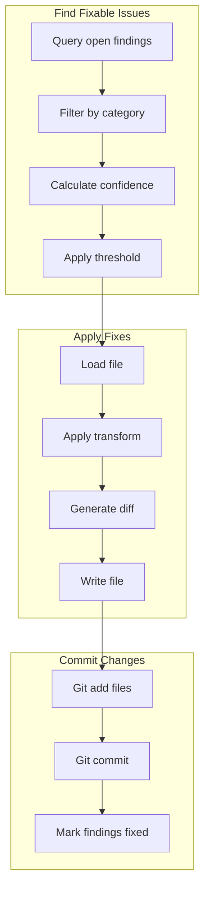

# Slop Fixer Tools

> aa_slop_fixer module for auto-fixing high-confidence code quality issues

## Diagram



## Fix Workflow



## Components

| Component | File | Description |
|-----------|------|-------------|
| tools_basic.py | `tool_modules/aa_slop_fixer/src/` | Fixer MCP tools |
| transforms.py | `tool_modules/aa_slop_fixer/src/` | Code transformation logic |
| types.py | `services/slop/` | Slop category definitions |

## Tool Summary

| Tool | Description |
|------|-------------|
| `slop_fixable` | List slop findings that can be auto-fixed |
| `slop_fix` | Auto-fix high-confidence slop findings |
| `slop_fix_stats` | Show statistics about findings and fixes |

## Auto-Fixable Categories

The fixer only handles deterministic, safe fixes:

| Category | Fix Action |
|----------|------------|
| `unused_imports` | Remove the import line |
| `unused_variables` | Remove or prefix with `_` |
| `bare_except` | Change to `except Exception:` |
| `empty_except` | Add `logger.exception()` |

## Usage Examples

```python
# List what can be fixed (90%+ confidence)
result = await slop_fixable(min_confidence=0.90)

# Preview fixes without applying (dry run)
result = await slop_fix(dry_run=True)

# Apply fixes with auto-commit
result = await slop_fix(commit=True)

# Fix with lower confidence threshold
result = await slop_fix(min_confidence=0.80, limit=10)

# View fix statistics
result = await slop_fix_stats()
```

## Confidence Scoring

Fixes are only applied when confidence meets the threshold:

```python
# From services/slop/types.py
def calculate_fix_confidence(category: SlopCategory, tool: str) -> float:
    """Calculate confidence score for a fix."""
    # Higher confidence for static analysis tools
    if tool in ["ruff", "mypy", "pylint"]:
        return 0.95
    # Lower confidence for LLM-detected issues
    if tool == "LLM":
        return 0.75
    return 0.85
```

## Database

Findings are stored in SQLite at `~/.config/aa-workflow/slop.db`:

| Column | Description |
|--------|-------------|
| `id` | Finding UUID |
| `loop` | Loop name (e.g., "slop") |
| `file` | File path |
| `line` | Line number |
| `category` | Issue category |
| `severity` | critical/high/medium/low |
| `status` | open/fixed/ignored |
| `detected_at` | Detection timestamp |
| `fixed_at` | Fix timestamp |
| `git_commit` | Commit that fixed it |

## Git Integration

When `commit=True`, fixes are automatically committed:

```
fix(slop): auto-fix 5 high-confidence issues

Categories fixed:
- unused_imports: 3
- bare_except: 2
```

## Related Diagrams

- [Slop Daemon](../02-services/slop-daemon.md)
- [Lint Tools](./lint-tools.md)
