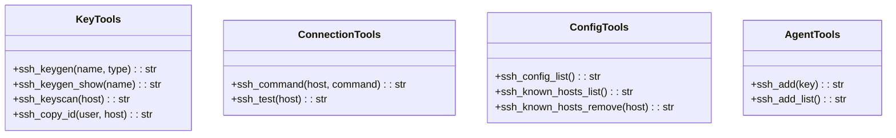
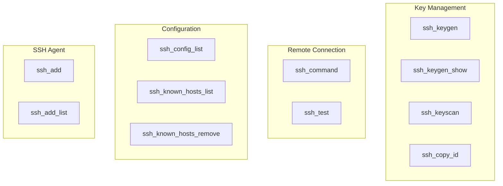

# SSH Tools

> aa_ssh module for SSH key management and remote connections

## Diagram



## Tool Categories



## Components

| Component | File | Description |
|-----------|------|-------------|
| tools_basic.py | `tool_modules/aa_ssh/src/` | All SSH tools |

## Tool Summary

### Key Tools

| Tool | Description |
|------|-------------|
| `ssh_keygen` | Generate SSH key pair |
| `ssh_keygen_show` | Show public key |
| `ssh_keyscan` | Scan host for SSH keys |
| `ssh_copy_id` | Copy public key to remote host |

### Connection Tools

| Tool | Description |
|------|-------------|
| `ssh_command` | Execute command on remote host |
| `ssh_test` | Test SSH connection |

### Config Tools

| Tool | Description |
|------|-------------|
| `ssh_config_list` | List SSH config hosts |
| `ssh_known_hosts_list` | List known hosts |
| `ssh_known_hosts_remove` | Remove host from known_hosts |

### Agent Tools

| Tool | Description |
|------|-------------|
| `ssh_add` | Add key to SSH agent |
| `ssh_add_list` | List keys in SSH agent |

## Usage Examples

```python
# Generate a new SSH key
result = await ssh_keygen("my_key", type="ed25519")

# Show public key
result = await ssh_keygen_show("my_key")

# Test connection
result = await ssh_test("server.example.com")

# Execute remote command
result = await ssh_command("server.example.com", "uptime")

# List configured hosts
result = await ssh_config_list()
```

## Key Paths

| Path | Description |
|------|-------------|
| `~/.ssh/id_ed25519` | Default ED25519 key |
| `~/.ssh/id_rsa` | Default RSA key |
| `~/.ssh/config` | SSH client config |
| `~/.ssh/known_hosts` | Known host keys |

## Related Diagrams

- [Kubernetes Tools](./k8s-tools.md)
- [Infrastructure Integration](../07-integrations/kubernetes-integration.md)
