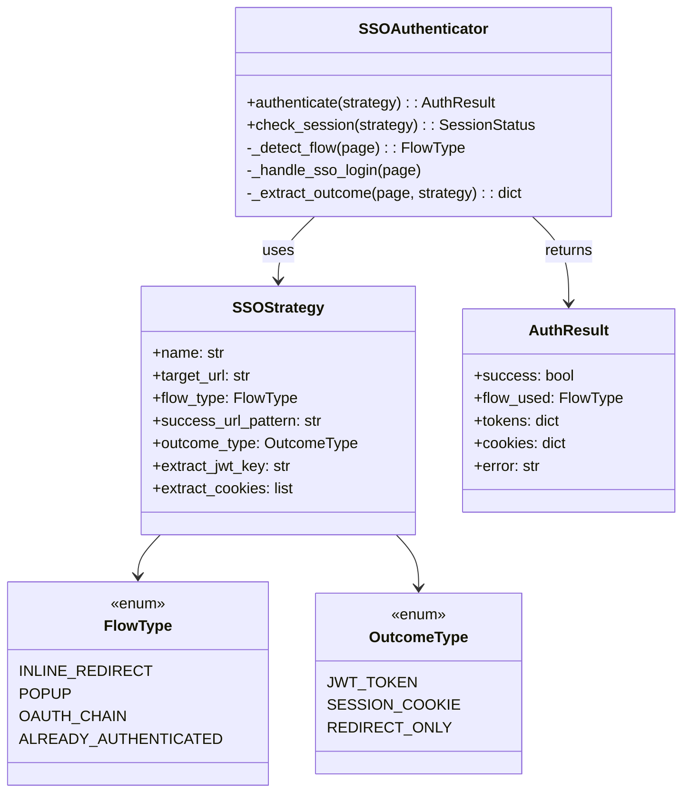
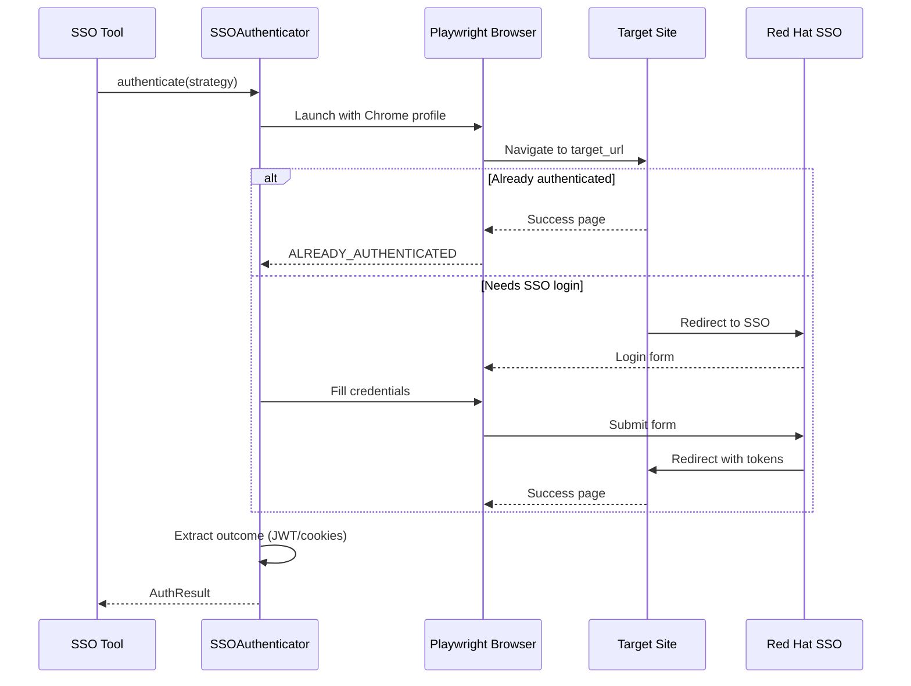

# SSO Authentication Tools

> aa_sso module for Red Hat internal SSO authentication via browser automation

## Diagram



## Authentication Flow



## Components

| Component | File | Description |
|-----------|------|-------------|
| SSOAuthenticator | `tool_modules/aa_sso/src/tools_basic.py` | Main authentication class |
| SSOStrategy | `tool_modules/aa_sso/src/tools_basic.py` | Configuration for target site |
| FlowType | `tool_modules/aa_sso/src/tools_basic.py` | Authentication flow types |
| OutcomeType | `tool_modules/aa_sso/src/tools_basic.py` | What to extract after auth |

## Flow Types

| Flow | Description | Example Sites |
|------|-------------|---------------|
| `INLINE_REDIRECT` | Page redirects to SSO, then back | Reward Zone, InScope |
| `POPUP` | SSO opens in popup window | Some internal apps |
| `OAUTH_CHAIN` | Multi-step OAuth flow | Google -> RH SSO -> Google |
| `ALREADY_AUTHENTICATED` | Session exists, skip login | Cached sessions |

## Outcome Types

| Outcome | Description | Use Case |
|---------|-------------|----------|
| `JWT_TOKEN` | Extract JWT from storage/network | API authentication |
| `SESSION_COOKIE` | Extract specific cookies | Session persistence |
| `REDIRECT_ONLY` | Just verify redirect | Simple access check |

## Built-in Strategies

| Strategy | Target | Flow | Outcome |
|----------|--------|------|---------|
| `reward_zone` | Reward Zone | INLINE_REDIRECT | REDIRECT_ONLY |
| `inscope` | InScope AI | INLINE_REDIRECT | JWT_TOKEN |
| `concur` | SAP Concur | INLINE_REDIRECT | SESSION_COOKIE |

## MCP Tools

| Tool | Description |
|------|-------------|
| `sso_authenticate` | Authenticate to a target site |
| `sso_list_strategies` | List available strategies |
| `sso_check_session` | Check if session is still valid |

## Usage Example

```python
# Authenticate to InScope
result = await sso_authenticate("inscope")

if result.success:
    jwt = result.tokens.get("authorization")
    # Use JWT for API calls

# List available strategies
strategies = await sso_list_strategies()

# Check session status
status = await sso_check_session("reward_zone")
```

## Browser Profile

Uses shared Chrome profile at `~/.config/google-chrome-sso/` for:
- Persistent cookies across sessions
- Pre-authenticated browser context
- Shared with `rhtoken` utility

## Related Diagrams

- [Auth Flows](../07-integrations/auth-flows.md)
- [InScope Tools](./inscope-tools.md)
- [Workflow Tools](./workflow-tools.md)
