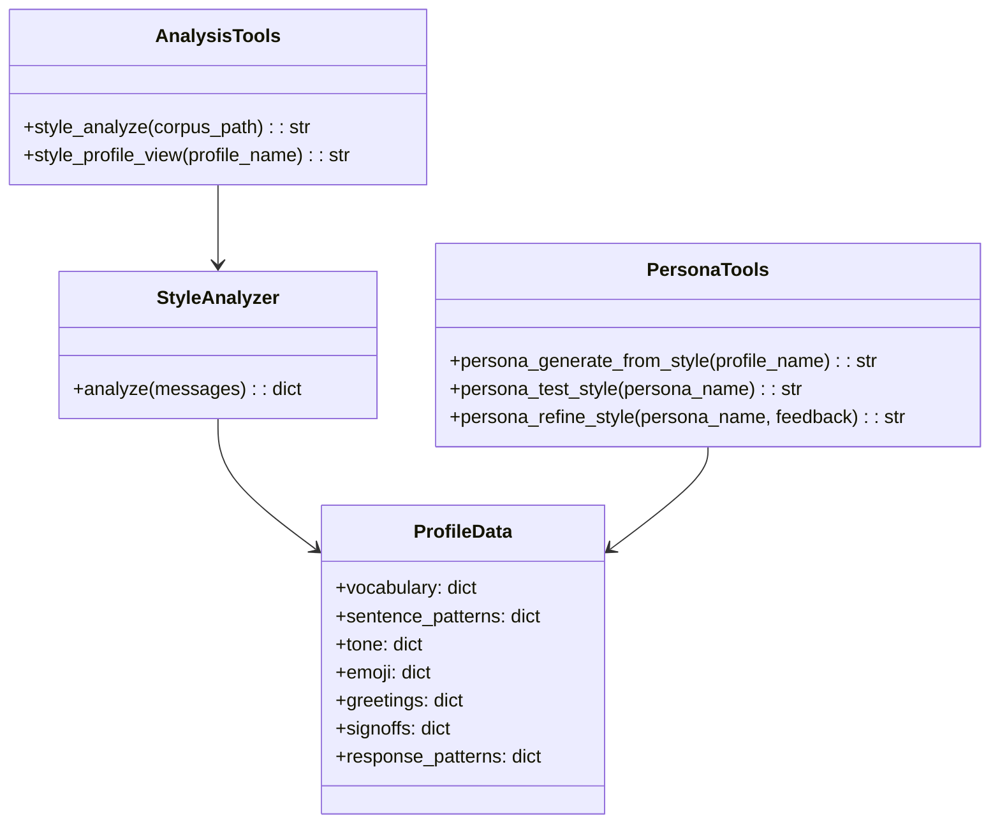

# Style Tools

> aa_style module for writing style analysis and persona generation

## Diagram



## Workflow

```mermaid
graph LR
    subgraph Export[1. Export Messages]
        SLACK[Slack Export]
    end

    subgraph Analyze[2. Analyze Style]
        CORPUS[Load Corpus]
        PATTERNS[Extract Patterns]
        PROFILE[Generate Profile]
    end

    subgraph Generate[3. Generate Persona]
        YAML[Create YAML]
        MD[Create Markdown]
        EXAMPLES[Add Examples]
    end

    subgraph Refine[4. Test & Refine]
        TEST[Test Persona]
        FEEDBACK[Collect Feedback]
        ADJUST[Adjust Style]
    end

    SLACK --> CORPUS --> PATTERNS --> PROFILE
    PROFILE --> YAML --> MD --> EXAMPLES
    EXAMPLES --> TEST --> FEEDBACK --> ADJUST
```



## Components

| Component | File | Description |
|-----------|------|-------------|
| tools_basic.py | `tool_modules/aa_style/src/` | Style MCP tools |
| analyzer.py | `tool_modules/aa_style/src/` | Style pattern extraction |

## Tool Summary

### Analysis Tools

| Tool | Description |
|------|-------------|
| `style_analyze` | Analyze writing patterns from a message corpus |
| `style_profile_view` | View a saved style profile |

### Persona Generation Tools

| Tool | Description |
|------|-------------|
| `persona_generate_from_style` | Generate persona YAML and markdown from profile |
| `persona_test_style` | Test persona output against real patterns |
| `persona_refine_style` | Refine persona based on feedback |

## Usage Examples

```python
# Analyze Slack messages to create style profile
result = await style_analyze(
    corpus_path="memory/style/slack_corpus.jsonl",
    profile_name="dave"
)

# View the generated profile
result = await style_profile_view("dave")

# Generate persona files
result = await persona_generate_from_style(
    profile_name="dave",
    persona_name="dave",
    example_count=20,
    include_tools="workflow,slack"
)

# Test the persona
result = await persona_test_style("dave")

# Refine based on feedback
result = await persona_refine_style(
    "dave",
    adjustment="more_casual"
)
```

## Style Profile Structure

The analyzer extracts:

```yaml
vocabulary:
  top_words: ["the", "and", "to", ...]
  unique_phrases: ["sounds good", "let me check", ...]
  filler_words: ["um", "like", "basically", ...]
  technical_terms: ["API", "deploy", "merge", ...]

sentence_patterns:
  avg_length: 12.5
  punctuation:
    exclamation_rate: 0.15
    question_rate: 0.08
  capitalization: "sentence"

tone:
  formality: 0.45
  directness: 0.72

emoji:
  frequency: 0.12
  favorites: ["👍", "🎉", "✅", ...]
  contextual_patterns:
    agreement: ["👍", "✅"]
    thinking: ["🤔"]
    positive: ["🎉", "🙌"]

greetings:
  common: ["Hey", "Hi there", ...]

signoffs:
  common: ["Thanks!", "Cheers", ...]

response_patterns:
  acknowledgment: ["Got it", "Makes sense", ...]
  agreement: ["Sounds good", "Agreed", ...]
  disagreement: ["I'm not sure about", ...]
```

## Generated Files

### Persona YAML (`personas/{name}.yaml`)
```yaml
name: dave
description: Personalized persona mimicking dave's communication style
persona: personas/dave.md
tools:
  - workflow
  - slack
skills:
  - start_work
  - create_jira_issue
  - review_pr
```

### Persona Markdown (`personas/{name}.md`)
Contains:
- Style overview table
- Vocabulary patterns
- Response patterns
- Greetings & signoffs
- Emoji usage
- 20+ example messages for few-shot learning
- Usage guidelines

## Refinement Adjustments

| Adjustment | Effect |
|------------|--------|
| `more_casual` | Decrease formality |
| `more_formal` | Increase formality |
| `less_emoji` | Reduce emoji guidance |
| `more_emoji` | Increase emoji guidance |
| `shorter` | Shorter responses |
| `longer` | More detailed responses |

## Related Diagrams

- [Persona Definitions](../05-personas/persona-definitions.md)
- [Slack Tools](./slack-tools.md)
- [Slack Persona Tools](./slack-persona-tools.md)
