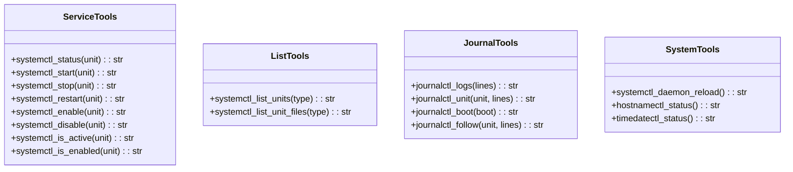
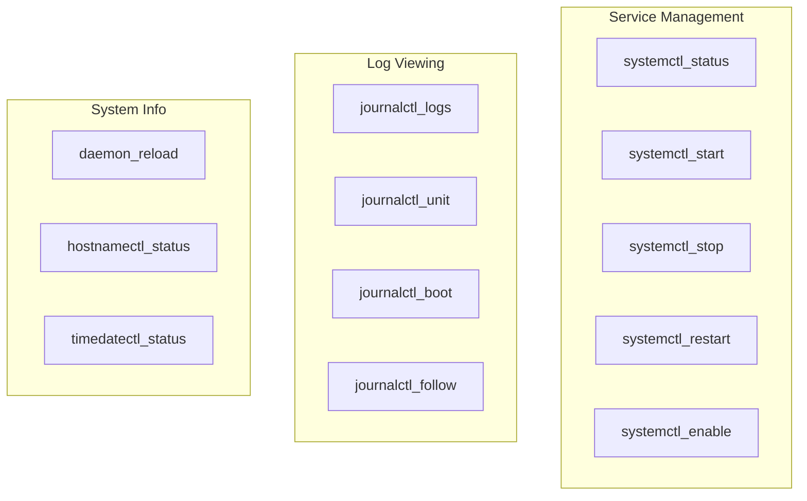

# Systemd Tools

> aa_systemd module for systemd service and journal management

## Diagram



## Tool Categories



## Components

| Component | File | Description |
|-----------|------|-------------|
| tools_basic.py | `tool_modules/aa_systemd/src/` | All systemd tools |

## Tool Summary

### Service Tools

| Tool | Description |
|------|-------------|
| `systemctl_status` | Get service status |
| `systemctl_start` | Start a service |
| `systemctl_stop` | Stop a service |
| `systemctl_restart` | Restart a service |
| `systemctl_enable` | Enable service at boot |
| `systemctl_disable` | Disable service at boot |
| `systemctl_is_active` | Check if service is active |
| `systemctl_is_enabled` | Check if service is enabled |

### List Tools

| Tool | Description |
|------|-------------|
| `systemctl_list_units` | List active units |
| `systemctl_list_unit_files` | List unit files |

### Journal Tools

| Tool | Description |
|------|-------------|
| `journalctl_logs` | View recent journal logs |
| `journalctl_unit` | View logs for specific unit |
| `journalctl_boot` | View logs from current/previous boot |
| `journalctl_follow` | Get recent logs (tail-like) |

### System Tools

| Tool | Description |
|------|-------------|
| `systemctl_daemon_reload` | Reload systemd configuration |
| `hostnamectl_status` | Get hostname info |
| `timedatectl_status` | Get time/date info |

## Usage Examples

```python
# Check service status
result = await systemctl_status("bot-slack")

# Restart a daemon
result = await systemctl_restart("bot-slack")

# View service logs
result = await journalctl_unit("bot-slack", lines=50)

# Reload after editing unit files
result = await systemctl_daemon_reload()
```

## Bot Daemon Management

This module is commonly used to manage the workflow daemons:

| Daemon | Service Name |
|--------|--------------|
| Slack | bot-slack |
| Sprint | bot-sprint |
| Meet | bot-meet |
| Video | bot-video |
| Session | bot-session |
| Cron | bot-cron |
| Memory | bot-memory |
| Config | bot-config |
| SLOP | bot-slop |
| Stats | bot-stats |

## Related Diagrams

- [Daemon Overview](../02-services/daemon-overview.md)
- [Systemd Services](../09-deployment/systemd-services.md)
