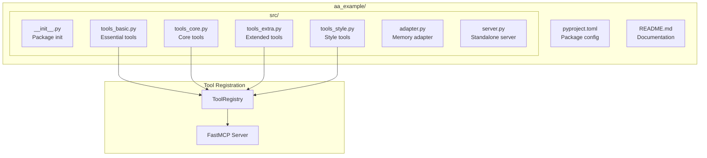
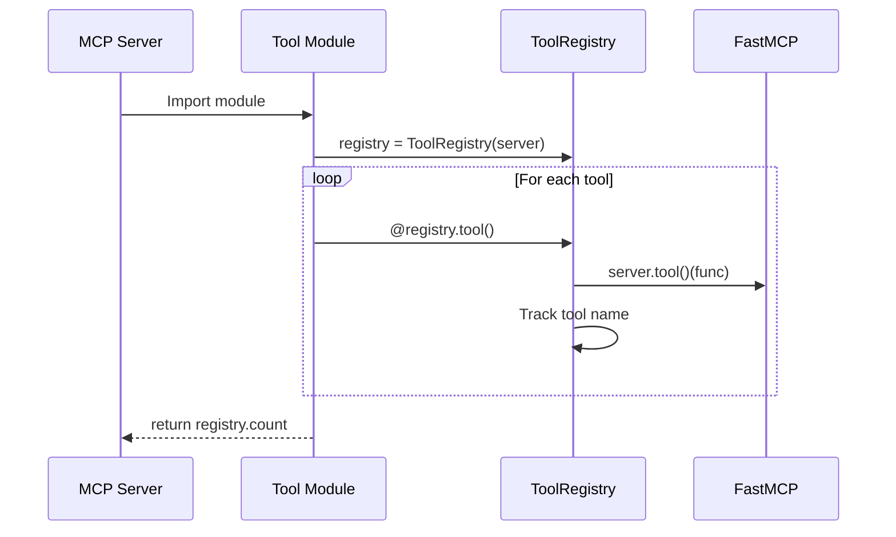

# Tool Module Structure

> Standard layout and organization of tool modules

## Diagram



## File Structure

```
tool_modules/
├── aa_jira/
│   ├── pyproject.toml
│   ├── README.md
│   └── src/
│       ├── __init__.py
│       ├── tools_basic.py      # jira_basic
│       ├── tools_core.py       # jira_core
│       ├── tools_extra.py      # jira_extra
│       ├── adapter.py          # Memory adapter
│       └── server.py           # Standalone server
├── aa_gitlab/
│   └── ...
├── aa_k8s/
│   └── ...
└── common/
    └── __init__.py             # Shared utilities
```

## Tool Registration Pattern



## pyproject.toml Structure

```toml
[project]
name = "aa_example"
version = "0.1.0"
description = "Example tool module"
requires-python = ">=3.11"
dependencies = [
    "aiohttp>=3.9.0",
    "pydantic>=2.0.0",
]

[project.optional-dependencies]
dev = ["pytest", "pytest-asyncio"]

[build-system]
requires = ["hatchling"]
build-backend = "hatchling.build"
```

## Tool Tiers

| Tier | File | Purpose | Loaded By |
|------|------|---------|-----------|
| basic | `tools_basic.py` | Essential, always-needed | All personas |
| core | `tools_core.py` | Core functionality | Most personas |
| extra | `tools_extra.py` | Extended features | Specific personas |
| style | `tools_style.py` | Style-related | Style personas |

## Components

| Component | Location | Description |
|-----------|----------|-------------|
| pyproject.toml | Root | Package configuration |
| __init__.py | src/ | Package initialization |
| tools_basic.py | src/ | Essential tools |
| tools_core.py | src/ | Core tools |
| tools_extra.py | src/ | Extended tools |
| adapter.py | src/ | Memory adapter |
| server.py | src/ | Standalone MCP server |

## Tool Function Pattern

```python
from server.tool_registry import ToolRegistry

def register_tools(server: FastMCP) -> int:
    registry = ToolRegistry(server)

    @registry.tool()
    async def example_tool(
        param1: str,
        param2: int = 10,
    ) -> str:
        """Tool description for Claude.

        Args:
            param1: Description of param1
            param2: Description of param2

        Returns:
            Description of return value
        """
        # Implementation
        return result

    return registry.count
```

## Related Diagrams

- [Tool Registry](../01-server/tool-registry.md)
- [Tool Tiers](./tool-tiers.md)
- [Persona Tool Mapping](../05-personas/persona-tool-mapping.md)
