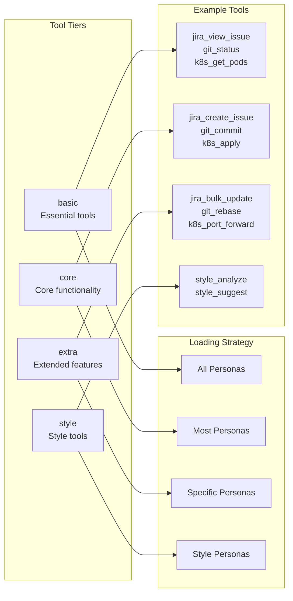
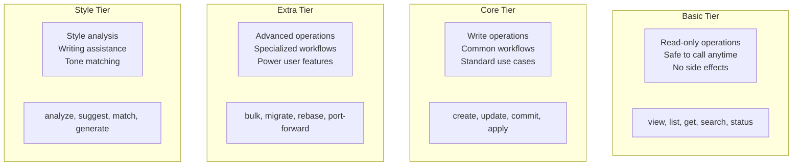
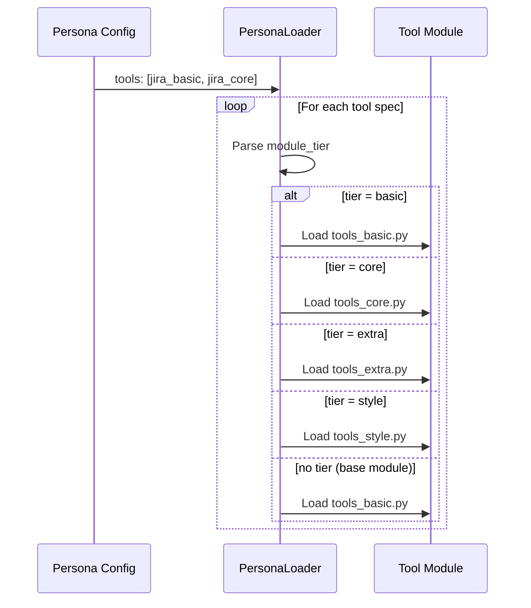

# Tool Tiers

> Basic, core, and extra tier system for tool organization

## Diagram



## Tier Definitions



## Tier by Module

| Module | Basic | Core | Extra | Style |
|--------|-------|------|-------|-------|
| jira | view, search, list | create, update, transition | bulk_update, clone | - |
| gitlab | view, list, search | create_mr, approve | merge, rebase | - |
| git | status, log, diff | commit, push, pull | rebase, cherry-pick | - |
| k8s | get, describe, logs | apply, delete | port-forward, exec | - |
| slack | search, history | send, react | bulk_send | - |
| style | - | - | - | analyze, suggest |

## Loading Rules



## Components

| Component | File | Description |
|-----------|------|-------------|
| tools_basic.py | `tool_modules/aa_*/src/` | Essential tools |
| tools_core.py | `tool_modules/aa_*/src/` | Core tools |
| tools_extra.py | `tool_modules/aa_*/src/` | Extended tools |
| tools_style.py | `tool_modules/aa_*/src/` | Style tools |

## Persona Examples

```yaml
# Developer persona - needs core tools
developer:
  tools:
    - jira_basic
    - jira_core
    - gitlab_basic
    - gitlab_core
    - git_basic
    - git_core

# DevOps persona - needs extra k8s tools
devops:
  tools:
    - k8s_basic
    - k8s_core
    - k8s_extra
    - bonfire_basic
    - bonfire_extra

# Researcher persona - basic only
researcher:
  tools:
    - jira_basic
    - gitlab_basic
    - code_search_basic
```

## Tool Count Guidelines

| Tier | Typical Count | Purpose |
|------|---------------|---------|
| basic | 5-10 | Essential read operations |
| core | 5-15 | Common write operations |
| extra | 5-20 | Advanced features |
| style | 2-5 | Style assistance |

## Related Diagrams

- [Tool Module Structure](./tool-module-structure.md)
- [Persona Tool Mapping](../05-personas/persona-tool-mapping.md)
- [Tool Registry](../01-server/tool-registry.md)
