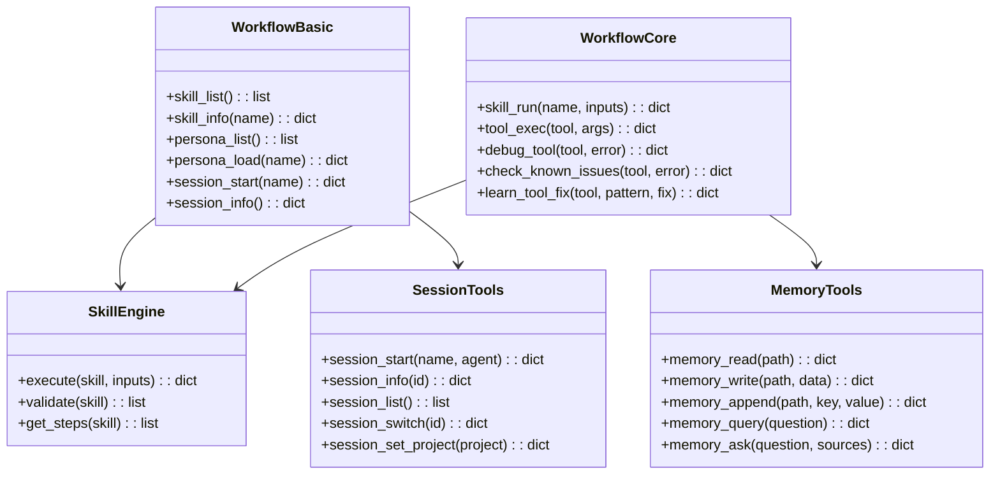
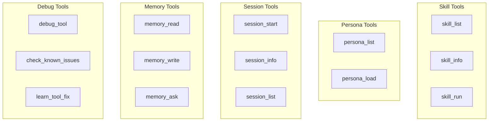
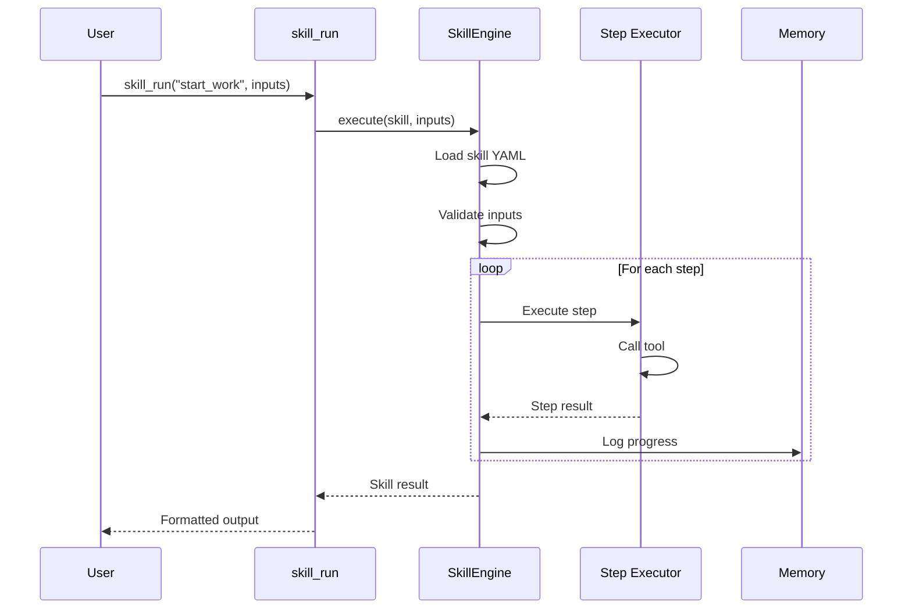
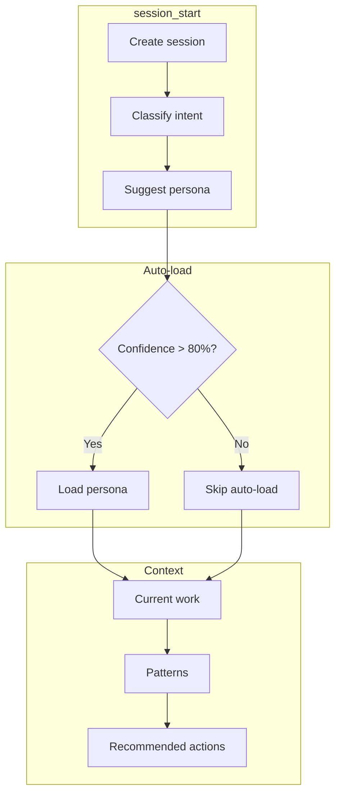

# Workflow Tools

> aa_workflow module for core workflow operations

## Diagram

## Tool Categories

## Components

| Component | File | Description |
|-----------|------|-------------|
| tools_basic.py | `tool_modules/aa_workflow/src/` | Basic operations |
| tools_core.py | `tool_modules/aa_workflow/src/` | Core operations |
| memory_tools.py | `tool_modules/aa_workflow/src/` | Memory operations |
| session_tools.py | `tool_modules/aa_workflow/src/` | Session management |
| skill_engine.py | `tool_modules/aa_workflow/src/` | Skill execution |
| scheduler.py | `tool_modules/aa_workflow/src/` | Job scheduling |
| tool_gap_detector.py | `tool_modules/aa_workflow/src/` | Gap detection |

## Tool Summary

| Tool | Category | Description |
|------|----------|-------------|
| `skill_list` | Skills | List available skills |
| `skill_run` | Skills | Execute a skill |
| `persona_load` | Personas | Load persona tools |
| `session_start` | Sessions | Start new session |
| `memory_ask` | Memory | Query memory |
| `debug_tool` | Debug | Debug failed tool |

## Skill Execution Flow

## Session Bootstrap

## Related Diagrams

- [Tool Module Structure](./tool-module-structure.md)
- [Skill Engine Architecture](../04-skills/skill-engine-architecture.md)
- [Session Builder](../01-server/session-builder.md)
