# Automation Skills

> Daily workflow and sprint automation skills

## Diagram

```mermaid
flowchart TB
    subgraph coffee[coffee Skill - Morning Briefing]
        C1[1. Get calendar events]
        C2[2. Get Jira issues]
        C3[3. Check Slack mentions]
        C4[4. Get git status]
        C5[5. Generate briefing]
        C1 --> C2 --> C3 --> C4 --> C5
    end

    subgraph beer[beer Skill - End of Day]
        B1[1. Get today's commits]
        B2[2. Get completed issues]
        B3[3. Get MR status]
        B4[4. Generate summary]
        B5[5. Log to memory]
        B1 --> B2 --> B3 --> B4 --> B5
    end

    subgraph sprint_autopilot[sprint_autopilot Skill]
        SA1[1. Get sprint issues]
        SA2[2. Check stale issues]
        SA3[3. Send reminders]
        SA4[4. Update board]
        SA1 --> SA2 --> SA3 --> SA4
    end
```



## coffee Skill

```yaml
name: coffee
description: Morning briefing - what's on for today

steps:
  - name: calendar
    tool: calendar_list_events
    args:
      days: 1
    output: events

  - name: jira_assigned
    tool: jira_search
    args:
      jql: "assignee = currentUser() AND status != Done"
    output: issues

  - name: slack_mentions
    tool: slack_search_messages
    args:
      query: "to:me after:yesterday"
    output: mentions

  - name: git_status
    tool: git_status
    output: git

  - name: memory_context
    tool: memory_read
    args:
      path: "state/current_work"
    output: current_work

  - name: generate_briefing
    tool: ollama_generate
    args:
      prompt: |
        Generate a morning briefing based on:
        - Calendar: {{ outputs.events }}
        - Jira issues: {{ outputs.issues }}
        - Slack mentions: {{ outputs.mentions }}
        - Current work: {{ outputs.current_work }}
    output: briefing
```

## beer Skill

```yaml
name: beer
description: End of day summary

steps:
  - name: commits
    tool: git_log
    args:
      since: "today"
    output: commits

  - name: completed
    tool: jira_search
    args:
      jql: "assignee = currentUser() AND status changed to Done today"
    output: completed

  - name: mrs
    tool: gitlab_list_mrs
    args:
      state: "opened"
      author: "me"
    output: mrs

  - name: generate_summary
    tool: ollama_generate
    args:
      prompt: |
        Generate end of day summary:
        - Commits: {{ outputs.commits }}
        - Completed issues: {{ outputs.completed }}
        - Open MRs: {{ outputs.mrs }}
    output: summary

  - name: log_day
    tool: memory_write
    args:
      path: "sessions/{{ today }}"
      data:
        commits: "{{ outputs.commits | length }}"
        completed: "{{ outputs.completed | length }}"
        summary: "{{ outputs.summary }}"
```

## jira_hygiene Skill

```yaml
name: jira_hygiene
description: Clean up Jira issues

inputs:
  - name: project
    type: string
    default: AAP

steps:
  - name: stale_in_progress
    tool: jira_search
    args:
      jql: "project = {{ inputs.project }} AND status = 'In Progress' AND updated < -3d"
    output: stale

  - name: notify_stale
    tool: slack_send_message
    args:
      channel: "#sprint-alerts"
      text: "Stale issues in progress: {{ outputs.stale | length }}"
    condition: "{{ outputs.stale | length > 0 }}"

  - name: unassigned
    tool: jira_search
    args:
      jql: "project = {{ inputs.project }} AND assignee is EMPTY AND status != Done"
    output: unassigned

  - name: notify_unassigned
    tool: slack_send_message
    args:
      channel: "#sprint-alerts"
      text: "Unassigned issues: {{ outputs.unassigned | length }}"
    condition: "{{ outputs.unassigned | length > 0 }}"
```

## Scheduled Execution

```json
{
  "schedules": {
    "jobs": [
      {
        "name": "morning_coffee",
        "skill": "coffee",
        "cron": "0 9 * * 1-5",
        "notify": ["slack"]
      },
      {
        "name": "evening_beer",
        "skill": "beer",
        "cron": "0 17 * * 1-5",
        "notify": ["memory"]
      },
      {
        "name": "jira_hygiene",
        "skill": "jira_hygiene_all",
        "cron": "0 10 * * 1-5",
        "notify": ["slack"]
      }
    ]
  }
}
```

## Components

| Skill | File | Description |
|-------|------|-------------|
| coffee | `skills/coffee.yaml` | Morning briefing |
| beer | `skills/beer.yaml` | End of day |
| jira_hygiene | `skills/jira_hygiene.yaml` | Jira cleanup |
| sprint_autopilot | `skills/sprint_autopilot.yaml` | Sprint automation |

## Related Diagrams

- [Skill Categories](./skill-categories.md)
- [Cron Daemon](../02-services/cron-daemon.md)
- [Sprint Automation Flow](../08-data-flows/sprint-automation.md)
