# Common Skills

> Frequently used development workflow skills

## Diagram

```mermaid
flowchart TB
    subgraph start_work[start_work Skill]
        SW1[1. Fetch Jira issue]
        SW2[2. Create branch]
        SW3[3. Transition to In Progress]
        SW4[4. Log to memory]
        SW1 --> SW2 --> SW3 --> SW4
    end

    subgraph create_mr[create_mr Skill]
        CM1[1. Get current branch]
        CM2[2. Push to remote]
        CM3[3. Create MR in GitLab]
        CM4[4. Link MR to Jira]
        CM5[5. Transition to In Review]
        CM1 --> CM2 --> CM3 --> CM4 --> CM5
    end

    subgraph close_issue[close_issue Skill]
        CI1[1. Check MR merged]
        CI2[2. Transition to Done]
        CI3[3. Add closing comment]
        CI4[4. Log completion]
        CI1 --> CI2 --> CI3 --> CI4
    end
```



## start_work Skill

```yaml
name: start_work
description: Start work on a Jira issue

inputs:
  - name: issue_key
    type: string
    required: true

steps:
  - name: fetch_issue
    tool: jira_view_issue
    args:
      issue_key: "{{ inputs.issue_key }}"
    output: issue

  - name: create_branch
    tool: git_create_branch
    args:
      name: "{{ inputs.issue_key | lower }}-{{ outputs.fetch_issue.summary | slugify }}"

  - name: transition
    tool: jira_transition
    args:
      issue_key: "{{ inputs.issue_key }}"
      status: "In Progress"

  - name: log_work
    tool: memory_append
    args:
      path: "state/current_work"
      key: "active_issues"
      value: "{{ inputs.issue_key }}"
```

## create_mr Skill

```yaml
name: create_mr
description: Create merge request from current branch

inputs:
  - name: issue_key
    type: string
    required: true
  - name: title
    type: string
    required: false

steps:
  - name: get_branch
    tool: git_branch_current
    output: branch

  - name: push
    tool: git_push
    args:
      remote: origin
      branch: "{{ outputs.get_branch }}"

  - name: create_mr
    tool: gitlab_create_mr
    args:
      source_branch: "{{ outputs.get_branch }}"
      target_branch: main
      title: "{{ inputs.title | default(inputs.issue_key + ' - ' + outputs.get_branch) }}"
    output: mr

  - name: link_jira
    tool: jira_add_comment
    args:
      issue_key: "{{ inputs.issue_key }}"
      comment: "MR created: {{ outputs.create_mr.web_url }}"

  - name: transition
    tool: jira_transition
    args:
      issue_key: "{{ inputs.issue_key }}"
      status: "In Review"
```

## review_pr Skill

```yaml
name: review_pr
description: Review a pull/merge request

inputs:
  - name: mr_id
    type: int
    required: true

steps:
  - name: fetch_mr
    tool: gitlab_view_mr
    args:
      mr_id: "{{ inputs.mr_id }}"
    output: mr

  - name: get_diff
    tool: gitlab_get_diff
    args:
      mr_id: "{{ inputs.mr_id }}"
    output: diff

  - name: search_patterns
    tool: code_search
    args:
      query: "similar code patterns"
    output: patterns

  - name: generate_review
    tool: ollama_generate
    args:
      prompt: "Review this diff: {{ outputs.diff }}"
    output: review
```

## Components

| Skill | File | Description |
|-------|------|-------------|
| start_work | `skills/start_work.yaml` | Start issue work |
| create_mr | `skills/create_mr.yaml` | Create MR |
| close_issue | `skills/close_issue.yaml` | Close issue |
| review_pr | `skills/review_pr.yaml` | Review MR |

## Related Diagrams

- [Skill Categories](./skill-categories.md)
- [Skill Execution Flow](./skill-execution-flow.md)
- [Deployment Skills](./deployment-skills.md)
