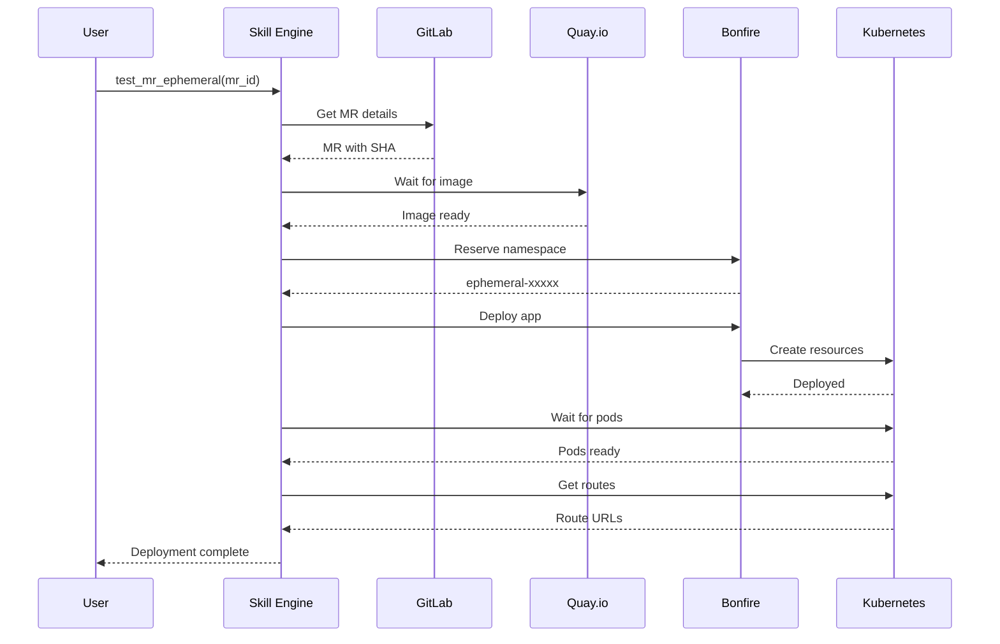

# Deployment Skills

> Ephemeral deployment and release skills

## Diagram

```mermaid
flowchart TB
    subgraph test_mr_ephemeral[test_mr_ephemeral Skill]
        TE1[1. Get MR details]
        TE2[2. Get commit SHA]
        TE3[3. Reserve namespace]
        TE4[4. Wait for image]
        TE5[5. Deploy to ephemeral]
        TE6[6. Wait for pods]
        TE7[7. Get routes]
        TE1 --> TE2 --> TE3 --> TE4 --> TE5 --> TE6 --> TE7
    end

    subgraph extend_ephemeral[extend_ephemeral Skill]
        EE1[1. Get namespace info]
        EE2[2. Extend duration]
        EE3[3. Confirm extension]
        EE1 --> EE2 --> EE3
    end

    subgraph release_to_prod[release_to_prod Skill]
        RP1[1. Get latest snapshot]
        RP2[2. Create release]
        RP3[3. Wait for pipeline]
        RP4[4. Verify deployment]
        RP5[5. Notify team]
        RP1 --> RP2 --> RP3 --> RP4 --> RP5
    end
```



## test_mr_ephemeral Skill

```yaml
name: test_mr_ephemeral
description: Deploy MR to ephemeral environment

inputs:
  - name: mr_id
    type: int
    required: true
  - name: billing
    type: bool
    default: false
    description: Deploy billing ClowdApp instead of main

steps:
  - name: get_mr
    tool: gitlab_view_mr
    args:
      mr_id: "{{ inputs.mr_id }}"
    output: mr

  - name: get_sha
    tool: git_rev_parse
    args:
      ref: "{{ outputs.get_mr.sha }}"
    output: full_sha

  - name: reserve_namespace
    tool: bonfire_namespace_reserve
    args:
      duration: "4h"
    output: namespace

  - name: wait_for_image
    tool: quay_wait_for_tag
    args:
      repo: "cloudservices/automation-analytics-backend"
      tag: "{{ outputs.full_sha }}"
      timeout: 300
    output: image

  - name: deploy
    tool: bonfire_deploy
    args:
      namespace: "{{ outputs.reserve_namespace }}"
      app: "{{ 'tower-analytics-billing-clowdapp' if inputs.billing else 'tower-analytics-clowdapp' }}"
      image_tag: "{{ outputs.image.digest }}"
    output: deployment

  - name: wait_pods
    tool: k8s_wait_pods
    args:
      namespace: "{{ outputs.reserve_namespace }}"
      timeout: 300

  - name: get_routes
    tool: k8s_get_routes
    args:
      namespace: "{{ outputs.reserve_namespace }}"
    output: routes
```

## release_to_prod Skill

```yaml
name: release_to_prod
description: Release to production via Konflux

inputs:
  - name: component
    type: string
    default: automation-analytics-backend

steps:
  - name: get_snapshot
    tool: konflux_list_snapshots
    args:
      application: "{{ inputs.component }}"
      limit: 1
    output: snapshots

  - name: create_release
    tool: konflux_create_release
    args:
      application: "{{ inputs.component }}"
      snapshot: "{{ outputs.snapshots[0].name }}"
    output: release
    confirm:
      prompt: "Create release from {{ outputs.snapshots[0].name }}?"
      options: [yes, no]
      default: yes

  - name: wait_pipeline
    tool: konflux_wait_release
    args:
      release: "{{ outputs.create_release.name }}"
      timeout: 600

  - name: verify
    tool: k8s_get_pods
    args:
      namespace: tower-analytics-prod
      cluster: prod
    output: pods

  - name: notify
    tool: slack_send_message
    args:
      channel: "#releases"
      text: "Released {{ inputs.component }} to production"
```

## Components

| Skill | File | Description |
|-------|------|-------------|
| test_mr_ephemeral | `skills/test_mr_ephemeral.yaml` | Deploy to ephemeral |
| extend_ephemeral | `skills/extend_ephemeral.yaml` | Extend namespace |
| release_to_prod | `skills/release_to_prod.yaml` | Production release |
| rollback | `skills/rollback.yaml` | Rollback deployment |

## Deployment Flow



## Related Diagrams

- [Skill Categories](./skill-categories.md)
- [Ephemeral Deployment Flow](../08-data-flows/ephemeral-deployment.md)
- [Release Pipeline Flow](../08-data-flows/release-pipeline.md)
