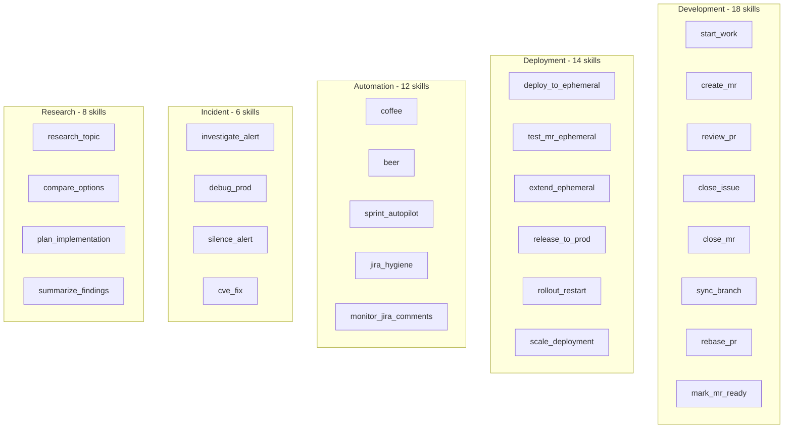

# Skill Categories

> Complete inventory of all 93 skills organized by purpose and domain

## Diagram

## Complete Skill Inventory (93 skills)

### Development Skills (18)

| Skill | Description |
|-------|-------------|
| `start_work` | Begin work on a Jira issue - creates branch, sets up environment |
| `create_mr` | Create GitLab MR from current branch with proper formatting |
| `review_pr` | Quick code review of a Merge Request |
| `review_local_changes` | Multi-agent code review for local uncommitted/staged changes |
| `review_pr_multiagent` | Comprehensive multi-agent code review (6 specialized agents) |
| `review_pr_multiagent_test` | Test skill for multi-agent PR review |
| `review_all_prs` | Review all open merge requests for a project |
| `check_my_prs` | Check status of your open merge requests |
| `check_mr_feedback` | Get review comments and feedback on a merge request |
| `close_issue` | Close a Jira issue and add summary comment |
| `close_mr` | Close a merge request and update linked Jira |
| `mark_mr_ready` | Remove draft status from MR and notify team |
| `sync_branch` | Quickly rebase current branch onto main |
| `rebase_pr` | Rebase a merge request onto latest main |
| `notify_mr` | Post review request to team Slack channel |
| `cleanup_branches` | Delete merged and stale feature branches |
| `pr_jira_audit` | Audit open MRs for missing Jira references |
| `clone_jira_issue` | Create a copy of an existing Jira issue |

### Deployment & Infrastructure Skills (14)

| Skill | Description |
|-------|-------------|
| `deploy_to_ephemeral` | Deploy code to ephemeral environment for testing |
| `test_mr_ephemeral` | Deploy and test a merge request in ephemeral environment |
| `extend_ephemeral` | Extend the lifetime of an ephemeral namespace |
| `release_to_prod` | Release a version to production environment |
| `release_aa_backend_prod` | Release automation-analytics-backend to production |
| `hotfix` | Create an emergency hotfix from production |
| `rollout_restart` | Restart a deployment and monitor the rollout |
| `scale_deployment` | Scale a deployment up or down |
| `environment_overview` | Get an overview of all environments |
| `check_secrets` | Verify Kubernetes secrets and configmaps |
| `cancel_pipeline` | Cancel a running Tekton pipeline |
| `appinterface_check` | Validate app-interface GitOps configuration |
| `konflux_status` | Get overall Konflux platform health |
| `check_integration_tests` | Run or check status of integration tests |

### Automation & Workflow Skills (12)

| Skill | Description |
|-------|-------------|
| `coffee` | Daily standup assistant - everything you need at start of day |
| `beer` | Wind down work day with summary and prep for tomorrow |
| `sprint_autopilot` | Work on sprint issue with dynamic persona switching |
| `sprint_planning` | Analyze backlog for sprint planning |
| `jira_hygiene` | Check and fix Jira issue quality before coding |
| `jira_hygiene_all` | Run hygiene checks on all assigned Jira issues |
| `create_jira_issue` | Create a new Jira issue |
| `monitor_jira_comments` | Daily monitoring of Jira comments on sprint issues |
| `sync_discovered_work` | Review and sync discovered work items to Jira |
| `discovered_work_summary` | Generate summary of discovered work |
| `cleanup_stale_executions` | Clean up stale skill executions |
| `slack_daemon_control` | Control the Slack daemon service |

### CI/CD Skills (6)

| Skill | Description |
|-------|-------------|
| `check_ci_health` | Diagnose CI/CD pipeline issues |
| `ci_retry` | Retry failed GitLab CI or Konflux/Tekton pipelines |
| `scan_vulnerabilities` | Scan code for security vulnerabilities |
| `cve_fix` | Automatically fix CVE vulnerabilities in Python dependencies |
| `update_docs` | Check and update repository documentation |
| `build_persona_style` | Build persona writing style from examples |

### Incident & Alerting Skills (6)

| Skill | Description |
|-------|-------------|
| `investigate_alert` | Quick triage of a firing Prometheus alert |
| `investigate_slack_alert` | Investigate an alert received via Slack |
| `debug_prod` | Deep investigation of production issues |
| `silence_alert` | Create or manage Alertmanager silences |
| `test_error_recovery` | Test skill for error recovery functionality |
| `hello_world` | Test skill to verify skill engine is working |

### Research & Analysis Skills (8)

| Skill | Description |
|-------|-------------|
| `research_topic` | Deep dive on topic using internal and external sources |
| `compare_options` | Compare multiple approaches, libraries, or patterns |
| `plan_implementation` | Create structured implementation plan from research |
| `summarize_findings` | Summarize research findings into actionable insights |
| `explain_code` | Explain code snippet or file using project knowledge |
| `find_similar_code` | Find code similar to pattern or description |
| `gather_context` | Gather relevant context using semantic search |
| `work_analysis` | Analyze work activity for management reporting |

### Communication Skills (7)

| Skill | Description |
|-------|-------------|
| `notify_team` | Send a message to a Slack channel |
| `standup_summary` | Generate standup summary from recent activity |
| `weekly_summary` | Generate summary of work from session logs |
| `attach_session_to_jira` | Attach AI session context to Jira issue |
| `schedule_meeting` | Schedule meeting with availability checking |
| `slack_persona_sync` | Sync persona profile to Slack |
| `submit_expense` | Submit Remote Worker Expense to SAP Concur |

### Knowledge & Memory Skills (10)

| Skill | Description |
|-------|-------------|
| `memory_init` | Initialize or reset memory files to clean state |
| `memory_view` | View and manage persistent memory |
| `memory_edit` | Modify or remove entries from memory |
| `memory_cleanup` | Clean up stale entries from memory |
| `bootstrap_knowledge` | Generate comprehensive project knowledge |
| `bootstrap_all_knowledge` | Build project knowledge for all projects |
| `knowledge_refresh` | Refresh project knowledge and vector index |
| `learn_architecture` | Perform deep scan of project architecture |
| `learn_pattern` | Save new error pattern to memory |
| `suggest_patterns` | Auto-discover error patterns from failures |

### Project Management Skills (5)

| Skill | Description |
|-------|-------------|
| `add_project` | Add new project to config.json with auto-detection |
| `list_projects` | List all configured projects |
| `detect_project` | Auto-detect project settings from directory |
| `remove_project` | Remove project from config.json |
| `reindex_all_vectors` | Reindex all vector databases |

### Presentation Skills (4)

| Skill | Description |
|-------|-------------|
| `create_slide_deck` | Create new Google Slides presentation |
| `edit_slide_deck` | Edit existing Google Slides presentation |
| `export_presentation` | Export Google Slides to PDF format |
| `list_presentations` | List Google Slides from your Drive |

### Performance Skills (3)

| Skill | Description |
|-------|-------------|
| `performance_daily` | Collect today's performance data |
| `performance_backfill` | Backfill missing performance data |
| `performance_evaluate` | Evaluate quarterly questions with AI |

### Calendar & Scheduling Skills (2)

| Skill | Description |
|-------|-------------|
| `my_calendar` | View upcoming calendar events |
| `sync_pto_calendar` | Sync PTO to calendar |

### Specialized Skills (2)

| Skill | Description |
|-------|-------------|
| `reward_zone` | Red Hat Reward Zone integration |
| `slop_scan` | SLOP scanner skill |

## Skill Count Summary

| Category | Count |
|----------|-------|
| Development | 18 |
| Deployment & Infrastructure | 14 |
| Automation & Workflow | 12 |
| Knowledge & Memory | 10 |
| Research & Analysis | 8 |
| Communication | 7 |
| CI/CD | 6 |
| Incident & Alerting | 6 |
| Project Management | 5 |
| Presentation | 4 |
| Performance | 3 |
| Calendar & Scheduling | 2 |
| Specialized | 2 |
| **Total** | **93** |

## Components

| Component | Location | Description |
|-----------|----------|-------------|
| Skill files | `skills/*.yaml` | Skill YAML definitions |
| Skill engine | `tool_modules/aa_workflow/src/skill_engine.py` | Skill executor |
| skill_list tool | `tool_modules/aa_workflow/src/tools_basic.py` | List available skills |
| skill_run tool | `tool_modules/aa_workflow/src/tools_basic.py` | Execute a skill |

## Related Diagrams

- [Skill Engine Architecture](./skill-engine-architecture.md)
- [Skill Execution Flow](./skill-execution-flow.md)
- [Skill YAML Schema](./skill-yaml-schema.md)
- [Skill Error Handling](./skill-error-handling.md)
